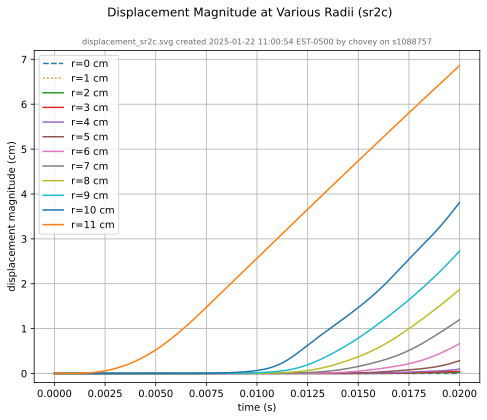
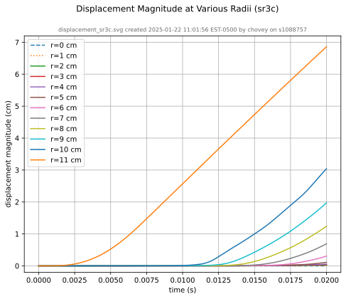
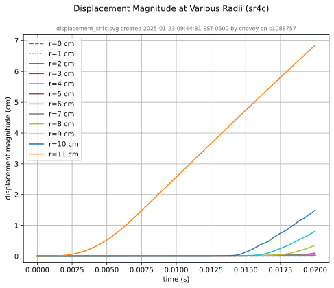
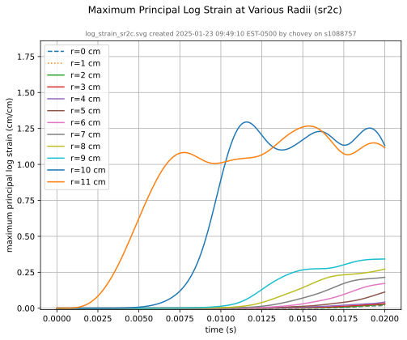
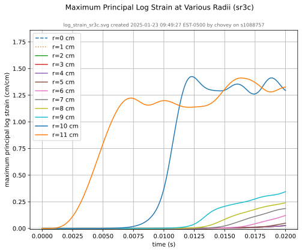
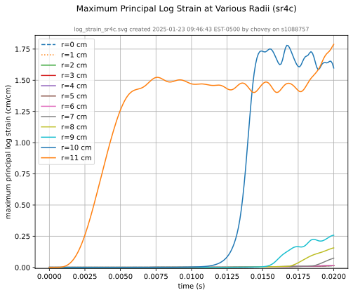
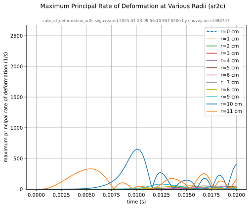
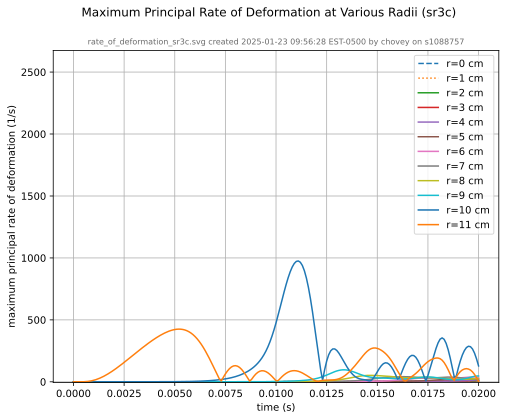
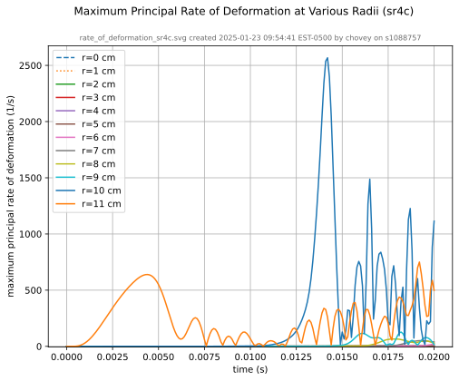

# Conforming Mesh

In this section, we develop a traditional conforming mesh, manually
constructed with Cubit.  We compare the results from the conforming
resolutions to the results obtained from the voxel mesh resolutions.

## Mesh Creation and Visualization

With [conforming_spheres.jou](conforming_spheres.jou) in Cubit, we create three conforming meshes to match the three voxel meshes of resolution 0.5, 0.25, and 0.1 cm (2 vox/cm, 4 vox/cm, and 10 vox/cm, respectively).

resolution | 2 vox/cm | 4 vox/cm | 10 vox/cm
---------- | -------: | -------: | --------:
midline   |   |  | 
isometric  |  |  | 
block 1 (green) #elements | 57,344 | 458,752 | 7,089,776
block 2 (yellow) #elements | 18,432 | 98,304 | 1,497,840
block 3 (magenta) #elements | 18,432 | 98,304 | 1,497,840
total #elements | 94,208 | 655,360 | 10,085,456

Copy from local to HPC:

```sh
# for example, manual copy from local to HPC
# macOS local finder, command+K to launch "Connect to Server"
# smb://cee/chovey
# copy [local]~/autotwin/automesh/book/analysis/sphere_with_shells/conf_0.5cm.g
# to
# [HPC]~/autotwin/ssm/geometry/sr2c/
```

We consider three simulations using the following three meshes (in the HPC `~/autotwin/ssm/geometry` folder):

folder | file | `md5` checksum
:---: | :---: | :---:
`sr2c` | `conf_0.5cm.g` | `3731460f73da70ae79dd8155e2a8e0c6`
`sr3c` | `conf_0.25cm.g` | `bf65e329f43867c8fabc64b1b5273b8c`
`sr4c` | `conf_0.1cm.g` | `ae0b13dec173c8fb030feab306a09db6`

## Tracers

View the tracer locations in Cubit:

```sh
graphics clip on plane location 0 0 1 direction 0 0 -1
view up 0 1 0
view from 0 0 100
graphics clip manipulation off
```


Figure: Tracer numbers `[0, 1, 2, ... 11]` at $\Delta x$ distance `[0, 1, 2, ... 11]` centimeters from point `(0, 0, 0)` along the x-axis at resolutions `sr2c`, `sr3c`, and `sr4c` (top to bottom, respectively).

## Simulation

We created three input decks:

* [`sr2c.i`](https://github.com/autotwin/ssm/blob/main/input/sr2c/sr2c.i) (for mesh `conf_0.5cm.g`)
* [`sr3c.i`](https://github.com/autotwin/ssm/blob/main/input/sr3c/sr3c.i) (for mesh `conf_0.25cm.g`)
* [`sr4c.i`](https://github.com/autotwin/ssm/blob/main/input/sr4c/sr4c.i) (for mesh `conf_0.1cm.g`)

## Results

Compute time:

item | sim | T_sim (ms) | HPC | #proc | cpu time (hh:mm)
:---: | :---: | :---: | :---: | :---: | :---:
0 | sr2c.i | 20 | gho | 160 | 00:02
1 | sr3c.i | 20 | gho | 160 | 00:21
2 | sr4.i | 20 | att | 160 | 14:00 (est)

### Rigid Body

We verified the rigid body kinematics match those from the [voxel mesh](simulation.md#rigid-body), but we don't repeat those time history plots here.

### Deformable Body

resolution | 2 vox/cm | 4 vox/cm | 10 vox/cm
---------- | -------- | -------- | ---------
midline   |  |  | 
displacement |  |  | 
recipe | [displacement_sr2c.yml](recipes/displacement_sr2c.yml) | [displacement_sr3c.yml](recipes/displacement_sr3c.yml) | [displacement_sr4c.yml](recipes/displacement_sr4c.yml)
log strain |  |  | 
recipe | [log_strain_sr2c.yml](recipes/log_strain_sr2c.yml) | [log_strain_sr3c.yml](recipes/log_strain_sr3c.yml) | [log_strain_sr4c.yml](recipes/log_strain_sr4c.yml)
rate of deformation |  |  | 
recipe | [rate_of_deformation_sr2c.yml](recipes/rate_of_deformation_sr2c.yml) | [rate_of_deformation_sr3c.yml](recipes/rate_of_deformation_sr3c.yml) | [rate_of_deformation_sr4c.yml](recipes/rate_of_deformation_sr4c.yml)

Figure: Conforming mesh midline section and tracer plots at 1 cm interval along the $x$-axis for displacement magnitude, log strain, and rate of deformation (10,000 Hz acquisition rate, $\Delta t$ = 0.0001 s).
