# Simulation

Work in progress.

## Meshes

Copy from local to HPC:

```sh
# for example, manual copy from local to HPC
# macOS local finder, command+K to launch "Connect to Server"
# smb://cee/chovey
# copy [local]~/autotwin/automesh/book/analysis/sphere_with_shells/spheres_resolution_2.exo
# to
# [HPC]~/autotwin/ssm/geometry/sr2/
```

We consider three simulations using the following three meshes (in the HPC `~/autotwin/ssm/geometry` folder):

folder | file | `md5` checksum
:---: | :---: | :---:
`sr2` | `spheres_resolution_2.exo` | `9f40c8bd91874f87e22a456c76b4448c`
`sr3` | `spheres_resolution_3.exo` | `6ae69132897577e526860515e53c9018`
`sr4` | `spheres_resolution_4.exo` | `b939bc65ce07d3ac6a573a4f1178cfd0`

We do not use the `spheres_resolution_1.exo` because the outer shell layer is not closed.

## Boundary Conditions

Consider an angular acceleration pulse of the form:

$$\alpha(t) := \alpha_{\max} \exp \left( 1 - \frac{1}{1 - \left(\frac{2t}{\Delta t} - 1 \right)^2}\right) \hspace{0.5cm} {\rm for} \hspace{0.5cm} 0 \leq t \leq \Delta t $$

and $\alpha(t) = 0$ is zero otherwise.  This pulse, referred to as the **bump function**, is continuously differentiable, with peak angular acceleration at $\Delta t / 2$.

With $\alpha_{\max} := 8.0$ krad/s^2, and $\Delta t := 8.0$ ms, we can create the angular acceleration boundary condition (with corresponding angular velocity) [^Carlsen_2021] plots:

| Angular Acceleration | Angular Velocity |
| :---: | :---: |
|  |  |

Figure: Angular acceleration and corresponding angular velocity time history.

* [Angular acceleration tabulated data](https://1drv.ms/u/s!ApVSeeLlvsE8g_4xLyBDaZDDXvh7iw?e=iikM6v):  The standardized angular acceleration load curve has column data as (time, magnitude) in (sec, krad/s^2).  The function used to generated the curve, from Equation (1) of [^Carlsen_2021], is
* [Angular velocity tabulated data](https://1drv.ms/u/s!ApVSeeLlvsE8g_4yrDrMBjYM28vt6A?e=reeUyW):  The angular velocity curve has column data as (time, magnitude) in (sec, rad/s).

The peak angular acceleration ocurrs at $t=\Delta t / 2$ (which occurs in the tabular data at data point 4144, values (0.00414310, 7.99999997)).

On the outer shell (block 3) of the model, we prescribe the angular velocity [boundary condition](https://github.com/autotwin/ssm/blob/c83fb7a629850ba225fd4cb45f5b70382ac0d074/bcs/shell_rotation.txt).

## Tracers

View the tracer locations in Cubit:

```sh
graphics clip on plane location 0 0 1 direction 0 0 -1
view up 0 1 0
view from 0 0 100
graphics clip manipulation off
```


Figure: Tracer numbers `[0, 1, 2, ... 11]` at $\Delta x$ distance `[0, 1, 2, ... 11]` centimeters from point `(0, 0, 0)` along the x-axis at resolutions `sr2`, `sr3`, and `sr4` (top to bottom, respectively).

## Materials

We model the outer shell (block 3) as a rigid body.  The inner sphere (block 1) is nodeled as Swanson viscoelastic [white matter](https://github.com/autotwin/ssm/blob/1fd3382f1b050465050ebc66c8fe7bbc87d690c3/material/whitematter.txt).  The intermediate material (block 2) is modeled as elastic [cerebral spinal fluid](https://github.com/autotwin/ssm/blob/1fd3382f1b050465050ebc66c8fe7bbc87d690c3/material/csf.txt).

## Input deck

We created three input decks:

* [`sr2.i`](https://github.com/autotwin/ssm/blob/main/input/sr2/sr2.i) (for mesh `spheres_reolution_2.exo`)
* [`sr3.i`](https://github.com/autotwin/ssm/blob/main/input/sr3/sr3.i) (for mesh `spheres_reolution_3.exo`)
* [`sr4.i`](https://github.com/autotwin/ssm/blob/main/input/sr4/sr4.i) (for mesh `spheres_reolution_4.exo`)

**Remark:** Originally, we used [APREPRO](https://sandialabs.github.io/seacas-docs/aprepro.pdf), part of [SEACAS](https://sandialabs.github.io/seacas-docs/sphinx/html/index.html#aprepro), to define tracer points along the line $y = x$ at 1-cm (radial) intervals.  We then updated the locations of these tracer points to be along the x-axis, which allowed for nodally exact locations to be established across all models, voxelized and conforming.

Displacement, maximum principal log strain, and maximum principal rate of deformation were logged at tracer points over the simulation duration.  The Sierra/Solid Mechanics documentation [^Sierra_2022] [^Sierra_examples_2024] was also useful for creating the input decks.

## Solver

Request resources:

```sh
mywcid # see what wcid resources are available, gives an FYxxxxxx number
```

```sh
#request 1 interactive node for four hours with wcid account FY180100
salloc -N1 --time=4:00:00 --account=FY180100
```

See idle nodes:

```sh
sinfo
```

Decompose the geometry, e.g., `~/autotwin/ssm/geometry/sr2/submit_script`:

```sh
#!/bin/bash

module purge
module load sierra
module load seacas

# previously ran with 16 processors
# PROCS=16
# 10 nodes = 160 processors
PROCS=160
# PROCS=320
# PROCS=336

# geometry and mesh file
GFILE="spheres_resolution_2.exo"

decomp --processors $PROCS $GFILE
```

Check the input deck `~/autotwin/ssm/input/sr2/sr2.i` with `submit_check`:

```sh
#!/bin/bash

echo "This is submit_check"
echo "module purge"
module purge

echo "module load sierra"
module load sierra

# new, run this first
export PSM2_DEVICES='shm,self'

IFILE="sr2.i"

echo "Check syntax of input deck: $IFILE"
adagio --check-syntax -i $IFILE  # to check syntax of input deck

# echo "Check syntax of input deck ($IFILE) and mesh loading"
adagio --check-input  -i $IFILE  # to check syntax of input deck and mesh load
```

Clean any preexisting result files with `submit_clean`:

```sh
#!/bin/bash

echo "This is submit_clean"
rm batch_*
rm sierra_batch_*
rm *.e.*
rm epu.log
rm *.g.*
rm *.err
rm g.rsout.*
```

Submit the job with `submit_script`:

```sh
#!/bin/bash

echo "This is submit_script"
module purge
module load sierra
module load seacas

# PROCS=16
PROCS=160
# PROCS=320
# PROCS=336

# geometry and mesh file
# GFILE="../../geometry/sphere/spheres_resolution_4.exo"
# decomp --processors $PROCS $GFILE

IFILE="sr2.i"

# queues
# https://wiki.sandia.gov/pages/viewpage.action?pageId=1359570410#SlurmDocumentation-Queues
# short can be used for nodes <= 40 and wall time <= 4:00:00 (4 hours)
# batch, the default queue, wall time <= 48 h
# long, wall time <= 96 h, eclipse 256 nodes

# https://wiki.sandia.gov/display/OK/Slurm+Documentation
# over 4 hours, then need to remove 'short' from the --queue-name
#
# sierra -T 00:20:00 --queue-name batch,short --account FY180042 -j $PROCS --job-name $IFILE --run adagio -i $IFILE
sierra -T 04:00:00 --queue-name batch,short --account FY180042 -j $PROCS --job-name $IFILE --run adagio -i $IFILE
# sierra -T 06:00:00 --queue-name batch --account FY180042 -j $PROCS --job-name $IFILE --run adagio -i $IFILE
# sierra -T 24:00:00 --queue-name batch --account FY180042 -j $PROCS --job-name $IFILE --run adagio -i $IFILE
```

Monitor the job:

```sh
# monitoring
squeue -u chovey
tail foo.log
tail -f foo.log # interactive monitor
```

Add shortcuts, if desired, to the `~/.bash_profile`:

```sh
alias sq="squeue -u chovey"
alias ss="squeue -u chovey --start"
```

Cancel the job:

```sh
scancel JOB_ID
scancel -u chovey # cancel all jobs
```

Compute time:

item | sim | T_sim (ms) | HPC | #proc | cpu time (hh:mm)
:---: | :---: | :---: | :---: | :---: | :---:
0 | sr2.i | 20 | att | 160 | less than 1 min
1 | sr3.i | 20 | att | 160 | 00:04
2 | sr4.i | 20 | ecl | 160 | 03:58

## Results

Copy the files, `history_rigid.csv` and `history.csv`, which contain tracer rigid and deformable body time histories, from the HPC to the local.

### Rigid Body

With [`figio`](https://github.com/autotwin/figio) and the [`rigid_body_ang_kinematics.yml`](recipes/rigid_body_ang_kinematics.yml) recipe,

```sh
cd ~/autotwin/automesh/book/analysis/sphere_with_shells/recipes
figio rigid_body_ang_kinematics.yml
```

verify that the rigid body input values were sucessfully reflected in the output:

angular acceleration | angular velocity | angular position
:---: | :---: | :---:
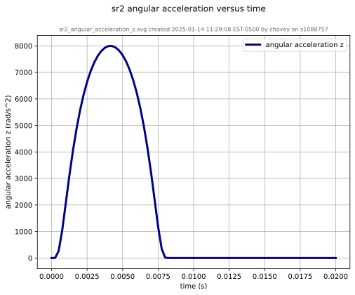 | 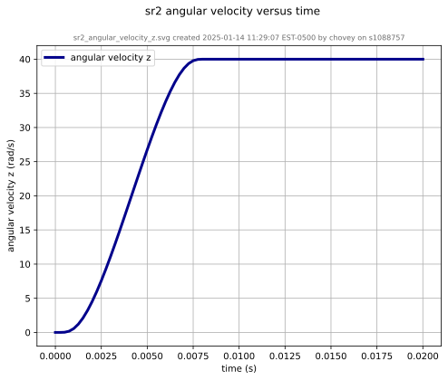 | 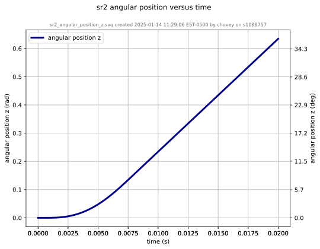

Figure: Rigid body (block 3) kinematics for `sr2`, the `sphere_resolution_2.exo` model.  The time history traces appear the same for the `sr3` and `sr4` models.

### Deformable Body

The following figure shows the maximum principal log strain for various resolutions and selected times.

resolution | 2 vox/cm | 4 vox/cm | 10 vox/cm
---------- | -------- | -------- | ---------
midline   |  |  | 
t=0.000 s |  |  | 
t=0.002 s |  |  | 
t=0.004 s |  |  | 
t=0.006 s |  |  | 
t=0.008 s |  |  | 
t=0.010 s |  |  | 
t=0.012 s |  |  | 
t=0.014 s |  |  | 
t=0.016 s |  |  | 
t=0.018 s |  |  | 
t=0.020 s |  |  | 
displacement | 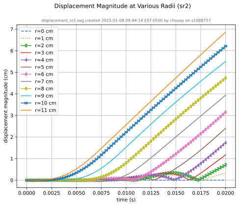 | 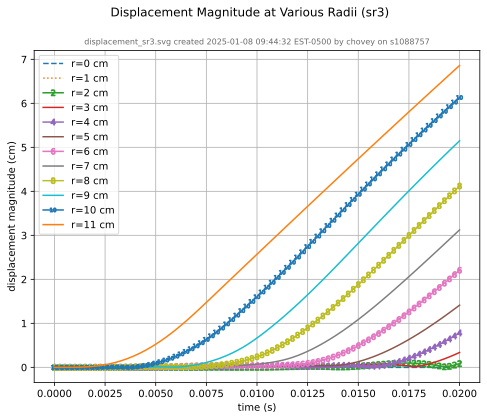 | 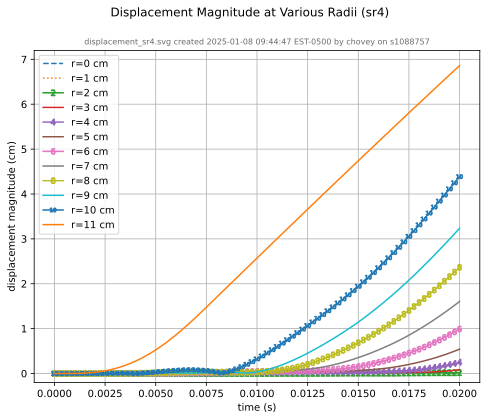
recipe | [displacement_sr2.yml](recipes/displacement_sr2.yml) | [displacement_sr3.yml](recipes/displacement_sr3.yml) | [displacement_sr4.yml](recipes/displacement_sr4.yml)
log strain | 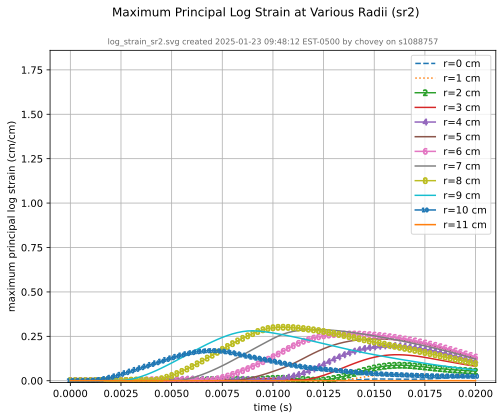 | 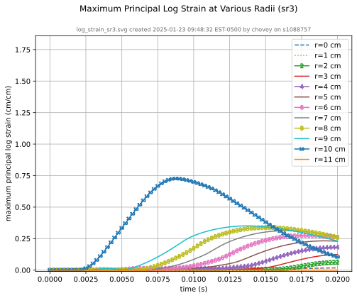 | 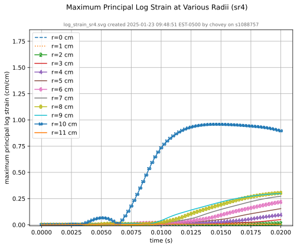
recipe | [log_strain_sr2.yml](recipes/log_strain_sr2.yml) | [log_strain_sr3.yml](recipes/log_strain_sr3.yml) | [log_strain_sr4.yml](recipes/log_strain_sr4.yml)
rate of deformation | 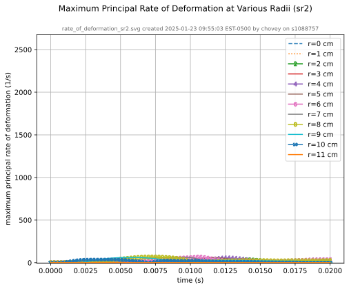 | 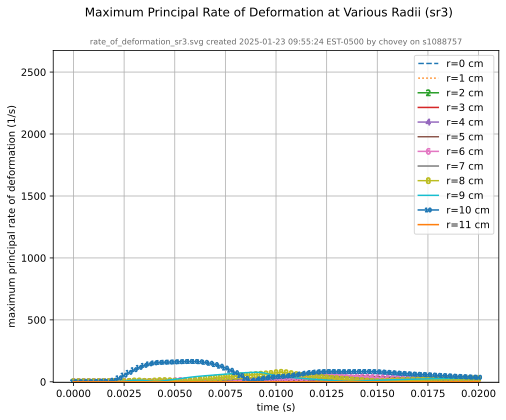 | 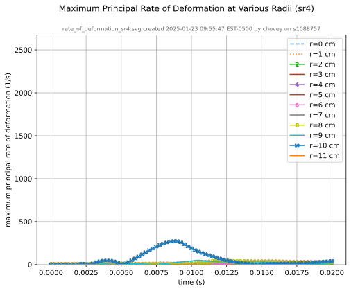
recipe | [rate_of_deformation_sr2.yml](recipes/rate_of_deformation_sr2.yml) | [rate_of_deformation_sr3.yml](recipes/rate_of_deformation_sr3.yml) | [rate_of_deformation_sr4.yml](recipes/rate_of_deformation_sr4.yml)

Figure:  Voxel mesh midline section, with contour plot of maximum principal log strain at selected times from 0.000 s to 0.020 s (1,000 Hz sample rate, $\Delta t$ = 0.001 s), and tracer plots at 1 cm interval along the $x$-axis for displacement magnitude, log strain, and rate of deformation (4,000 Hz acquisition rate, $\Delta t$ = 0.00025 s).

## References

[^Carlsen_2021]: Carlsen RW, Fawzi AL, Wan Y, Kesari H, Franck C. A quantitative relationship between rotational head kinematics and brain tissue strain from a 2-D parametric finite element analysis. Brain Multiphysics. 2021 Jan 1;2:100024.  [paper](https://1drv.ms/b/s!ApVSeeLlvsE8g9tyGKINkyp_5cb1hA?e=G9XGIZ)

[^Sierra_2022]: Beckwith FN, Bergel GL, de Frias GJ, Manktelow KL, Merewether MT, Miller ST, Parmar KJ, Shelton TR, Thomas JD, Trageser J, Treweek BC. Sierra/SolidMechanics 5.10 Theory Manual. Sandia National Lab. (SNL-NM), Albuquerque, NM (United States); Sandia National Lab. (SNL-CA), Livermore, CA (United States); 2022 Sep 1. [link](https://www.osti.gov/servlets/purl/1885094)

[^Sierra_examples_2024]: Thomas JD, Beckwith F, Buche MR, de Frias GJ, Gampert SO, Manktelow K, Merewether MT, Miller ST, Mosby MD, Parmar KJ, Rand MG, Schlinkman RT, Shelton TR, Trageser J, Treweek B, Veilleux MG, Wagman EB. Sierra/SolidMechanics 5.22 Example Problems Manual. Sandia National Lab. (SNL-NM), Albuquerque, NM (United States); Sandia National Lab. (SNL-CA), Livermore, CA (United States); 2024 Oct 1. [link](https://www.osti.gov/servlets/purl/2480120)
