# Dualization

Dualization is the process of using a primal mesh to construct a dual mesh.
Dualization can be performed on 2D/3D surface meshes composed of quadrilateral
elements, and 3D volumetric meshes composed of hexahedral elements.
Both quadrilateral and hexahedral elements will be discussed.

## Quadtree

With [`plot_quadtree_convention.py`](https://github.com/sandialabs/sibl/blob/master/geo/doc/plot_quadtree_convention.py), we create the following index scheme:


With [`fig_quadtree.tex`](https://github.com/sandialabs/sibl/blob/master/geo/doc/fig_quadtree.tex), we create the following image of the inverted tree:


With [`plot_quadtree.py`](https://github.com/sandialabs/sibl/blob/master/geo/doc/plot_quadtree.py), we plot a domain

* A square domain `L0` $$(x, y) \in ([1, 3] \otimes  [-1, 1])$$
* Single point at `(2.6, 0.6)` to trigger refinement.

Level 0 | 1 | 2
--- | --- | ---
 |  | 

3 | 4 | 5
--- | --- | ---
 |  | 

### Circle from Segmentation

We illustrate the **segmentation start point** as it applies to quadtree formation.

* For a segmentation at a given resolution of pixels, we immerse the segmentation into a single-cell (`L0`) quadtree domain.
* We pad the segmentation margins with void (segmentation ID `0`) such that the pixel count in all directions ($x$ and $y$)
  * is the same, and
  * is divisible by 2 for $n$ cell subdivisions.
* For each cell in the quadtree, we process the cells recursively and ask this question:  Does the cell contain more than one material?  If yes, then subdivide; if no, then do not subdivide.

3 | 4 | 5 | 6
--- | --- | --- | ---
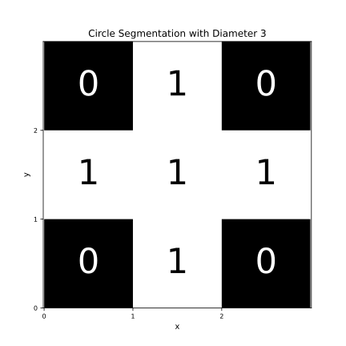 |  | 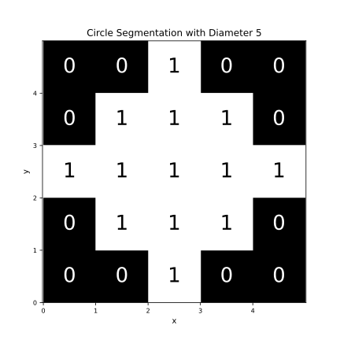 | 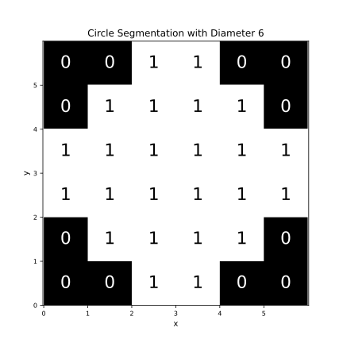

13 | 14 | 15 | 16
--- | --- | --- | ---
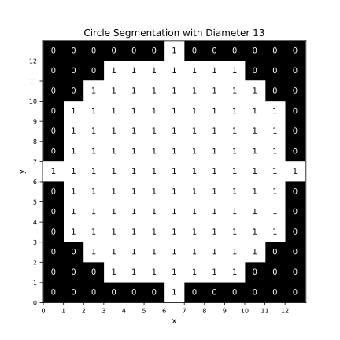 | 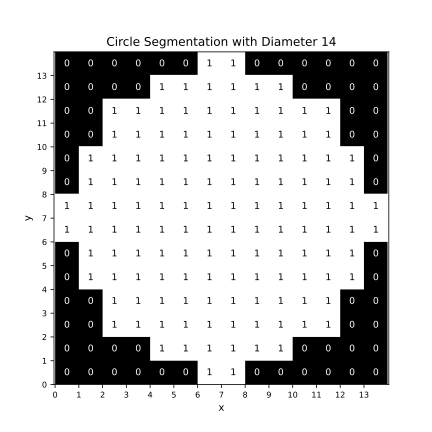 | 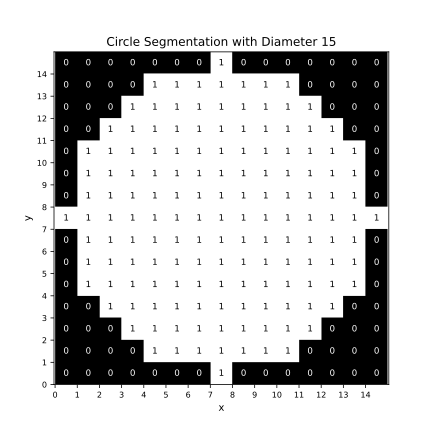 | 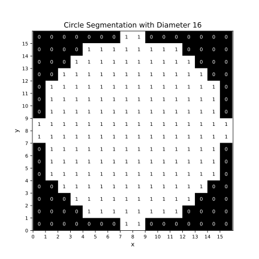


### Circle from Boundary

We illustrate the **boundary start point** as it applies to quadtree formation.

* We define a boundary as directed series of connected, discrete points that create a closed-loop, non-intersecting path.
* We immerse the boundary into a single-cell (`L0`) quadtree domain.
* For each cell in the quadtree, we process the cells recursively and ask this question:  Does the cell contain at least one boundary point?  If yes, then subdivide; if no, then do not subdivide.

Consider a boundary of a circle defined by discrete `(x, y)` points.

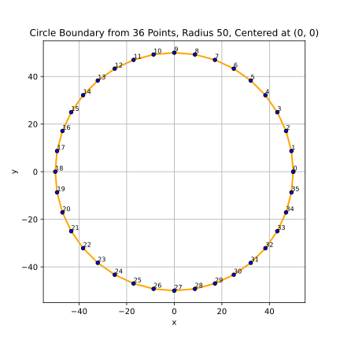

Level 0 | 1 | 2
--- | --- | ---
|  | 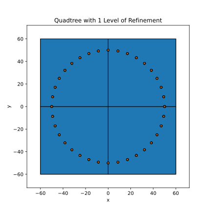 | 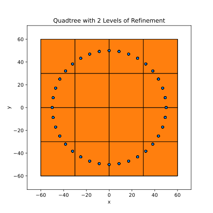

3 | 4 | 5
--- | --- | ---
 |  | 


### Circle from Tesellation

We illustrate the **tesellation** as it applies to quadtree formation.

* We immerse the tesellation into a single-cell (`L0`) quadtree domain.
* We create a boundary of the tesellation with points that lie on the boundary of the tesellation.
* We immerse the boundary into a single-cell (`L0`) quadtree domain.
* For each cell in the quadtree, we process the cells recursively and ask this question:  Does the cell contain at least one boundary point?  If yes, then subdivide; if no, then do not subdivide.

### Quarter Plate

With [Python](#source), we produce a Quadtree with zero to five levels of refinement.  Refinement is triggered based on whether or not a cell contains one or more seed points, shown as points along the quarter circle centered at `(4, 0)`.

Level 0 | 1 | 2
--- | --- | ---
| 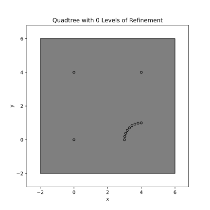 |  | 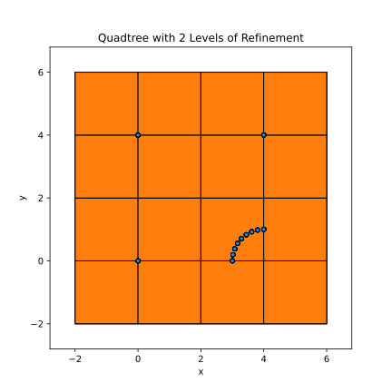

3 | 4 | 5
--- | --- | ---
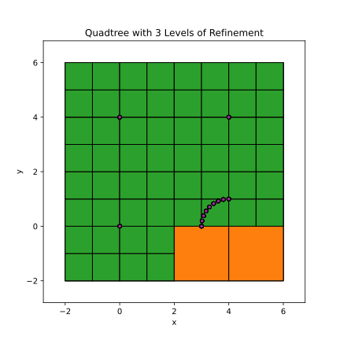 |  | 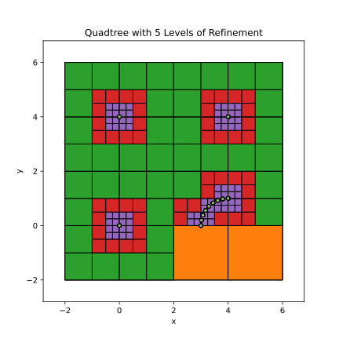

## Octree


## Sphere

Consider a boundary of a sphere defined by a discrete triangular
tesselation.

## References

* [https://github.com/sandialabs/sibl/blob/master/geo/doc/quadtree.md](https://github.com/sandialabs/sibl/blob/master/geo/doc/quadtree.md)
* [https://github.com/sandialabs/sibl/blob/master/geo/doc/dual_quad_transitions.md](https://github.com/sandialabs/sibl/blob/master/geo/doc/dual_quad_transitions.md)
* [https://github.com/sandialabs/sibl/blob/master/geo/doc/dual/lesson_11.md](https://github.com/sandialabs/sibl/blob/master/geo/doc/dual/lesson_11.md)

## Source

### `quadtree_plot.py`

```python
<!-- cmdrun cat code/quadtree_plot.py -->
```
