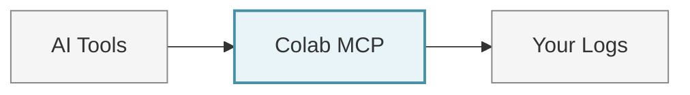
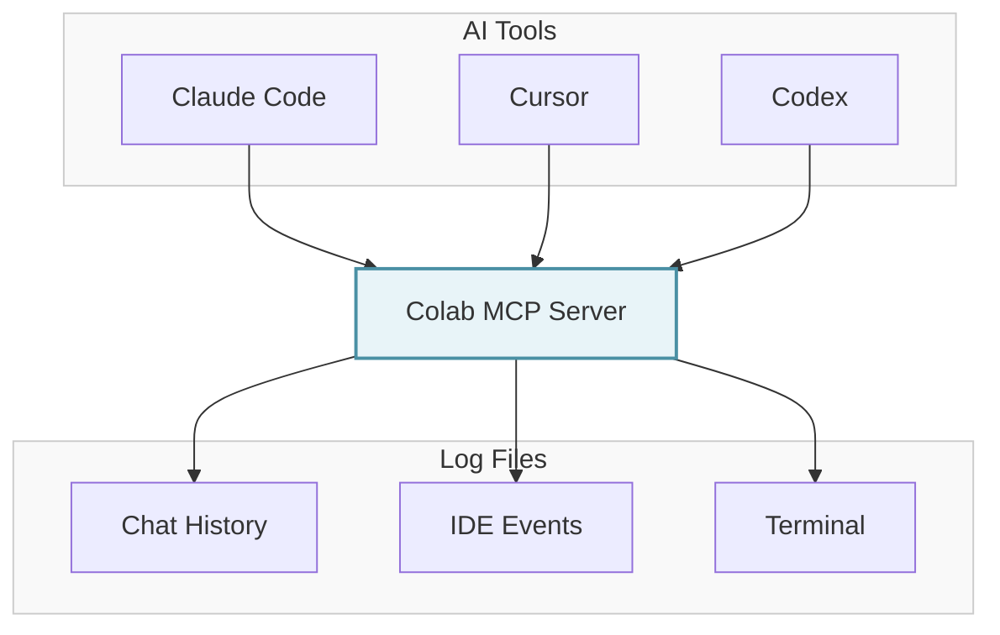

# Colab MCP 🔗

> **Stop losing context when you switch between AI coding tools.**

A Model Context Protocol (MCP) server that lets Claude Code, Cursor, Codex, and other AI coding assistants share logs and session history with each other.

[](https://badge.fury.io/py/colab-mcp)
[](https://opensource.org/licenses/MIT)

## The Problem

You're coding with Claude Code. You make progress. Then you switch to Cursor to test something. Now you've lost all your context. You explain everything again. Then you jump to Codex. Explain it all over again. 

**It's exhausting.**

## The Solution

Colab MCP is a shared MCP server that exposes your chat logs, terminal history, and IDE events as **tools** and **resources** across all your AI coding assistants.

When you switch tools, your AI already knows what you were working on. No more copy-pasting. No more re-explaining. Just continuous flow.

---

## ✨ Features

- 🔄 **Share context across tools** - Claude Code, Cursor, Codex, Gemini
- 📜 **Access chat transcripts** from previous sessions
- 🔍 **Search across all logs** - find that conversation from last week
- 🎯 **Session summaries** - quick overview of what you were working on
- 🖥️ **Terminal & IDE event tracking** - see what commands were run
- 🚀 **Fast setup** - one command to install across all your tools

---

## 🏗️ How It Works

Colab MCP sits between your AI coding tools and your local log files, giving all your assistants access to shared context.



**The Flow:**

1. **You work with Claude Code** - Have a great conversation about architecture
2. **Logs are saved automatically** - Claude stores the session in `~/.claude/`
3. **You switch to Cursor** - Time to write some code
4. **Cursor asks Colab MCP** - "What was discussed earlier?"
5. **MCP reads the logs** - Fetches your Claude session from disk
6. **Context restored** - Cursor now knows everything Claude knew

No cloud sync. No APIs. Just local files read by a local server.

**Installation is simple:**

- Run `sudo ./install.py`
- Installer detects which AI tools you have (Claude, Cursor, Codex, Gemini)
- Choose which ones to configure
- Installer writes MCP config files for each tool
- Restart your tools - done!

**Context sharing in practice:**

You can ask any AI tool things like:
- "What was I working on yesterday?"
- "Search my logs for authentication discussions"
- "Summarize my last Cursor session"
- "What errors did I hit this morning?"

And they'll actually know, because they can all read the same logs through Colab MCP.

---

## 🚀 Quick Start

### 1. Install

```bash
pip install colab-mcp
```

### 2. Configure Your AI Tools

Run the interactive installer:

```bash
sudo python -m colab_mcp.install
```

Or use the standalone installer script:

```bash
sudo ./install.py
```

The installer will:
- 🔍 Detect which AI coding tools you have installed
- ✅ Let you choose which ones to configure
- ⚙️ Add Colab MCP to their MCP server configs
- 📝 Give you instructions to restart each tool

### 3. Restart Your AI Tools

Restart Claude Code, Cursor, Codex, or whichever tools you configured.

That's it! 🎉

---

## 📖 Usage

Once installed, Colab MCP exposes several tools and resources to your AI assistants:

### Tools

- **`list_sessions`** - Get a list of all coding sessions
- **`fetch_transcript`** - Retrieve the full transcript of a session
- **`summarize_session`** - Get a quick summary of what happened
- **`search_logs`** - Search across all logs (chat, MCP, IDE events)
- **`codex_status`** - Check recent Codex CLI activity

### Example Prompts

Try asking your AI assistant:

> "What was I working on in my last session?"

> "Search my logs for discussions about authentication"

> "Summarize my session from yesterday afternoon"

> "What errors did I encounter in the last hour?"

---

## 🛠️ Manual Configuration

If you prefer to configure manually, add this to your MCP config:

### Claude Code (`~/.claude/mcp.json`)

```json
{
  "servers": {
    "colab-mcp": {
      "command": "colab-mcp",
      "env": {
        "CLAUDE_HOME": "/home/yourusername/.claude",
        "CURSOR_LOGS": "/home/yourusername/.cursor-server/data/logs",
        "TMPDIR": "/tmp"
      }
    }
  }
}
```

### Cursor (`~/.cursor/mcp.json`)

```json
{
  "mcpServers": {
    "colab-mcp": {
      "command": "colab-mcp",
      "env": {
        "CLAUDE_HOME": "/home/yourusername/.claude",
        "CURSOR_LOGS": "/home/yourusername/.cursor-server/data/logs",
        "TMPDIR": "/tmp"
      }
    }
  }
}
```

### Codex (`~/.codex/config.toml`)

```toml
[mcp_servers.colab-mcp]
command = "colab-mcp"
args = []
env = { CLAUDE_HOME = "/home/yourusername/.claude", CURSOR_LOGS = "/home/yourusername/.cursor-server/data/logs", TMPDIR = "/tmp" }
```

---

## 🗂️ Architecture



---

## 🤝 Contributing

Contributions are welcome! Check out the [docs/](docs/) folder for more detailed information about how Colab MCP works.

---

## 📝 License

MIT License - see [LICENSE](LICENSE) for details.

---

## 🙏 Acknowledgments

Built with [FastMCP](https://github.com/jlowin/fastmcp) - the fastest way to build MCP servers in Python.

---

**Made with ❤️ by developers tired of losing context**

