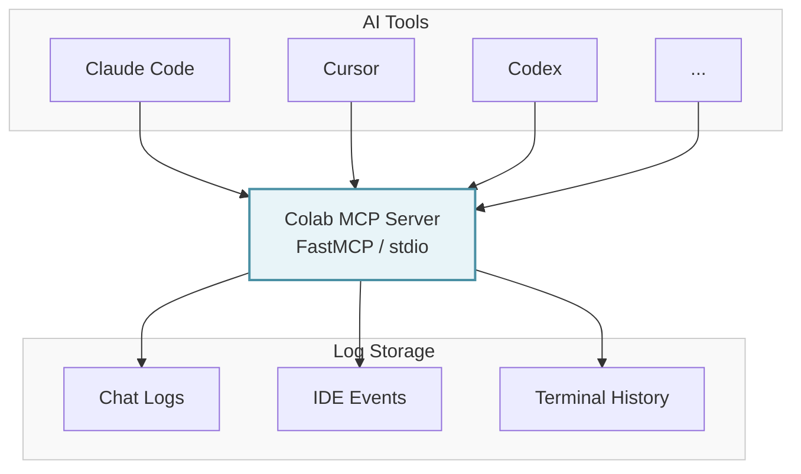
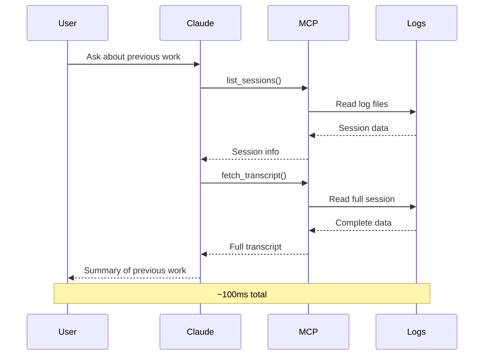

# How It Works

Technical overview for the curious.

## Architecture

Colab MCP is a **FastMCP server** that runs locally on your machine and exposes your AI tool logs through the Model Context Protocol.



## Components

### 1. The MCP Server (`main.py`)

Built on FastMCP, this is the core server that:

- Listens on stdio (standard input/output)
- Implements MCP tools and resources
- Handles requests from AI assistants
- Reads and parses various log formats

### 2. Path Detection (`paths.py`)

Automatically discovers where your AI tools store their data:

- `~/.claude/` - Claude Desktop chat history
- `~/.cursor-server/data/logs/` - Cursor IDE events  
- `~/.cache/claude-cli-nodejs/` - Claude CLI MCP logs
- `~/.codex/` - Codex CLI sessions

Works across Linux, macOS, and (mostly) Windows.

### 3. Log Readers (`readers.py`)

Parsers for different log formats:

- **Claude chat logs** - JSONL format with messages, timestamps, roles
- **Cursor events** - JSON logs of IDE actions (file opens, edits, errors)
- **MCP logs** - Protocol-level communication logs
- **Codex history** - Terminal session transcripts

Each parser is resilient to format changes and partial files.

### 4. Services Layer (`services.py`)

Business logic that combines raw logs into useful outputs:

- **`list_session_files()`** - Finds all sessions across tools
- **`session_metadata()`** - Extracts timestamps, message counts, CWD
- **`build_context_bundle()`** - Assembles full transcripts with pagination
- **`search_across()`** - Full-text search across all logs
- **`codex_summary()`** - Recent Codex activity digest

### 5. The Installer (`install.py`)

Interactive TUI (Terminal User Interface) that:

- Detects which AI tools you have installed
- Shows a nice selection menu (with Rich library)
- Writes MCP config to the right places for each tool
- Handles ownership/permissions when run with sudo

## The MCP Protocol

MCP (Model Context Protocol) is Anthropic's standard for extending AI assistants with external tools and data.

### Tools

Think of these like function calls. Your AI can invoke them to perform actions:

```python
# Example tool call from Claude:
list_sessions(filter_project="my-app")

# Response:
[
  {"session_id": "abc123", "timestamp": "2025-10-01T14:30:00Z", ...},
  ...
]
```

### Resources  

These are data sources your AI can read:

```python
# Example resource request:
fetch_resource("session://abc123/transcript")

# Response: full chat transcript as JSON
```

Colab MCP exposes **5 tools** and dynamically generates **resources** for each session.

## Data Flow Example

Let's say you ask Claude Code:

> "What was I working on in my last Cursor session?"

Here's what happens:



All of this happens in ~100ms. 

## Security & Privacy

**Your data never leaves your machine.**

- No cloud services
- No external API calls  
- Everything runs locally
- Logs are read-only (never modified)

The only thing that sees your logs:

- The Colab MCP server (running on your machine)
- Your AI assistants (running on your machine)
- That's it.

If you're using cloud-based AI assistants (like Claude Desktop with Anthropic's API), the logs are sent to the AI provider only when you explicitly ask for them. This is no different than you copy-pasting chat history manually.

## Performance

Colab MCP is **fast**:

- Written in Python with async/await
- Lazy loading (doesn't read logs until needed)
- Efficient JSONL streaming for large files
- No database required (reads directly from log files)

Typical operations:

- List sessions: **< 50ms**
- Fetch transcript: **< 200ms** (depends on size)
- Search logs: **< 500ms** (depends on corpus size)

## Extensibility

Want to add support for a new AI tool?

1. Add a detection function in `paths.py`
2. Add a reader in `readers.py` if it has a custom format
3. Add an installer in `install.py`
4. Done!

The architecture is designed to be modular. PRs welcome. 😊

## Tech Stack

- **FastMCP** - MCP server framework
- **Pydantic** - Data validation and serialization
- **Rich** - Beautiful terminal UI for installer
- **Python 3.10+** - Modern async/await syntax

No database. No web server. No containers. Just a simple stdio server.

## What's Next?

Check out [Usage Examples](usage-examples.md) to see real-world scenarios, or head to [Contributing](contributing.md) if you want to help make this better!

