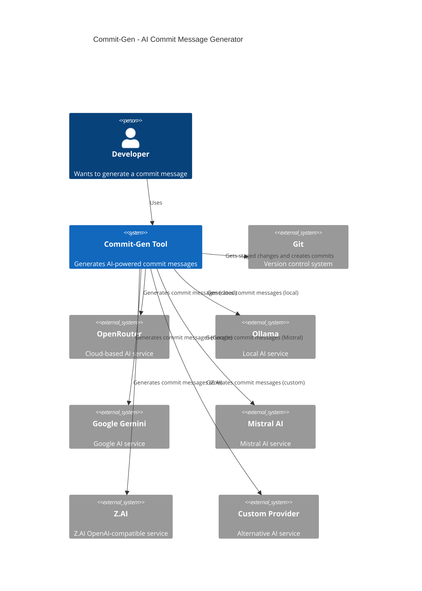

# Commit-Gen - AI-Powered Git Commit Message Generator

Commit-Gen is a command-line tool that automatically generates conventional commit messages using AI. It supports multiple AI providers including OpenRouter, Ollama, Google Gemini, Mistral AI, Z.AI, and custom providers.

## Features

- Generate commit messages using AI based on your staged changes
- **Interactive file selection** - Choose which files to commit
- Support for multiple AI providers:
    - **OpenRouter** (cloud-based, multiple models)
    - **Ollama** (local, requires Ollama installation)
    - **Google Gemini** (cloud-based, powerful models)
    - **Mistral AI** (cloud-based, high performance)
    - **Z.AI** (cloud-based, OpenAI-compatible)
    - **Custom providers** (your own configuration)
- Interactive setup wizard
- Easy configuration management
- Customizable models and prompts
- Optional automatic pushing to remote repository

## Installation

### Method 1: Using pip (Recommended)

```bash
pip install commit-gen
```

### Method 2: Manual Installation

1. Clone this repository:
   ```
   git clone "https://gitlab.mobio.vn/mobio/tools/gen-commit-message.git"
   cd gen-commit-message
   ```

2. Make the script executable:
   ```
   chmod +x install.sh
   ```
3. Install
   ```
   ./install.sh
   ```

## Quick Setup

### Interactive Setup Wizard (Recommended)

```bash
commit-gen --setup
```

This will guide you through:
- Selecting a provider
- Setting up API keys
- Configuring models
- Testing the connection

### Manual Setup

```bash
# Show available providers
commit-gen --providers

# Set provider
commit-gen --set-provider gemini
commit-gen --set-provider mistral
commit-gen --set-provider openrouter
commit-gen --set-provider ollama
commit-gen --set-provider zai
commit-gen --set-provider custom

# Set API key
commit-gen --set-api-key YOUR_API_KEY

# Set model (optional)
commit-gen --set-model gemini-2.5-pro

# Show current configuration
commit-gen --config
```

## Usage

### File Selection Options

**Interactive Selection (Default):**
```bash
commit-gen
# Opens interactive file selection with arrow keys
```

**Specific Files:**
```bash
commit-gen --files file1.py file2.txt
# Stage specific files only
```

**All Files:**
```bash
commit-gen --all
# Stage all modified files (legacy behavior)
```

**Force Interactive:**
```bash
commit-gen --interactive
# Force interactive selection even with other options
```

### File Selection Interface

When you run `commit-gen` without arguments, you'll see an interactive interface with arrow key navigation:

```
📁 Files to commit:
============================================================
Use ↑/↓ to navigate, SPACE to toggle, ENTER to confirm
a=select all, n=select none, s=skip (stage all), q=quit

📂 CODE:
→ [ ] commit_gen/cli.py (modified, 18KB)
  [x] demo_file2.py (added, 13B) ✅
  [ ] README.md (modified, 9KB)
  [ ] arrow_config.json (untracked, 12B)

Selected: 1/4 files
```

**Navigation Controls:**
- **↑/↓ Arrow Keys**: Navigate through files
- **SPACE**: Toggle file selection (check/uncheck)
- **ENTER**: Confirm selection and proceed
- **a**: Select all files
- **n**: Select none (use only already staged files)
- **s**: Skip selection (stage all files)
- **q**: Quit without committing

**Visual Indicators:**
- **→**: Current cursor position
- **[x]**: Selected file
- **[ ]**: Unselected file
- **✅**: Already staged file
- **Selected: X/Y files**: Shows selection count

**Features:**
- **Status indicators**: Shows if files are modified, added, or untracked
- **Size information**: Displays file sizes
- **Staged markers**: Shows which files are already staged
- **Real-time selection**: See selection count update as you navigate
- **Keyboard navigation**: Intuitive arrow key and spacebar controls

### Commit Confirmation

After selecting files, commit-gen will:

1. **Generate AI commit message**
2. **Show commit message for review**
3. **Allow editing** (with external editor or simple input)
4. **Confirm before committing**

**Commit Review Interface:**
```
🤖 Generating commit message...

📝 Edit commit message:
============================================================
Current commit message:
------------------------------
feat: add interactive file selection with arrow keys

- Implement arrow key navigation for file selection
- Add spacebar toggle for file selection
- Improve UX with visual indicators and real-time feedback
------------------------------

Options:
1. Edit message
2. Use as-is
3. Cancel
```

**Commit Confirmation:**
```
🔍 Commit Review:
============================================================
Commit message:
------------------------------
feat: add interactive file selection with arrow keys

- Implement arrow key navigation for file selection
- Add spacebar toggle for file selection
- Improve UX with visual indicators and real-time feedback
------------------------------

Options:
1. ✅ Yes, commit
2. 🚀 Yes, commit and push
3. ❌ No, go back to editing
4. 🚪 Cancel
```

**Confirmation Options:**
- **Yes, commit**: Commit only
- **Yes, commit and push**: Commit and push to remote
- **No, go back to editing**: Return to edit commit message
- **Cancel**: Exit without committing

**Editing Options:**
- **External Editor**: Uses `$EDITOR` (default: nano)
- **Simple Input**: Fallback if editor not available
- **Validation**: Ensures commit message is not empty

### Basic Usage

**Simple commit:**
```bash
commit-gen
# Interactive file selection → AI commit message → Review → Confirm
```

**Commit and push:**
```bash
commit-gen --push
# Same as above but with "commit and push" option
```

**Quick commit with specific files:**
```bash
commit-gen --files src/main.py tests/test_main.py
# Stage specific files → AI commit message → Review → Confirm
```

## Provider Setup

### OpenRouter (Default)

1. Get an API key from [OpenRouter](https://openrouter.ai)
2. Set up your API key:
   ```
   commit-gen --set-provider openrouter
   commit-gen --set-api-key YOUR_API_KEY
   ```

### Ollama (Local)

1. [Install Ollama](https://ollama.ai)
2. Start Ollama server:
   ```
   ollama serve
   ```
3. Pull the model you want to use (default is `codellama`):
   ```
   ollama pull codellama
   ```
4. Switch to Ollama provider:
   ```
   commit-gen --set-provider ollama
   ```

### Google Gemini

1. Get an API key from [Google AI Studio](https://ai.google.dev/)
2. Set up your API key:
   ```
   commit-gen --set-provider gemini
   commit-gen --set-api-key YOUR_API_KEY
   ```

### Mistral AI

1. Get an API key from [Mistral AI](https://console.mistral.ai/)
2. Set up your API key:
   ```
   commit-gen --set-provider mistral
   commit-gen --set-api-key YOUR_API_KEY
   ```

### Z.AI

1. Get an API key from [Z.AI Open Platform](https://docs.z.ai/guides/overview/quick-start)
2. Set up your API key and select provider:
   ```
   commit-gen --set-provider zai
   commit-gen --set-api-key YOUR_API_KEY
   # Optional: set model (default is `glm-4.6`)
   commit-gen --set-model glm-4.6
   ```
3. Notes:
   - Uses endpoint `https://api.z.ai/api/paas/v4/chat/completions`
   - OpenAI-compatible request/response shape (non-stream)

### Custom Provider

1. Set up your custom provider:
   ```
   commit-gen --set-provider custom
   commit-gen --set-base-url https://your-api-endpoint.com/v1
   commit-gen --set-api-key YOUR_API_KEY
   commit-gen --set-model your-model-name
   ```

## Using Custom Prompts

You can customize the prompt used to generate commit messages:

1. Provide a prompt directly via command-line:
   ```
   commit-gen --prompt "Generate a commit message for these changes: {changes}"
   ```

2. Save a prompt from a file for repeated use:
   ```
   commit-gen --save-prompt my-prompt.txt
   ```

The prompt can include the following placeholders:
- `{changes}` - Will be replaced with the list of changed files
- `{diff_content}` - Will be replaced with the full diff content

Example prompt file:
```
Generate a commit message for these changes:

Changed files:
{changes}

Code changes:
{diff_content}

The commit message should follow this format:
[TYPE]: Short description

Detailed explanation

Types: FEATURE, FIX, DOCS, STYLE, REFACTOR, TEST, CHORE
```

## Configuration Commands

### Show Information

```bash
# Show current configuration
commit-gen --config

# Show available providers
commit-gen --providers
```

### Set Configuration

```bash
# Set provider
commit-gen --set-provider gemini

# Set API key
commit-gen --set-api-key YOUR_API_KEY

# Set model
commit-gen --set-model gemini-2.5-pro

# Set base URL (for custom provider)
commit-gen --set-base-url https://your-api.com/v1
```

## All Options

```
Usage: commit-gen [options]

Main Options:
  --debug               Enable debug mode
  --push                Push changes after commit
  --setup               Interactive setup wizard
  --config              Show current configuration
  --providers           Show available providers

File Selection:
  --all                 Stage all files (legacy behavior)
  --files FILES         Stage specific files
  --interactive         Interactive file selection

Configuration:
  --set-provider        Set provider (openrouter, ollama, gemini, mistral, zai, custom)
  --set-api-key         Set API key
  --set-model           Set model name
  --set-base-url        Set base URL for custom provider

Changelog:
  --changelog           Generate a changelog
  --compare-branch      Branch to compare against when generating changelog
  --changelog-file      Filename for the changelog

Legacy Options:
  --provider            Set the provider (legacy)
  --model               Set the model name (legacy)
  --api-key             Set the API key (legacy)
  --base-url            Set the base URL for custom provider (legacy)
  --prompt              Set a custom prompt
  --save-prompt         Save custom prompt to file
  --use-ollama          Use Ollama as the provider (legacy)
  --use-openrouter      Use OpenRouter as the provider (legacy)
  --use-custom          Use custom provider with base URL (legacy)
```

## Configuration

Configuration is stored in `~/.config/git-commit-ai/` directory:
- API key: `~/.config/git-commit-ai/config`
- Model: `~/.config/git-commit-ai/model`
- Provider: `~/.config/git-commit-ai/provider`
- Base URL: `~/.config/git-commit-ai/base_url`
- Custom prompt: `~/.config/git-commit-ai/prompt`

## Troubleshooting

### Issue: Command not found after installation

If `commit-gen` command is not found after installation:

1. **Check if symlink exists:**
   ```bash
   ls -la /usr/local/bin/commit-gen
   ```

2. **If symlink is broken, recreate it:**
   ```bash
   sudo ln -s /path/to/your/project/commit-gen.py /usr/local/bin/commit-gen
   ```

3. **For pip installation, check PATH:**
   ```bash
   which commit-gen
   echo $PATH
   ```

### Issue: Configuration files not cleaned up

If configuration files remain after uninstallation:

```bash
rm -rf ~/.config/git-commit-ai/
```

### Issue: Multiple installations conflict

If you have both manual installation and pip installation:

1. **Uninstall both:**
   ```bash
   ./uninstall.sh
   pip uninstall commit-gen
   ```

2. **Choose one installation method:**
    - For development: Use manual installation (`./install.sh`)
    - For production: Use pip installation (`pip install commit-gen`)

### Issue: API Key not working

1. **Check if API key is set:**
   ```bash
   commit-gen --config
   ```

2. **Set API key:**
   ```bash
   commit-gen --set-api-key YOUR_API_KEY
   ```

3. **Test with setup wizard:**
   ```bash
   commit-gen --setup
   ```

### Issue: No files to commit

If you see "No staged changes found":

1. **Check if you're in a git repository:**
   ```bash
   git status
   ```

2. **Make some changes to files first:**
   ```bash
   echo "test" > new_file.txt
   ```

3. **Use interactive file selection:**
   ```bash
   commit-gen
   ```

## Architecture



## License

MIT
