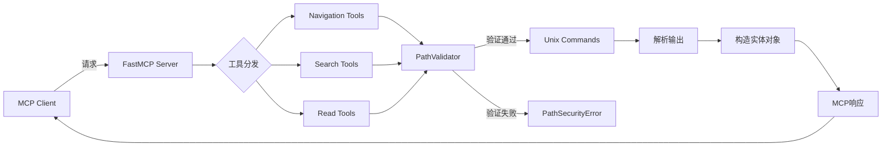

# Data Model

**Feature**: MCP 项目上下文集成服务
**Date**: 2025-10-03

## 概述

本服务主要处理文件系统元数据和操作结果,不涉及持久化数据存储。所有实体都是请求-响应周期内的临时数据结构。

---

## 核心实体

### 1. ProjectConfig
**用途**: 服务配置,从环境变量加载

**字段**:
| 字段名 | 类型 | 必填 | 默认值 | 说明 | 来源需求 |
|--------|------|------|--------|------|---------|
| root_path | Path | ✅ | - | 项目根目录绝对路径 | FR-026 |
| search_timeout | int | ❌ | 60 | 搜索操作超时秒数 | FR-024 |
| log_retention_days | int | ❌ | 7 | 日志保留天数 | FR-025 |

**验证规则**:
- `root_path`必须是已存在的目录
- `search_timeout` > 0
- `log_retention_days` ≥ 1

**状态转换**: 不可变对象,服务启动时初始化

---

### 2. FileEntry (目录条目)
**用途**: 表示目录列表中的单个文件或目录

**字段**:
| 字段名 | 类型 | 必填 | 说明 | 来源需求 |
|--------|------|------|------|---------|
| name | str | ✅ | 文件/目录名称 | FR-001 |
| type | Literal["file", "dir"] | ✅ | 类型标识 | FR-001 |
| size | int | ✅ | 文件大小(字节),目录为0 | FR-002 |
| mtime | float | ✅ | 最后修改时间(Unix时间戳) | FR-002 |
| path | str | ✅ | 相对于项目根目录的路径 | FR-001 |

**排序支持**:
- 按`name`排序(字母序)
- 按`size`排序(数值)
- 按`mtime`排序(时间)
- 支持升序/降序

---

### 3. SearchMatch (搜索匹配结果)
**用途**: 表示单个搜索匹配项

**字段**:
| 字段名 | 类型 | 必填 | 说明 | 来源需求 |
|--------|------|------|------|---------|
| file_path | str | ✅ | 匹配文件相对路径 | FR-013 |
| line_number | int | ✅ | 匹配行号(从1开始) | FR-013 |
| line_content | str | ✅ | 匹配行的完整内容 | FR-006 |
| match_start | int | ❌ | 匹配起始位置(列号) | 扩展字段 |
| match_end | int | ❌ | 匹配结束位置(列号) | 扩展字段 |

**关系**:
- 一个搜索查询返回0-N个SearchMatch
- 按file_path + line_number排序

---

### 4. SearchQuery (搜索查询参数)
**用途**: 封装搜索请求的所有参数

**字段**:
| 字段名 | 类型 | 必填 | 默认值 | 说明 | 来源需求 |
|--------|------|------|--------|------|---------|
| query | str | ✅ | - | 搜索文本或正则表达式 | FR-006 |
| file_pattern | str | ❌ | "*" | 文件名glob模式 | FR-009 |
| path | str | ❌ | "." | 搜索起始路径(相对) | FR-008 |
| use_regex | bool | ❌ | False | 是否使用正则表达式 | FR-007 |
| exclude_query | str | ❌ | "" | 排除匹配模式 | FR-010 |
| timeout | int | ❌ | 60 | 超时秒数 | FR-024 |

**验证规则**:
- `query`非空
- `path`必须在项目根目录内(安全检查)
- `file_pattern`是有效的glob模式
- 如果`use_regex=True`, `query`必须是有效正则表达式

---

### 5. FileContent (文件内容)
**用途**: 封装文件读取结果

**字段**:
| 字段名 | 类型 | 必填 | 说明 | 来源需求 |
|--------|------|------|------|---------|
| file_path | str | ✅ | 文件相对路径 | FR-014 |
| content | str | ✅ | 文件文本内容 | FR-014 |
| encoding | str | ✅ | 检测到的编码(如"utf-8") | FR-018 |
| line_count | int | ✅ | 总行数 | FR-015 |
| is_partial | bool | ✅ | 是否部分读取 | FR-015, FR-016 |

**特殊情况**:
- 如果是二进制文件,抛出`BinaryFileError`而非返回FileContent(FR-018a)
- 如果文件不存在,抛出`FileNotFoundError`(FR-021)

---

### 6. TreeNode (树状结构节点)
**用途**: 表示目录树的单个节点

**字段**:
| 字段名 | 类型 | 必填 | 说明 | 来源需求 |
|--------|------|------|------|---------|
| name | str | ✅ | 文件/目录名称 | FR-004 |
| type | Literal["file", "dir"] | ✅ | 类型 | FR-004 |
| children | list[TreeNode] | ❌ | 子节点(仅目录有) | FR-004 |
| depth | int | ✅ | 当前深度(根为0) | FR-005 |

**递归结构**: 通过`children`字段形成树

**深度限制**: 由`max_depth`参数控制,超出时不展开children

---

## 异常类型

### MCPError (基类)
所有业务异常的基类

### PathSecurityError < MCPError
**触发条件**: 请求路径不在配置的根目录内(FR-020)
**字段**:
- `requested_path`: str
- `root_path`: str

### BinaryFileError < MCPError
**触发条件**: 尝试读取二进制文件(FR-018a)
**字段**:
- `file_path`: str

### SearchTimeoutError < MCPError
**触发条件**: 搜索操作超时(FR-024)
**字段**:
- `timeout_seconds`: int
- `partial_results`: list[SearchMatch] | None

### PermissionDeniedError < MCPError
**触发条件**: 文件权限错误(FR-022)
**字段**:
- `file_path`: str
- `operation`: str (e.g., "read", "list")

---

## 类型定义(Python)

```python
from typing import Literal, Optional
from pathlib import Path
from dataclasses import dataclass
from datetime import datetime

@dataclass(frozen=True)
class ProjectConfig:
    root_path: Path
    search_timeout: int = 60
    log_retention_days: int = 7

@dataclass
class FileEntry:
    name: str
    type: Literal["file", "dir"]
    size: int
    mtime: float
    path: str

@dataclass
class SearchMatch:
    file_path: str
    line_number: int
    line_content: str
    match_start: Optional[int] = None
    match_end: Optional[int] = None

@dataclass
class SearchQuery:
    query: str
    file_pattern: str = "*"
    path: str = "."
    use_regex: bool = False
    exclude_query: str = ""
    timeout: int = 60

@dataclass
class FileContent:
    file_path: str
    content: str
    encoding: str
    line_count: int
    is_partial: bool

@dataclass
class TreeNode:
    name: str
    type: Literal["file", "dir"]
    depth: int
    children: Optional[list['TreeNode']] = None

# 异常类
class MCPError(Exception):
    pass

class PathSecurityError(MCPError):
    def __init__(self, requested_path: str, root_path: str):
        self.requested_path = requested_path
        self.root_path = root_path
        super().__init__(f"Path {requested_path} outside root {root_path}")

class BinaryFileError(MCPError):
    def __init__(self, file_path: str):
        self.file_path = file_path
        super().__init__(f"Cannot read binary file: {file_path}")

class SearchTimeoutError(MCPError):
    def __init__(self, timeout_seconds: int, partial_results: Optional[list[SearchMatch]] = None):
        self.timeout_seconds = timeout_seconds
        self.partial_results = partial_results
        super().__init__(f"Search timed out after {timeout_seconds}s")

class PermissionDeniedError(MCPError):
    def __init__(self, file_path: str, operation: str):
        self.file_path = file_path
        self.operation = operation
        super().__init__(f"Permission denied: {operation} on {file_path}")
```

---

## 数据流



---

## 验证矩阵

| 实体 | 验证时机 | 验证规则 | 异常类型 |
|------|---------|---------|---------|
| ProjectConfig | 服务启动 | root_path存在且可读 | ValueError |
| SearchQuery | 工具调用前 | path在root内,regex有效 | PathSecurityError, ValueError |
| FileContent | 读取前 | 文件存在,非二进制,有权限 | FileNotFoundError, BinaryFileError, PermissionDeniedError |
| TreeNode | 构建时 | depth不超过max_depth | - |
| FileEntry | 列表时 | 无需额外验证(ls输出) | - |

---

## 与需求的映射

| 实体/字段 | 需求ID | 说明 |
|-----------|--------|------|
| ProjectConfig.root_path | FR-026 | 环境变量配置 |
| SearchQuery.timeout | FR-024 | 可配置超时 |
| FileEntry.{size,mtime} | FR-002 | 排序支持 |
| SearchMatch.line_number | FR-013 | 行号返回 |
| FileContent.encoding | FR-018 | 保持编码 |
| BinaryFileError | FR-018a | 二进制文件拒绝 |
| PathSecurityError | FR-020 | 路径安全 |
