# Core System gRPC Package

이 패키지는 Saladlab Core System의 gRPC 프로토 파일로 생성된 서버와 스텁을 관리합니다.

> 📋 **변경 이력**: 버전별 상세 변경사항은 [CHANGELOG.md](./CHANGELOG.md)를 참조하세요.
> 
> **최신 버전**: v0.8.2 (2025-10-01)
> - 상품 카테고리(Product Category) 도메인 추가
> - 상품과 카테고리 간 연결 구조 구현

## 🚀 빠른 시작

```bash
# 1. 의존성 설치
make install-deps
# 📦 의존성 설치 중...
# ✅ 의존성 설치 완료!

# 2. 기존 파일 정리 (중요!)
make clean
# 🧹 빌드 결과물 정리 중...
# ✅ 정리 완료!

# 3. proto 파일 컴파일
make compile-proto
# 🔧 proto 파일 컴파일 중...
# ✅ Proto 컴파일 및 패키지 구조 설정 완료!

# 4. 패키지 빌드
make build-package
# 📦 hatch로 패키지 빌드 중...
# ✅ 패키지 빌드 완료!
```

## 📋 사전 요구사항

- Python 3.11+
- uv (Python 패키지 매니저)
- Protocol Buffer 컴파일러 (grpcio-tools)

## 🛠️ 개발 환경 설정

### 1. 의존성 설치
```bash
make install-deps
```

이 명령어는 다음을 설치합니다:
- `grpcio-tools`: Protocol Buffer 컴파일러
- `hatch`: Python 패키지 빌드 도구
- 기타 개발 의존성

### 2. 로컬 개발
```bash
# proto 파일 수정 후
make compile-proto    # proto → Python 컴파일 (import 수정 포함)
make build-package    # 패키지 빌드
```

## 📦 빌드 시스템

### 주요 Makefile 타겟

| 타겟 | 설명 |
|------|------|
| `help` | 사용 가능한 모든 타겟 표시 |
| `install-deps` | 의존성 설치 (grpcio-tools 포함) |
| `compile-proto` | proto 파일을 Python으로 컴파일 (import 수정 포함) |
| `build-package` | hatch로 패키지 빌드 |
| `publish-pypi` | PyPI에 배포 |
| `clean` | 빌드 아티팩트 정리 |
| `clean-all` | 빌드 아티팩트 및 컴파일된 파일 정리 |

### 빌드 프로세스

```bash
# 1. 의존성 설치
make install-deps

# 2. 기존 파일 정리
make clean

# 3. proto 파일 컴파일 (로컬에서 수동 실행)
make compile-proto

# 4. 패키지 빌드
make build-package
```

**중요**: `compile-proto`는 다음을 순차적으로 실행합니다:
1. proto 파일을 Python으로 컴파일
2. `__init__.py` 파일 생성
3. import 경로 자동 수정

## 🧪 로컬 테스트

### 패키지 설치 및 테스트
```bash
# 개발 모드로 패키지 설치
make test-local

# 수동으로 테스트
python -c "import core_system_grpc; print('Import successful!')"
```

### 개별 단계별 테스트
```bash
# proto 컴파일만 테스트
make compile-proto

# 패키지 빌드만 테스트
make build-package
```

## 🚀 배포

### 로컬에서 배포 준비

```bash
# 1. 기존 컴파일된 파일 정리 (중요!)
make clean
# 🧹 빌드 결과물 정리 중...
# ✅ 정리 완료!

# 2. proto 파일 컴파일
make compile-proto
# 🔧 proto 파일 컴파일 중...
# 📁 Python 패키지 구조를 위한 __init__.py 파일 생성 중...
# 🔧 __init__.py 내용 동적 생성 중...
# 🔧 import 경로 수정 중...
# 📋 functions/ 폴더에서 함수 복사 중...
# ✅ functions/ 폴더에서 함수 복사 완료
# ✅ Proto 컴파일 및 패키지 구조 설정 완료!

# 3. 패키지 빌드
make build-package
# 📦 hatch로 패키지 빌드 중...
# ✅ 패키지 빌드 완료!

# 4. 변경사항 커밋 및 푸시
git add .
git commit -m "feat: 기능 추가 또는 변경사항"
git push origin main

# 5. 버전 태그 생성 및 푸시
git tag v0.8.0
git push origin v0.8.0
# 🚀 GitHub Actions가 자동으로 PyPI에 배포합니다!
```

> **🧹 중요**: 
> - `make clean`은 기존 빌드 결과물(`dist/`, `build/`, `*.egg-info/`)과 컴파일된 Python 파일(`core_system_grpc/`)을 모두 삭제합니다.
> - 이전 빌드의 잔여 파일로 인한 import 충돌을 방지하기 위해 반드시 실행해야 합니다.
> - proto 파일 수정 시 항상 `make clean` → `make compile-proto` 순서로 실행하세요.

### CI/CD 배포
GitHub Actions가 자동으로 다음을 수행합니다:
1. **Makefile 검증**: Makefile 존재 확인
2. **패키지 빌드**: `make build-package`로 최종 패키지 빌드
3. **PyPI 배포**: 검증된 패키지를 PyPI에 업로드
4. **배포 검증**: PyPI에서 패키지 설치 가능성 확인

**트리거 조건**:
- `v*` 태그 푸시 시 자동 배포
- GitHub Actions 워크플로우 수동 실행 가능

**CI/CD 워크플로우 단계**:
1. **환경 설정**: Python 3.11, pip 업그레이드
2. **의존성 설치**: hatch, twine, wheel 설치
3. **Makefile 검증**: Makefile 존재 확인
4. **패키지 빌드**: `make build-package` 실행
5. **PyPI 배포**: twine으로 패키지 업로드
6. **배포 검증**: PyPI에서 패키지 설치 테스트

> **⚠️ 중요**: CI/CD에서는 proto 컴파일을 수행하지 않습니다. 
> 반드시 로컬에서 `make compile-proto`를 실행한 후 커밋해야 합니다.

## 🔧 문제 해결

### Import 오류가 발생하는 경우
```bash
# 1. 기존 파일 정리
make clean
# 🧹 빌드 결과물 정리 중...

# 2. proto 컴파일 재실행 (import 수정 포함)
make compile-proto
# 🔧 proto 파일 컴파일 중...
# 🔧 import 경로 수정 중...

# 3. 전체 재빌드
make build-package
```

**원인**: 
- 이전 빌드의 잔여 파일로 인한 import 경로 충돌
- `scripts/fix_imports.py`가 실행되지 않아 상대 import가 남아있음

**해결**: `make clean` 후 `make compile-proto` 실행

---

### proto 파일 수정 후
```bash
# proto 파일이 수정된 경우 반드시 실행
make clean       # 🧹 기존 파일 정리
make compile-proto   # 🔧 새로 컴파일
make build-package   # 📦 패키지 빌드
```

**중요**: proto 파일 수정 시 항상 `make clean`부터 시작하세요!

---

### 빌드 실패 시
```bash
# 완전 정리 후 재시도
make clean
# 🧹 빌드 결과물 정리 중...

# 모든 단계 다시 실행
make compile-proto
make build-package
```

**확인사항**:
- Python 3.11+ 설치 확인: `python --version`
- uv 설치 확인: `uv --version`
- 의존성 설치 확인: `make install-deps`

---

### 기존 파일로 인한 import 충돌 시
```bash
# 1. 기존 컴파일된 파일들을 완전히 정리
make clean

# 2. core_system_grpc 디렉토리 확인
ls -la core_system_grpc/

# 3. 필요시 수동으로 정리 (clean이 실패한 경우에만)
rm -rf core_system_grpc/

# 4. 전체 재빌드
make compile-proto
# ✅ functions/ 폴더에서 함수 복사 완료
# ✅ Proto 컴파일 및 패키지 구조 설정 완료!

make build-package
# ✅ 패키지 빌드 완료!
```

---

### PyPI 배포 실패 시
```bash
# PyPI 배포 실패 시 (권한 문제)
make publish-pypi
# ❌ 패키지를 찾을 수 없습니다. 먼저 'make build-package'를 실행하세요.
```

**해결**:
1. 빌드가 완료되었는지 확인: `ls -la dist/`
2. PyPI 토큰 확인 (GitHub Actions Secrets)
3. 수동 배포: `uv run python -m twine upload dist/*`

## 📁 프로젝트 구조

```
core-system-grpc/
├── proto/                           # Protocol Buffer 정의 파일
│   ├── messages/                    # 메시지 정의
│   │   ├── common/                  # 공통 메시지
│   │   │   ├── pagination.proto    # 페이지네이션
│   │   │   ├── request.proto       # 공통 요청 (GetByShopRequest)
│   │   │   └── search.proto        # 검색
│   │   ├── customer/               # 고객 도메인
│   │   │   ├── common.proto
│   │   │   └── response.proto
│   │   ├── order/                  # 주문 도메인
│   │   │   ├── common.proto
│   │   │   └── response.proto
│   │   ├── product/                # 상품 도메인
│   │   │   ├── common.proto
│   │   │   └── response.proto
│   │   ├── product_category/       # 상품 카테고리 도메인
│   │   │   └── common.proto
│   │   └── shop/                   # 상점 도메인
│   │       ├── common.proto
│   │       ├── request.proto
│   │       └── response.proto
│   └── services/                    # 서비스 정의
│       ├── customer_service.proto  # 고객 서비스
│       ├── order_service.proto     # 주문 서비스
│       ├── product_service.proto   # 상품 서비스
│       └── shop_service.proto      # 상점 서비스
├── core_system_grpc/               # 컴파일된 Python 코드
│   ├── __init__.py
│   ├── functions.py                # gRPC 호출 헬퍼 함수
│   ├── messages/                   # 컴파일된 메시지
│   │   ├── common/                 # 공통 메시지 (*_pb2.py)
│   │   ├── customer/               # 고객 메시지
│   │   ├── order/                  # 주문 메시지
│   │   ├── product/                # 상품 메시지
│   │   ├── product_category/       # 상품 카테고리 메시지
│   │   └── shop/                   # 상점 메시지
│   └── services/                   # 컴파일된 서비스 (*_pb2_grpc.py)
├── functions/                      # Python 소스코드 (빌드시 복사됨)
│   ├── __init__.py
│   └── functions.py
├── scripts/                        # 빌드 및 유틸리티 스크립트
│   ├── fix_imports.py             # import 경로 자동 수정
│   └── generate_init_files.py    # __init__.py 자동 생성
├── .github/workflows/              # CI/CD 워크플로우
├── Makefile                        # 빌드 시스템
├── pyproject.toml                  # 프로젝트 설정 및 의존성
├── uv.lock                         # 의존성 락 파일
├── CHANGELOG.md                    # 버전별 변경 이력
└── README.md                       # 이 문서
```

### 주요 디렉토리 설명

- **`proto/`**: Protocol Buffer 원본 정의 파일 (`.proto`)
  - `messages/`: 데이터 구조 정의
  - `services/`: gRPC 서비스 인터페이스 정의

- **`core_system_grpc/`**: 컴파일된 Python 패키지
  - `messages/`: 메시지 클래스 (`*_pb2.py`, `*_pb2.pyi`)
  - `services/`: 서비스 스텁 및 서버 (`*_pb2_grpc.py`)
  - `functions.py`: gRPC 호출을 위한 헬퍼 함수

- **`functions/`**: Python 소스코드 (빌드 시 `core_system_grpc/`로 복사)

- **`scripts/`**: 빌드 자동화 스크립트
  - `fix_imports.py`: 상대 import를 절대 import로 자동 변환
  - `generate_init_files.py`: 패키지 구조에 맞는 `__init__.py` 생성

## 🔌 사용 가능한 서비스

이 패키지는 다음 gRPC 서비스를 제공합니다:

### 1. Product Service (상품 서비스)
```python
from core_system_grpc.functions import get_product_by_grpc

# 상점별 상품 목록 조회
response = get_product_by_grpc(
    core_grpc_host="localhost",
    core_grpc_port=50051,
    shop_id="shop123",
    limit=10,
    offset=0,
    filters=None,
    filter_type=None,
    embed=None,
    fields=None
)
```

### 2. Order Service (주문 서비스)
```python
from core_system_grpc.functions import get_order_by_grpc

# 상점별 주문 목록 조회
response = get_order_by_grpc(
    core_grpc_host="localhost",
    core_grpc_port=50051,
    shop_id="shop123",
    limit=10,
    offset=0
)
```

### 3. Customer Service (고객 서비스)
```python
from core_system_grpc.functions import get_customer_by_grpc

# 상점별 고객 목록 조회
response = get_customer_by_grpc(
    core_grpc_host="localhost",
    core_grpc_port=50051,
    shop_id="shop123",
    limit=10,
    offset=0
)
```

### 4. Shop Service (상점 서비스)
```python
from core_system_grpc.functions import get_shop_by_grpc

# 상점 목록 조회
response = get_shop_by_grpc(
    core_grpc_host="localhost",
    core_grpc_port=50051,
    limit=10,
    offset=0
)
```

### 공통 요청 메시지 (GetByShopRequest)

v0.8.0부터 모든 도메인(Product, Order, Customer)에서 공통 요청 메시지를 사용합니다:

```python
from core_system_grpc.messages.common.request_pb2 import GetByShopRequest
from core_system_grpc.messages.common.pagination_pb2 import PaginationRequest

# 공통 요청 메시지 생성
pagination = PaginationRequest(limit="10", offset="0")
request = GetByShopRequest(
    shop_id="shop123",
    pagination=pagination,
    fields="id,name,price",  # 선택적 필드
    embed="category",        # 포함할 관계 데이터
    order_by="-created_at",  # 정렬 (-는 내림차순)
    filter_type="AND",       # 필터 타입
    filters='{"status": "active"}'  # JSON 필터
)
```

## 📝 버전 관리

이 패키지는 [시멘틱 버저닝](https://semver.org/lang/ko/)을 따릅니다:
- **Major** (x.0.0): Breaking changes (호환성 깨지는 변경)
- **Minor** (0.x.0): 새로운 서비스/메시지 추가 (하위 호환)
- **Patch** (0.0.x): 버그 수정, 문서 업데이트

📋 **전체 변경 이력**: [CHANGELOG.md](./CHANGELOG.md)에서 확인하세요.

## 🔒 라이선스

Closed Source - 사내 전용 서비스입니다.

## 📋 워크플로우 요약

### 개발자 워크플로우

#### 1️⃣ 개발 단계
```bash
# proto 파일 수정
vim proto/messages/product/common.proto

# 기존 파일 정리
make clean

# proto 컴파일 (import 자동 수정 포함)
make compile-proto

# 로컬 테스트
python -c "from core_system_grpc.functions import get_product_by_grpc"
```

#### 2️⃣ 배포 단계
```bash
# 패키지 빌드
make build-package

# 변경사항 커밋
git add .
git commit -m "feat: 새로운 기능 추가"
git push origin main

# 버전 태그 생성 및 푸시
git tag v0.8.0
git push origin v0.8.0
```

#### 3️⃣ 자동 배포
- 🚀 GitHub Actions가 자동으로 PyPI에 배포
- ✅ 배포 후 자동으로 설치 검증

### 핵심 포인트

| 단계 | 실행 위치 | 설명 |
|------|----------|------|
| 🔧 **Proto 컴파일** | 로컬 | `make compile-proto` - proto → Python 변환 |
| 🔍 **Import 수정** | 로컬 | `scripts/fix_imports.py` - 자동 경로 수정 |
| 📋 **함수 복사** | 로컬 | `functions/` → `core_system_grpc/` 복사 |
| 📦 **패키지 빌드** | 로컬/CI | `make build-package` - wheel 생성 |
| 🚀 **PyPI 배포** | CI/CD | GitHub Actions - 자동 배포 |
| ✅ **배포 검증** | CI/CD | PyPI에서 설치 가능성 확인 |

### 빌드 프로세스 상세

```mermaid
graph LR
    A[proto 파일] -->|make compile-proto| B[Python 코드]
    B -->|scripts/fix_imports.py| C[Import 수정]
    C -->|functions/ 복사| D[core_system_grpc/]
    D -->|make build-package| E[wheel 패키지]
    E -->|git tag push| F[GitHub Actions]
    F -->|make build-package| G[최종 패키지]
    G -->|twine upload| H[PyPI]
```



### 중요 체크리스트

개발 전:
- [ ] `make install-deps` - 의존성 설치 완료
- [ ] `make clean` - 기존 파일 정리

개발 중:
- [ ] proto 파일 수정
- [ ] `make compile-proto` - 컴파일 및 import 수정
- [ ] 로컬 테스트 실행

배포 전:
- [ ] `make build-package` - 패키지 빌드 성공
- [ ] git commit 및 push
- [ ] 버전 태그 생성 (semantic versioning)
- [ ] 태그 push (자동 배포 트리거)

## 📞 지원

문제가 발생하거나 질문이 있으시면 Core System Team에 문의하세요.

---

## 📚 관련 문서

- 📋 [CHANGELOG.md](./CHANGELOG.md) - 버전별 상세 변경 이력
- 🔧 [Makefile](./Makefile) - 빌드 시스템 명령어
- 📦 [pyproject.toml](./pyproject.toml) - 프로젝트 설정 및 의존성
- 🚀 [GitHub Actions](./.github/workflows/) - CI/CD 파이프라인
