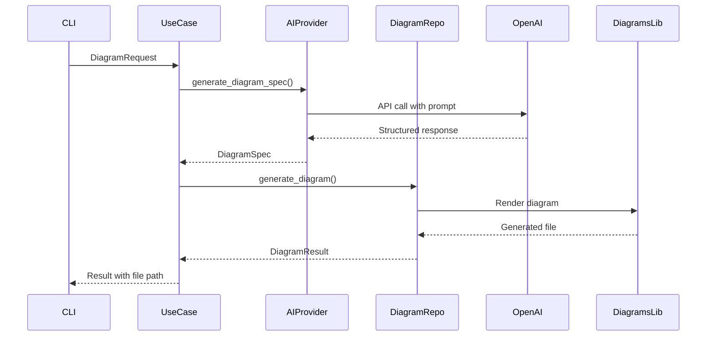
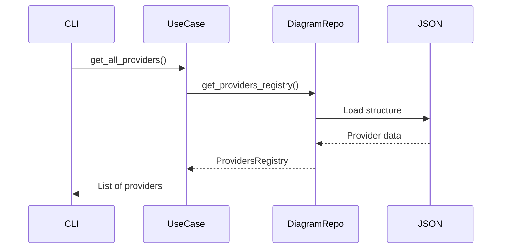

# Arquitectura del Proyecto

## Visión General

Diagram AI Generator sigue una **arquitectura hexagonal** (también conocida como puertos y adaptadores), que permite un diseño modular, testeable y fácilmente extensible.

## Principios de Diseño

### 1. Separación de Responsabilidades
- **Dominio**: Lógica de negocio pura, sin dependencias externas
- **Infraestructura**: Implementaciones concretas de servicios externos
- **Aplicación**: Interfaces de usuario y orquestación

### 2. Inversión de Dependencias
- El dominio define interfaces (puertos)
- La infraestructura implementa estas interfaces (adaptadores)
- La aplicación orquesta el uso de casos de negocio

### 3. Testabilidad
- Cada capa puede ser testeada independientemente
- Fácil mockeo de dependencias externas
- Tests unitarios, de integración y end-to-end

## Estructura de Capas

```
src/
├── domain/                 # 🎯 Capa de Dominio
│   ├── entities/          # Entidades de negocio
│   ├── repositories/      # Interfaces (puertos)
│   └── use_cases/         # Casos de uso
├── infrastructure/        # 🔧 Capa de Infraestructura
│   ├── adapters/         # Implementaciones (adaptadores)
│   └── external/         # Datos externos
└── application/          # 🖥️ Capa de Aplicación
    ├── cli/             # Interfaz CLI
    └── mcp/             # Servidor MCP
```

## Capa de Dominio

### Entidades (`domain/entities/`)

#### `diagram.py`
- `DiagramRequest`: Solicitud de generación
- `DiagramSpec`: Especificación completa del diagrama
- `DiagramResult`: Resultado de la operación
- `DiagramNode`: Nodo individual del diagrama
- `DiagramConnection`: Conexión entre nodos

#### `provider.py`
- `DiagramProvider`: Información de proveedores
- `DiagramCategory`: Categorías de componentes
- `ProvidersRegistry`: Registro centralizado

### Repositorios (`domain/repositories/`)

#### `ai_provider_repository.py`
```python
class AIProviderRepository(ABC):
    @abstractmethod
    async def generate_diagram_spec(self, request: DiagramRequest) -> DiagramSpec:
        pass
```

#### `diagram_repository.py`
```python
class DiagramRepository(ABC):
    @abstractmethod
    async def generate_diagram(self, spec: DiagramSpec, output_path: str) -> DiagramResult:
        pass
```

### Casos de Uso (`domain/use_cases/`)

#### `generate_diagram_use_case.py`
- Orquesta la generación completa de diagramas
- Coordina AI provider y diagram repository
- Maneja errores y validaciones

#### `list_providers_use_case.py`
- Gestiona consultas sobre proveedores disponibles
- Búsqueda y filtrado de componentes

## Capa de Infraestructura

### Adaptadores (`infrastructure/adapters/`)

#### `openai_provider.py`
- Implementa `AIProviderRepository`
- Integración con OpenAI API
- Structured outputs con Pydantic
- Manejo de prompts optimizados

#### `diagrams_repository.py`
- Implementa `DiagramRepository`
- Integración con librería `diagrams`
- Renderizado a múltiples formatos
- Validación de especificaciones

### Datos Externos (`infrastructure/external/`)
- `diagrams_structure.json`: Registro de componentes disponibles

## Capa de Aplicación

### CLI (`application/cli/`)

#### `main.py`
- Interfaz de línea de comandos con Click
- Comandos: `generate`, `list-providers`, `search`, `test-connection`
- Output con Rich para mejor UX
- Manejo de configuración y errores

### MCP (`application/mcp/`)

#### `server.py`
- Servidor Model Context Protocol
- Herramientas para integración con IA
- Recursos dinámicos
- Prompts optimizados

## Flujo de Datos

### Generación de Diagrama



### Consulta de Proveedores



## Patrones de Diseño Utilizados

### 1. Repository Pattern
- Abstrae el acceso a datos
- Permite cambiar implementaciones fácilmente
- Facilita testing con mocks

### 2. Use Case Pattern
- Encapsula lógica de negocio específica
- Un caso de uso por funcionalidad
- Fácil de testear y mantener

### 3. Adapter Pattern
- Convierte interfaces incompatibles
- OpenAI API → AIProviderRepository
- Diagrams library → DiagramRepository

### 4. Factory Pattern
- Creación de objetos complejos
- Instanciación de dependencias
- Configuración centralizada

## Extensibilidad

### Agregar Nuevo Proveedor de IA

1. Implementar `AIProviderRepository`
2. Crear adaptador específico
3. Configurar en factory/DI

```python
class AnthropicProvider(AIProviderRepository):
    async def generate_diagram_spec(self, request: DiagramRequest) -> DiagramSpec:
        # Implementación específica
        pass
```

### Agregar Nueva Interfaz

1. Crear nueva aplicación (web, API)
2. Reutilizar casos de uso existentes
3. Implementar presentación específica

```python
# application/web/main.py
@app.post("/generate")
async def generate_endpoint(request: DiagramRequest):
    result = await generate_use_case.execute(request)
    return result
```

### Agregar Nuevo Formato de Salida

1. Extender `DiagramRepository`
2. Implementar renderizado específico
3. Actualizar validaciones

## Configuración y Dependencias

### Inyección de Dependencias

```python
def create_dependencies():
    # Infrastructure
    ai_provider = OpenAIProvider()
    diagram_repository = DiagramsRepository()
    
    # Use cases
    generate_use_case = GenerateDiagramUseCase(ai_provider, diagram_repository)
    
    return generate_use_case
```

### Variables de Entorno

```env
OPENAI_API_KEY=sk-...
OPENAI_MODEL=gpt-4o
DEBUG=false
LOG_LEVEL=INFO
```

## Testing Strategy

### Unit Tests
- Cada caso de uso independientemente
- Mocking de dependencias externas
- Validación de lógica de negocio

### Integration Tests
- Adaptadores con servicios reales
- End-to-end de casos de uso críticos
- Validación de contratos

### Acceptance Tests
- CLI con comandos reales
- Generación de diagramas completos
- Validación de archivos de salida

## Consideraciones de Rendimiento

### Async/Await
- Operaciones de red no bloqueantes
- Mejor utilización de recursos
- Escalabilidad mejorada

### Caching
- Cache de estructura de proveedores
- Reutilización de clases de nodos
- Optimización de consultas frecuentes

### Error Handling
- Excepciones específicas del dominio
- Fallbacks y recuperación graceful
- Logging estructurado

## Métricas y Observabilidad

### Logging
- Logs estructurados por capa
- Correlación de requests
- Niveles apropiados (DEBUG, INFO, ERROR)

### Métricas
- Tiempo de generación
- Éxito/fallo de operaciones
- Uso de proveedores

### Monitoreo
- Health checks
- Disponibilidad de servicios externos
- Alertas en errores críticos
