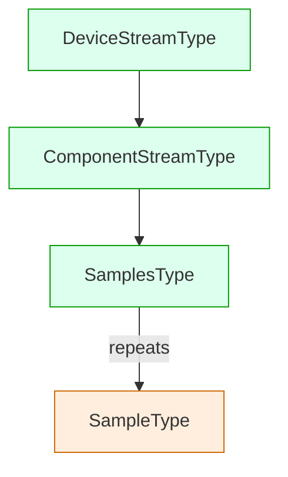

# XML Schema Handling: Elements, Attributes, Types, Relationships

This document explains how Pydantic2Django (P2D) interprets XML Schema (XSD) and generates Django models with validation and relationships. As context, the Open311 conventions (e.g., Parker/Spark/BadgerFish) focus on converting XML instances to JSON instances. P2D goes beyond serialization: it reads schema structure and produces a typed, relational model (Django ORM) with constraints, relationships, and optional Timescale integration. See Open311 background: `https://wiki.open311.org/JSON_and_XML_Conversion/#json-representation`.

---

## High‑level flow

1. Parse XSD into internal models (`XmlSchemaDefinition`, `XmlSchemaComplexType`, `XmlSchemaSimpleType`, `XmlSchemaElement`, `XmlSchemaAttribute`, `XmlSchemaKey`, `XmlSchemaKeyRef`).
2. Map XSD constructs to Django fields and relationships via the XMLSchema factory, applying validation and choices.
3. Finalize cross‑model relationships (child FKs, optional M2M, soft references) and emit indexes.
4. Render concrete Django model classes with imports and metadata.

Key modules:
- `src/pydantic2django/xmlschema/models.py` — in‑memory XSD model types.
- `src/pydantic2django/xmlschema/factory.py` — element/attribute → Django field/relationship mapping.
- `src/pydantic2django/xmlschema/generator.py` — orchestration, Timescale roles, rendering.

---

## Elements (`xs:element`)

- Base simple types map to Django fields (see FIELD_TYPE_MAP):
  - Strings → `CharField` (or `TextField` when unconstrained), numerics → integer/decimal fields, booleans → `BooleanField`, dates/times → `DateField`/`DateTimeField`/`TimeField`, binary → `BinaryField`.
- Occurrence/optionality:
  - `minOccurs=0` or `nillable=true` ⇒ `null=True`, `blank=True`.
  - Repeating elements (`maxOccurs>1` or `unbounded`) are represented as relationships (see “Repeating content and containers”).
- Defaults/fixed values: populate Django `default` when present and safe.
- Inline restrictions map to validators and precision (see “Restrictions and validators”).
- `xs:ID` elements become `CharField(primary_key=True)` to preserve identifiers.
- `xs:IDREF` elements map to a `ForeignKey` when target resolution is possible (via `xs:key/xs:keyref`), otherwise a placeholder relation is emitted with a warning or a soft reference may be used depending on Timescale rules.

### Complex element references (`type="tns:SomeType"`)

When an element references a complex type:
- Single nested complex element: by default becomes a `ForeignKey` to the child model unless Timescale rules require a soft reference or FK inversion.
- Repeating complex element: represented as a child relation (FK from child → parent) or `ManyToManyField` when configured; parent may expose only a reverse accessor. JSON fallback is available.
- If the type cannot be resolved to a generated model (e.g., filtered out), the field falls back to a `JSONField` for safety.

---

## Attributes (`xs:attribute`)

- Map similarly to simple elements: base type → Django field.
- Optional attributes ⇒ `null=True`, `blank=True`.
- Defaults map to Django `default`.
- `xs:ID` attributes can be `primary_key=True` when appropriate.
- Restrictions on attribute simple types feed into validators/length just like elements.
- Attribute groups (`xs:attributeGroup`) are resolved: named groups declared at the schema root are flattened into complex types wherever referenced, including within `complexContent/extension` and `simpleContent/extension`.

---

## Simple types (`xs:simpleType`) and restrictions

P2D preserves key XSD facets as Django validators/field options:
- `enumeration` → `models.CharField(choices=TextChoices)`; choices classes are shared and emitted once per type; defaults may emit as enum members.
- `pattern` → `RegexValidator`.
- `minInclusive`/`maxInclusive` → `MinValueValidator`/`MaxValueValidator`.
- `minExclusive`/`maxExclusive` → adjusted min/max validators.
- `totalDigits`/`fractionDigits` → `max_digits`/`decimal_places` for decimals.
- `maxLength` → `max_length` for string fields.

Notes:
- Unconstrained strings default to `TextField` (no `max_length`), while constrained strings retain `CharField`.
- Validator imports are tracked and automatically added to the rendered file only when used.

---

## Complex types (`xs:complexType`)

- Content models: `sequence`, `choice`, `all` are parsed; child `xs:element`s are collected on the type and mapped per the rules above.
- Attributes declared on complex types are included.
- `simpleContent` (minimal): attribute extensions are captured so attribute‑only types are not dropped.
- `complexContent`:
  - `extension`: inherit base members; parse local particles and attributes.
  - `restriction`: currently treated extension‑like (inherits members); specific restriction semantics are not fully enforced yet.

See `docs/how_it_works/xmlschema_notes.md` for current fidelity and planned enhancements.

---

## Repeating content and containers (wrappers)

Tip: For large polymorphic/repeating regions you can enable Generic Entries mode to store children as `GenericEntry` rows via Django ContentTypes. See `docs/how_it_works/generic_entries_contenttypes.md`.

For elements containing repeated complex children:
- Default style is `child_fk`: no concrete list field on the parent; instead, the child receives a `ForeignKey` to the parent during the finalize pass, and the parent accesses children via Django reverse relation. Related names are disambiguated when the same child appears under multiple parents.
- `m2m` style: when configured and a leaf child type is identifiable, emit `ManyToManyField` from the parent to the leaf.
- JSON fallback: per strategy or when a referenced type will not be generated, the field becomes `JSONField`.

Wrapper heuristics:
- TitleCase element names or type names ending in `WrapperType` are treated as containers; we prefer `child_fk` and inject the child FK(s) on finalize.

### Discovery tradeoff: only generate top‑level, selected types

P2D’s discovery deliberately scopes what becomes a Django model. Only top‑level `xs:complexType` (and types not filtered out) are generated; nested/inline/anonymous leaf types are not promoted automatically. This keeps the model surface manageable and reduces noise, but it has tradeoffs for deeply nested wrappers.

Consequences:
- Leaf/wrapper children that are not generated cannot be targets of FKs in the finalize pass.
- We preserve content via JSON fallback or soft references, but lose some relational fidelity unless explicitly opted into generating those leaves.

Example structure impacted by this rule:



In this scenario, `SampleType` is a repeated leaf and may not be generated unless configured. The finalize pass must not attempt to emit FKs to `SampleType` when it is not included.

### Refined finalize behavior at discovery boundaries

We refine `finalize_relationships` to respect discovery scope and degrade cleanly:
- Gate: before injecting a FK, verify both child and parent exist in `carriers_by_name` and are included in `included_model_names`.
- Fallbacks:
  - If child or parent is missing, skip FK injection for that relation and prefer the already‑emitted JSON placeholder on the parent, or emit a soft UUID reference when Timescale policy requires.
- Logging: emit a concise INFO/WARNING with enough context: child, parent, element name, and decision (skipped/soft/JSON) to aid debugging.
- Config switch:
  - Add a generator option (e.g., `auto_generate_missing_leaves: bool = False`), and a per‑factory flag, to allow promoting missing leaf types into generated models in future enhancements. Default remains False to avoid surprising schema growth.

This approach preserves data (JSON fallback) and avoids broken relations, while giving teams an opt‑in path to richer relational models when desired.

---

## Wrapper behavior: current implementation and flags

This section documents how wrappers and repeated leaves are mapped today, and which flags influence behavior.

### Defaults (what you get out of the box)
- Repeating complex elements (maxOccurs>1/unbounded): one‑to‑many modeled as child‑side FK.
  - The repeated leaf type receives a `ForeignKey` to its immediate wrapper/container.
  - The wrapper/container exposes a reverse relation (via `related_name`).
- Single nested wrapper elements (TitleCase element or `*WrapperType`): treated as containers.
  - The child wrapper model holds a `ForeignKey` to the immediate parent wrapper (not the other way around).
  - For multi‑level wrappers, additional child FKs connect intermediate wrappers up to the outer container (resulting in a simple chain of FKs).
- Identity constraints (`xs:key`/`xs:keyref`): add additional FKs as specified, but do not invert the one‑to‑many direction implied by repetition.
- Discovery boundary respected: if a referenced child/leaf is not generated, FK injection is skipped; the parent retains JSON fallback or a soft reference (Timescale policies).

### Flags and their effects
- `nested_relationship_strategy`: `auto` (default), `fk`, `json`.
  - `auto`: depth‑sensitive; shallow wrappers prefer `fk`, deeply nested content may fall back to `json`.
  - `fk`: force relational representation where supported.
  - `json`: force JSON representation for nested content.
- `list_relationship_style`: `child_fk` (default), `m2m`, `json`.
  - `child_fk`: repeated leaf receives `ForeignKey` back to the container (default relational shape).
  - `m2m`: parent emits `ManyToManyField` to a resolvable leaf type (when identifiable), instead of child‑side FKs.
  - `json`: repeated content represented as `JSONField` on the parent.
- Timescale roles (`enable_timescale`, overrides, strict):
  - Hypertable→Hypertable edges become soft references (UUID with index) instead of FKs.
  - Dimension→Hypertable edges may invert: FK injected on the hypertable back to the dimension, with SET_NULL and helpful indexes.
  - `timescale_strict=True` can fail generation if a hypertable lacks a direct time field.
- Missing leaf policy (discovery boundary):
  - FK injection is gated by generated types; when missing, we log a skip and keep JSON/soft fallback.
  - Future: `auto_generate_missing_leaves` (planned) to opt‑in to promote leaves into generated models.

### Related names and field names
- `related_name` derivation is based on the element path (e.g., `items` → `items`).
- When the same child appears under multiple parents, we suffix the parent name for uniqueness (e.g., `items_parenttype`).
- When multiple FKs to the same parent from one child are required (e.g., multiple wrapper elements), we also suffix by element (e.g., field name `parenttype_items`).

### Does the parent ever hold the FK to the leaf?
- Under `child_fk` (default): no. The child (repeated) side holds the FK; the parent sees only the reverse relation.
- Under `m2m`: the parent holds a `ManyToManyField` to the leaf.
- Under JSON strategy or when the leaf is not generated: the parent holds a `JSONField` instead of a relation.

---

## Relationships from identity constraints

- `xs:key`/`xs:keyref` are used to construct `ForeignKey` targets:
  - `keyref.selector` and `refer` help resolve the target model name (`<X>Type`, global element type, or direct complex type name).
  - `related_name` is derived from the selector path for readability.
  - Optional references (`minOccurs=0`/`nillable`) use `on_delete=SET_NULL`, `null=True`, `blank=True`.
- If a keyref cannot be fully resolved, a safe placeholder is emitted and a log warning is produced; Timescale rules may cause a soft reference (UUID) instead of FK.

---

## Timescale‑aware behavior (optional)

When enabled, the generator classifies complex types as `hypertable` or `dimension` and adjusts relationships accordingly:
- Hypertable → Hypertable edges become soft references (UUID with index) instead of FKs.
- Dimension → Hypertable edges are inverted: FK is created on the hypertable back to the dimension with `on_delete=SET_NULL`, and helpful indexes are emitted.
- Strict mode can fail generation if a hypertable lacks a direct time field.

See `docs/how_it_works/timescale.md` for details and ingestion timestamp mapping behavior.

---

## Naming, namespaces, and imports

- Field names are sanitized to valid Django identifiers (normalize case, replace unsafe characters, avoid plain `id` unless it is a primary key).
- Type/element/attribute names are resolved using local names when prefixed (e.g., `tns:Foo` → `Foo`).
- Validator usage and extra imports are tracked during mapping to avoid unused imports.

---

## Unsupported or partially supported XSD constructs

The following are either mapped conservatively (often via JSON) or not yet fully supported:
- `xs:group`.
- `xs:any`, `xs:anyAttribute` (consider JSON or key‑value side tables; future configurable handling).
- Strict restriction enforcement for `complexContent/restriction` (occurrence tightening, prohibitions).
- Mixed content and advanced substitution-group semantics beyond basic head→member expansion.

Where fidelity is limited, P2D prefers safe fallbacks (e.g., `JSONField`) and clear logging. See `xmlschema_notes.md` for roadmap items.

---

## Configuration knobs

- `nested_relationship_strategy`: `auto` (default), `fk`, or `json`.
- `list_relationship_style`: `child_fk` (default), `m2m`, or `json`.
- `nesting_depth_threshold`: depth limit for `auto` strategy.
- `enable_timescale`: enable classification and Timescale‑safe relationship policies.
- `timescale_overrides`, `timescale_config`, `timescale_strict`: fine‑tune roles and safety checks.

---

## Practical outcomes vs. Open311 conventions

- Open311 conventions define how an XML instance becomes a JSON instance (attributes kept/dropped, arrays inferred, mixed content encoding). They do not generate a database schema or enforce constraints.
- P2D generates a relational schema with validators, choices, keys/refs as relationships, wrapper/container handling, and Timescale‑aware constraints. JSON is used as a deliberate fallback for complex/nested areas that are better denormalized or unsupported.

---

## References

- Parser/model types: `src/pydantic2django/xmlschema/models.py`
- Field and relationship mapping: `src/pydantic2django/xmlschema/factory.py`
- Generator and finalization: `src/pydantic2django/xmlschema/generator.py`
- Timescale integration: `docs/how_it_works/timescale.md`
- Notes and roadmap: `docs/how_it_works/xmlschema_notes.md`


### MTConnect Streams: quick guide

This short guide shows how MTConnect Streams (2.4) maps to generated Django models and how to traverse wrappers and observations.

1) Generate models (downloads XSDs, writes models, and creates migrations):

```bash
uv run python examples/mtconnect_example/mtconnect_xml_schema_example.py --version 2.4
```

2) Import generated models in a Django shell and navigate:

```python
from examples.mtconnect_example.generated_models.v2_4.mtconnect_streams import models as s

# Pick a component stream
cs = s.ComponentStreamType.objects.first()

# Wrapper relations: reverse managers from wrappers (e.g., Samples, Events)
samples_wrappers = cs.samples.all()

# Concrete observation models (substitution groups expanded)
# Example: PositionDataSetType (availability depends on the schema/content)
pos = s.PositionDataSetType.objects.filter(componentstreamtype=cs).first()
if pos:
    # Common attributes resolved from attribute groups
    print(pos.timestamp, getattr(pos, "sub_type", None))

# Tip: Explore available reverse accessors and fields
print([f.name for f in cs._meta.get_fields()])
```

Notes
- Substitution groups are expanded: observation heads under wrappers (Samples/Events/Condition) produce concrete classes like `PositionDataSetType`, `TemperatureDataSetType`, etc.
- Attribute groups are resolved: observation classes include fields like `timestamp`, `subType`/`sub_type`, `dataItemId`, etc., as defined by the schema.
- Wrapper elements (e.g., `SamplesType`, `EventsType`) are treated as containers; you typically traverse from `ComponentStreamType` via reverse relations to wrappers and then to observations, or directly query concrete observation classes filtered by the parent.
