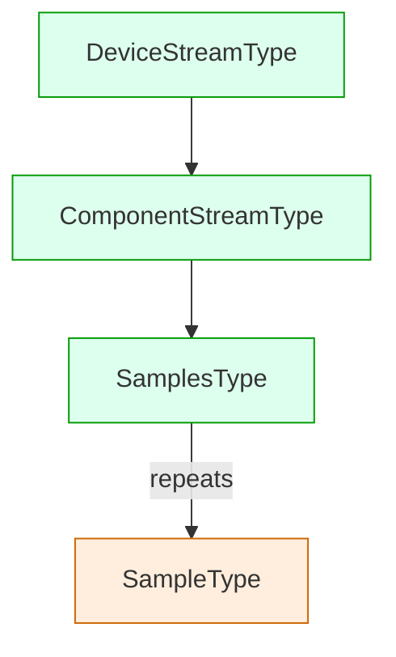
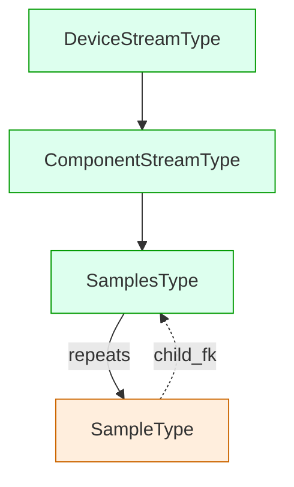

# XML Schema Notes: complexType Handling

This note documents the current level of `xs:complexType` support in the XML Schema parser and outlines next steps for improved fidelity.

## What’s supported today

- Content models inside `xs:complexType`:
  - `xs:sequence`, `xs:choice`, `xs:all` are parsed and their child `xs:element` entries are collected onto the type.
  - `xs:attribute` entries on the type are parsed and attached.
- `xs:simpleContent` (minimal):
  - We capture attributes declared on the `xs:extension` node so attribute-only types aren’t dropped.
  - Other `simpleContent` patterns remain limited and may emit warnings.
- `xs:complexContent` (minimal but usable):
  - `xs:extension`: the derived type inherits elements and attributes from the base complex type, then parses any locally declared particles (`sequence`/`choice`/`all`) and attributes. This enables basic inheritance in common schemas.
  - `xs:restriction`: currently treated like an extension (inherits base members); local particles/attributes are parsed. Restriction facets are not enforced yet. A warning is logged to indicate limited handling.

Notes and limits:
- Base type lookup assumes the same schema target namespace. Cross-schema/import resolution is limited.
- `xs:group`, `xs:attributeGroup`, `xs:any`, and `xs:anyAttribute` are not yet handled.
- Restriction semantics (e.g., occurrence tightening, element/attribute prohibition) are not enforced.
- Mixed content and substitution groups are not modeled.
- Identity constraints (`xs:key`/`xs:keyref`) are parsed at the schema level but not enforced during ingest yet.

## Impact on ingestion

- Derived complex types appear with inherited elements/attributes, so ingestion can proceed for most extension-based hierarchies.
- Because restriction rules aren’t enforced, ingest may accept instances that a strict validator would reject. If strict validation is required, keep producer-side validation enabled or post-validate with a dedicated XML library.
- Timescale-aware timestamp mapping: when a generated model inherits from `XmlTimescaleBase` (requiring a non-null `time` column), the ingestor remaps common XML timestamp attributes to the canonical `time` field when not explicitly set. For example, `creationTime` is mapped to `time` for MTConnect Streams headers.

## Discovery, promotion, demotion, and collapsing

This section explains how P2D decides which XSD types become concrete Django models (promotion), when we intentionally avoid creating a model and store data in a denormalized form (demotion), and how we resolve relationship direction across wrapper chains (collapsing).

### Discovery and promotion

- By default, only top‑level, selected `xs:complexType` entries are promoted to Django models. Nested/inline/anonymous leaf types are not automatically promoted.
- Promotion scope is controlled by discovery filters and per‑run options. This keeps generated models concise and avoids exploding the schema surface.

Mermaid: promoted vs. not promoted

In this example, `SampleType` is a repeated leaf and may not be generated unless explicitly selected. The system must therefore avoid emitting FKs that target `SampleType` unless it is in scope.

### Demotion (safe fallback)

When a referenced type is outside discovery scope or cannot be resolved to a generated model, we demote that structure to a safe representation:

- JSON fallback on the parent field for nested structures (used during the element mapping stage).
- Soft references (UUID with index) when Timescale rules indicate FK inversion or hypertable→hypertable safety.

Demotion preserves data while sacrificing some relational fidelity, and is logged to aid debugging. This is preferable to emitting broken FKs.

### Collapsing wrapper chains (relationship direction)

P2D uses wrapper heuristics and a finalize pass to place FKs on children while keeping parents minimal:

- Repeating complex children: default `child_fk` places FK on the child back to the parent.
- Single wrapper elements (TitleCase or `*WrapperType`): treat as containers and inject child‑side FK(s) to the immediate wrapper (not the grandparent), unless an M2M configuration or Timescale policy applies.
- Deep wrapper chains: we may “collapse” chains to an appropriate ancestor, but only when it makes sense and does not cross discovery boundaries. Immediate wrapper preference is maintained for direct elements.

Mermaid: collapsing behavior (immediate wrapper vs. top ancestor)

Finalization respects discovery boundaries and will skip FK injection whenever either side is not generated, preferring the previously emitted JSON placeholder or soft reference.

### Configuration knobs (related)

- `list_relationship_style`: `child_fk` (default), `m2m`, or `json`.
- `nested_relationship_strategy`: `fk`, `json`, or `auto`.
- Timescale flags to invert or soften relationships for hypertables.
- (Planned) `auto_generate_missing_leaves`: opt‑in to promote leaf types on demand; default False to avoid uncontrolled schema growth.

## Recommended next steps

1. Complex content completeness
   - Implement `xs:group` and `xs:attributeGroup` expansion.
   - Add support for `xs:any` / `xs:anyAttribute` (map to flexible fields, e.g., JSON or key-value side tables; make this configurable).
   - Resolve base types across imported schemas and different namespaces.
2. Proper restriction handling
   - Enforce occurrence constraints and member prohibitions for `xs:restriction`.
   - Apply facet-driven narrowing where applicable.
3. Mixed content and substitution groups
   - Add mixed content support (e.g., serialize as text + children, or a structured representation).
   - Implement substitution group resolution for element polymorphism.
4. Identity constraints
   - Add a post-pass to resolve `xs:key` / `xs:keyref` (e.g., ID/IDREF) during ingestion.
5. Diagnostics & configuration
   - Reduce warnings once features are implemented; add a strict mode to fail on unsupported constructs.
   - Expose per-feature toggles (e.g., treat restriction as error vs. extension-like fallback).

## Practical guidance

- If you encounter warnings about unsupported `complexContent` but your schema mostly uses `xs:extension`, the current implementation will usually be sufficient for ingesting instances.
- For schemas relying heavily on `xs:restriction`, consider flattening types or relaxing validation on the ingest path until restriction semantics are implemented.
- You can silence specific parser warnings by adjusting the logger for `pydantic2django.xmlschema.parser` if the limits don’t affect your ingestion semantics.

## References

- Implementation locations:
  - Parser: `src/pydantic2django/xmlschema/parser.py`
  - Ingestor: `src/pydantic2django/xmlschema/ingestor.py`
