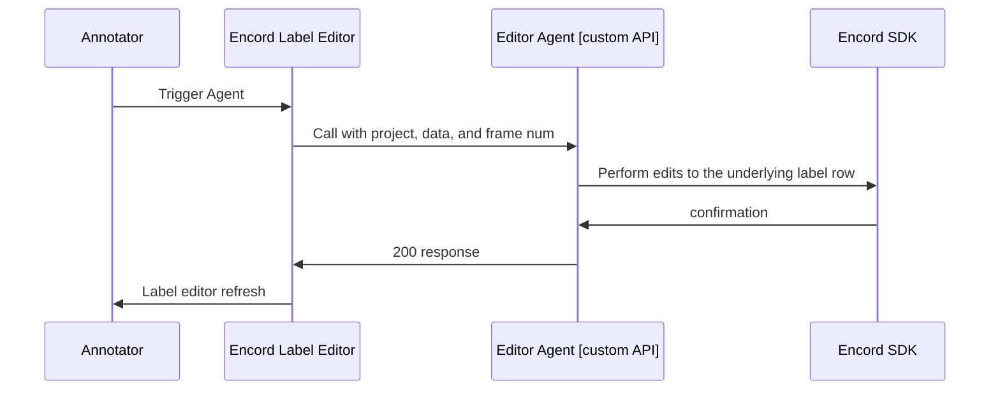

  

    

      
      
      
      
    

  

  

Editor Agents allow you to integrate your own API endpoint with Encord, enhancing your annotation processes. For example, this could be a model hosted on a server or a cloud function. Annotators can trigger Editor Agents while annotating in the Label Editor.

Some common use-cases are:

- _Validate the current state of the annotations_ within a frame, video, or image group. You might, for example, want to give the labelers an option to annotate the current state of the labels before submitting.
- Do _custom conversions or modifications_ of labels before they are submitted. For example, you could be simplifying polygons with an RDP algorithm.
- Employ custom prompting models like [DINOv][dinov]{ target="\_blank", rel="noopener noreferrer" } or [T-Rex2][trex2]{ target="\_blank", rel="noopener noreferrer" } to speed up annotations.
- _Trigger notifications_ internally related to the given task.

Editor Agents are actions your annotators can trigger _while they are labeling_.

!!! info
    Editor Agents are API endpoints triggered on individual tasks within the Label Editor. They differ from [Task Agents][task-agents], which are Workflow components that activate on all tasks passing through the Agent stage.

## General Concepts

Editor Agents work in the following way:

Use `encord-agents` to define the logic for the "Editor Agent [custom API]" section of the diagram. You are responsible for programmatically determining what happens when your custom API receives a `project_hash`, `data_hash`, and potentially a `frame` number and `objectHashes`.

We help with two different ways of building such Custom APIs:

1. Using [`Google run functions`][gcp-functions]{ target="\_blank", rel="noopener noreferrer" } which is Google's way of building cloud functions.
2. Using [FastAPI][fastapi]{ target="\_blank", rel="noopener noreferrer" } which is a flexible (self-hosted) python library for building custom APIs.
3. Using [Modal][modal-docs]{ target="\_blank", rel="noopener noreferrer" } which provides a serverless cloud for engineers and researchers who want to build compute-intensive applications without thinking about infrastructure.

!!! tip
    The `encord-agents` library takes a lot of inspiration from [FastAPI][fastapi]{ target="\_blank", rel="noopener noreferrer" }. Specifically, we have adopted the idea of [dependency injections][fastapi-dependency-injection]{ target="\_blank", rel="noopener noreferrer" } from that library. While our [injection scheme](../dependencies.md) is not as sophisticated, it should feel familiar.

Google Cloud Run functions are ideal for lightweight operations, such as serving as proxies for model inference APIs or making minor label adjustments. In contrast, FastAPI and Modal apps are better suited for hosting your own models and handling resource-intensive tasks.

In the next section, we include a GCP example. If you need to build a FastAPI (or Modal) application, feel free to [skip it](./fastapi.md).

[task-agents]: ../task_agents/index.md
[dinov]: https://github.com/UX-Decoder/DINOv/tree/main
[trex2]: https://github.com/IDEA-Research/T-Rex/tree/trex2
[gcp-functions]: https://cloud.google.com/functions/docs
[fastapi]: https://fastapi.tiangolo.com/
[fastapi-dependency-injection]: https://fastapi.tiangolo.com/tutorial/dependencies/
[modal-docs]: https://modal.com/docs