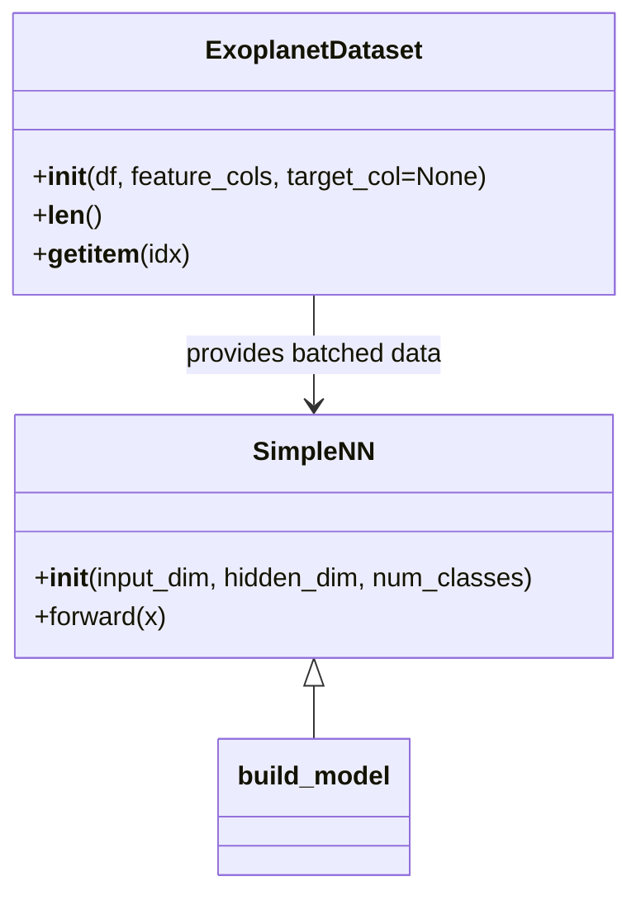

# Exso-SDK Documentation

This document provides a comprehensive guide to the **Exso-SDK**, an exoplanet candidate classification toolkit with preprocessing, feature engineering, model training and serving capabilities.

## Table of Contents
- [Project Overview](#project-overview)
- [Installation Guide](#installation-guide)
- [Module and Function Documentation](#module-and-function-documentation)
  - [Configuration (config.py)](#configuration-configpy)
  - [Data Management (data.py)](#data-management-datapy)
  - [Data Preprocessing (preprocessing.py)](#data-preprocessing-preprocessingpy)
  - [Feature Engineering (features.py)](#feature-engineering-featurespy)
  - [Evaluation Metrics (metrics.py)](#evaluation-metrics-metricspy)
  - [Modeling (model.py)](#modeling-modelpy)
  - [Model Explanations (explain.py)](#model-explanations-explainpy)
  - [REST API (api.py)](#rest-api-apipy)
  - [Utilities (utils.py)](#utilities-utilspy)
  - [API Testing Suite (tests/)](#api-testing-suite-tests)
  - [Package Entry Script (main.py)](#package-entry-script-mainpy)
  - [Package Initialization (__init__.py)](#package-initialization-__init__py)
- [Workflow / Usage Guide](#workflow--usage-guide)
- [Diagrams and Flowcharts](#diagrams-and-flowcharts)
- [Best Practices](#best-practices)
- [FAQ / Troubleshooting](#faq--troubleshooting)

---

<details open>
<summary>Project Overview</summary>

# Project Overview

The **Exso-SDK** classifies exoplanet candidates into three classes: False Positive, Candidate, and Positive.  
It offers modules for data loading, validation, preprocessing, feature computation, model training, prediction, explanation, and a Flask-based REST API.

**Main Features**  
- Data ingestion from CSV or public URLs  
- Data validation and cleaning  
- Lightcurve preprocessing  
- Domain and statistical feature engineering  
- Neural network model training and evaluation  
- Prediction with probability outputs  
- Gradient-based saliency explanations  
- Flask API for batch prediction  
- Utility functions for logging and error handling  

**Dependencies & Requirements**  
- Python ≥ 3.11  
- pandas ≥ 1.0  
- numpy ≥ 1.18  
- scikit-learn ≥ 0.22  
- torch ≥ 1.7  
- flask ≥ 1.1  
- requests  
- llvmlite ≥ 0.44.0  

Dependency declarations appear in `pyproject.toml` and `requirements.txt`. The `uv.lock` file locks exact versions.
</details>

---

<details open>
<summary>Installation Guide</summary>

# Installation Guide

Follow these steps to set up **Exso-SDK** locally.

## 1. Clone the Repository  
```bash
git clone https://github.com/yourname/exso-sdk.git
cd exso-sdk
```

## 2. Create Virtual Environment  
```bash
python -m venv .venv
source .venv/bin/activate  # Linux/Mac
.venv\Scripts\activate     # Windows
```

## 3. Install Dependencies  
```bash
pip install --upgrade pip
pip install -r requirements.txt
```
Alternatively, install via `pyproject.toml`:  
```bash
pip install .
```

## 4. Configuration  
- **MODEL_PATH**: Set `EXSO_MODEL_PATH` environment variable to override default model file location.  
- **API**: No API key required; runs locally on port 5000 by default.
</details>

---

<details open>
<summary>Module and Function Documentation</summary>

# Module and Function Documentation

This section details every module, class, and function in the project.

---

## Configuration (config.py)

Defines global constants for model path and required input schema.

| Constant         | Description                                                  |
|------------------|--------------------------------------------------------------|
| _PACKAGE_DIR     | Absolute path to this package directory                     |
| MODEL_PATH       | Path to the trained model file (`.pth`), default via envvar |
| REQUIRED_COLUMNS | List of numeric feature column names for model input        |

---

## Data Management (data.py)

Handles dataset fetching, loading, validation, merging, and splitting.

### fetch_datasets()
Download example mission CSVs and return as DataFrames.

- **Returns**: `List[pd.DataFrame]`  
- **Raises**: `requests.HTTPError` on download failure  
- **Example**:
  ```python
  from exso_sdk.data import fetch_datasets
  dfs = fetch_datasets()
  ```

### load_csv(path)
Load a local CSV file.

- **Parameters**:
  - `path` (str): File path to CSV  
- **Returns**: `pd.DataFrame`  
- **Raises**: `FileNotFoundError` if file missing  
- **Example**:
  ```python
  df = load_csv("data/exoplanets.csv")
  ```

### validate_dataset(df)
Ensure DataFrame has all required numeric columns and plausible ranges.

- **Parameters**:
  - `df` (`pd.DataFrame`): Input data  
- **Returns**: `True` if valid  
- **Raises**:
  - `ValueError` if columns missing or invalid values  
  - `TypeError` if column dtype is non-numeric  
- **Example**:
  ```python
  validate_dataset(df)
  ```

### merge_datasets(list_of_dfs)
Concatenate multiple mission DataFrames, aligning to `REQUIRED_COLUMNS`.

- **Parameters**:
  - `list_of_dfs` (`List[pd.DataFrame]`): DataFrames to merge  
- **Returns**: `pd.DataFrame` merged dataset  
- **Example**:
  ```python
  all_df = merge_datasets([df1, df2, df3])
  ```

### split_train_val_test(df, ratios=(0.7,0.15,0.15), random_state=42)
Split dataset into train/val/test.

- **Parameters**:
  - `df` (`pd.DataFrame`): Full dataset  
  - `ratios` (`tuple`): Fractions summing to 1.0  
  - `random_state` (`int`): Seed for reproducibility  
- **Returns**: `(train_df, val_df, test_df)`  
- **Raises**: `ValueError` if ratios sum ≠ 1  
- **Example**:
  ```python
  train, val, test = split_train_val_test(all_df)
  ```

---

## Data Preprocessing (preprocessing.py)

Cleans and scales raw data; handles missing values and encoding.

### clean_missing(df, strategy='drop')
Fill or drop missing values.

- **Parameters**:
  - `df` (`pd.DataFrame`)
  - `strategy` (`'drop'|'fill'`)  
- **Returns**: `pd.DataFrame` cleaned  
- **Raises**: `ValueError` if strategy invalid  
- **Example**:
  ```python
  df_clean = clean_missing(df, strategy='fill')
  ```

### normalize_scale(df, cols, method='standard')
Scale numeric columns by z-score or min-max.

- **Parameters**:
  - `df` (`pd.DataFrame`)
  - `cols` (`List[str]`): Columns to scale
  - `method` (`'standard'|'minmax'`)
- **Returns**: `(df_scaled, scaler_object)`  
- **Raises**: `ValueError` if method invalid  
- **Example**:
  ```python
  df_scaled, scaler = normalize_scale(df, REQUIRED_COLUMNS)
  ```

### encode_categorical(df)
One-hot encode string columns.

- **Parameters**:
  - `df` (`pd.DataFrame`)
- **Returns**: `pd.DataFrame` encoded  
- **Example**:
  ```python
  df_enc = encode_categorical(df)
  ```

### preprocess_lightcurve(lc)
Detrend and resample a lightcurve.

- **Parameters**:
  - `lc` (`pd.DataFrame`): must contain `time`, `flux`
- **Returns**: `pd.DataFrame` resampled with `flux_detrended`  
- **Example**:
  ```python
  lc_processed = preprocess_lightcurve(lightcurve_df)
  ```

---

## Feature Engineering (features.py)

Compute domain-specific and statistical features.

### compute_period_features(df)
Add period harmonics and simple folded stats.

- **Parameters**:
  - `df` (`pd.DataFrame`)
- **Returns**: `pd.DataFrame` extended  
- **Example**:
  ```python
  df_feat = compute_period_features(df)
  ```

### compute_statistical_features(df)
Compute skewness and kurtosis for all numeric columns.

- **Parameters**:
  - `df` (`pd.DataFrame`)
- **Returns**: `pd.DataFrame` extended  
- **Example**:
  ```python
  df_stats = compute_statistical_features(df)
  ```

### compute_domain_features(df)
Compute transit SNR and vetting flag.

- **Parameters**:
  - `df` (`pd.DataFrame`)
- **Returns**: `pd.DataFrame` extended  
- **Example**:
  ```python
  df_domain = compute_domain_features(df)
  ```

---

## Evaluation Metrics (metrics.py)

Evaluate classification performance.

### compute_metrics(y_true, y_pred)
Return common metrics (`accuracy`, `precision`, `recall`, `f1`, `auc`).

- **Parameters**:
  - `y_true` (`array-like`)
  - `y_pred` (`array-like`)
- **Returns**: `dict` of metric values  
- **Example**:
  ```python
  stats = compute_metrics(y_true, y_pred)
  ```

---

## Modeling (model.py)

Defines dataset wrapper, neural network, training, evaluation, and inference.

### Class: ExoplanetDataset(Dataset)
Wrap pandas DataFrame for PyTorch.

- **Constructor**:
  - `df` (`pd.DataFrame`)
  - `feature_cols` (`List[str]`)
  - `target_col` (`str` or `None`)
- **Methods**:
  - `__len__()` → int
  - `__getitem__(idx)` → `(X[idx], y[idx])` or `X[idx]`

**Example**:
```python
from exso_sdk.model import ExoplanetDataset
dataset = ExoplanetDataset(df, REQUIRED_COLUMNS, target_col='label')
```

### Class: SimpleNN(nn.Module)
Feed-forward network with two hidden layers.

- **Constructor**:
  - `input_dim` (int)
  - `hidden_dim` (int, default=64)
  - `num_classes` (int, default=3)
- **Method**:
  - `forward(x)` → logits

### build_model(input_dim, config=None)
Instantiate `SimpleNN`.

- **Parameters**:
  - `input_dim` (int)
  - `config` (`dict` with keys `hidden_dim`, `num_classes`)  
- **Returns**: `SimpleNN` model  
- **Example**:
  ```python
  model = build_model(len(REQUIRED_COLUMNS), config={'hidden_dim':128})
  ```

### train_model(model, train_loader, val_loader, config)
Train model with checkpoint saving.

- **Parameters**:
  - `model` (`nn.Module`)
  - `train_loader` (`DataLoader`)
  - `val_loader` (`DataLoader`)
  - `config` (`dict` with `lr`, `epochs`)
- **Returns**: None (saves best model to `MODEL_PATH`)  
- **Example**:
  ```python
  train_model(model, train_loader, val_loader, {'lr':1e-3, 'epochs':5})
  ```

### evaluate_model(model, data_loader)
Compute accuracy, precision, recall, f1, confusion matrix.

- **Parameters**:
  - `model` (`nn.Module`)
  - `data_loader` (`DataLoader`)
- **Returns**: `dict` with metrics and `confusion_matrix`  
- **Example**:
  ```python
  results = evaluate_model(model, test_loader)
  ```

### predict(model, sample)
Predict a single sample.

- **Parameters**:
  - `model` (`nn.Module`)
  - `sample` (`np.ndarray` or `torch.Tensor`)
- **Returns**:
  - `pred_class` (int), `probs` (`np.ndarray`)  
- **Example**:
  ```python
  cls, probs = predict(model, sample_vector)
  ```

### save_model(model, path)
Save model state_dict.

- **Parameters**:
  - `model` (`nn.Module`)
  - `path` (str)  
- **Example**:
  ```python
  save_model(model, "exoplanet_model.pth")
  ```

### load_model(input_dim, path=MODEL_PATH, config=None)
Load model weights into new instance.

- **Parameters**:
  - `input_dim` (int)
  - `path` (str)
  - `config` (`dict` or `None`)
- **Returns**: `SimpleNN` in eval mode  
- **Example**:
  ```python
  model = load_model(len(REQUIRED_COLUMNS))
  ```

---

## Model Explanations (explain.py)

Gradient-based saliency explanation without external libs.

### explain_prediction(model, sample, target_class_index=None)
Compute absolute gradient of class logit w.r.t. input features.

- **Parameters**:
  - `model` (`nn.Module`)
  - `sample` (`np.ndarray` or `torch.Tensor`)
  - `target_class_index` (`int` or `None`)
- **Returns**: `np.ndarray` saliency map  
- **Example**:
  ```python
  sal = explain_prediction(model, sample_vec)
  ```

---

## REST API (api.py)

Provides a Flask app to serve predictions.

- **App Initialization**: loads model on startup using `load_model`.

### Endpoint: GET `/`
Render HTML form for CSV upload.

```api
{
  "title": "Home Page",
  "description": "Render CSV upload form",
  "method": "GET",
  "baseUrl": "http://localhost:5000",
  "endpoint": "/",
  "headers": [],
  "pathParams": [],
  "queryParams": [],
  "bodyType": "none",
  "responses": {
    "200": {
      "description": "HTML form page",
      "body": "<h1>Exoplanet Predictor</h1>…"
    }
  }
}
```

### Endpoint: POST `/predict`
Process uploaded CSV and return predictions.

```api
{
  "title": "Batch Prediction",
  "description": "Upload CSV and receive predictions",
  "method": "POST",
  "baseUrl": "http://localhost:5000",
  "endpoint": "/predict",
  "headers": [
    {"key":"Content-Type","value":"multipart/form-data","required":true}
  ],
  "bodyType":"form",
  "formData":[
    {"key":"file","value":"CSV file with required columns","required":true}
  ],
  "responses":{
    "200":{"description":"Success","body":"{\"results\":[…]}"},
    "400":{"description":"Bad Request","body":"{\"error\":\"No file part\"}"},
    "500":{"description":"Server Error","body":"{\"error\":\"...\"}"}
  }
}
```

**Integration**: calls `validate_dataset`, `clean_missing`, `normalize_scale`, and `predict` for each row.

---

## Utilities (utils.py)

Utility logging and error handling.

- **log_metrics(run_id, metrics)**: Log experiment metrics via `logging.info`.  
- **monitor_training(run_id)**: Placeholder for training monitoring.  
- **handle_errors(e)**: Log errors via `logging.error`.

---

## Basic Test Script (test_basic.py)

Simple script to predict one sample from a dict.

- **predict_single_sample(sample)**:  
  - Converts dict → DataFrame  
  - Cleans, scales, loads model, predicts, and prints results.  
- **Entry Point**: Executed when `__name__ == '__main__'`.

---

## Package Initialization (__init__.py)

Package docstring; prevents side-effect imports.
</details>

---

<details open>
<summary>Workflow / Usage Guide</summary>

# Workflow / Usage Guide

## 1. Data Preparation  
- Gather mission CSVs with **REQUIRED_COLUMNS**.  
- Optionally call `fetch_datasets()` for examples.  
- Use `merge_datasets()` to combine missions.

## 2. Data Validation & Cleaning  
```python
validate_dataset(df)
df_clean = clean_missing(df, strategy='fill')
```

## 3. Feature Engineering  
```python
from exso_sdk.features import (
    compute_period_features,
    compute_statistical_features,
    compute_domain_features
)
df_feat = compute_period_features(df_clean)
df_feat = compute_statistical_features(df_feat)
df_feat = compute_domain_features(df_feat)
```

## 4. Train/Test Split  
```python
train_df, val_df, test_df = split_train_val_test(df_feat)
```

## 5. Model Training  
```python
from torch.utils.data import DataLoader
train_loader = DataLoader(ExoplanetDataset(train_df,…), batch_size=32)
val_loader   = DataLoader(ExoplanetDataset(val_df,…), batch_size=32)
train_model(model, train_loader, val_loader, {'lr':1e-3, 'epochs':10})
```

## 6. Evaluation  
```python
test_loader = DataLoader(ExoplanetDataset(test_df,…), batch_size=32)
results = evaluate_model(model, test_loader)
```

## 7. Batch Prediction via CLI or API  
- CLI: use `test_basic.py`  
- API: start server and `POST /predict` with CSV  
</details>

---

<details open>
<summary>Diagrams and Flowcharts</summary>

# Diagrams and Flowcharts

### Data & API Flow  
<div align="center">
  
</div>


### Model Class Relationships  

</details>

---

<details open>
<summary>Best Practices</summary>

# Best Practices

- **Extend Features**: add new feature functions in `features.py` and integrate in pipeline.  
- **Custom Preprocessing**: override `clean_missing` or add new strategies.  
- **Model Tuning**: adjust `hidden_dim`, learning rate, and epochs via `train_model` config.  
- **Logging**: call `log_metrics()` inside training loops.  
- **Error Handling**: wrap calls with `handle_errors(e)` from `utils.py`.
</details>

---

<details open>
<summary>FAQ / Troubleshooting</summary>

# FAQ / Troubleshooting

**Q: `ValueError: Missing required columns`**  
- Ensure CSV has all names in `REQUIRED_COLUMNS` (see `config.py`).  

**Q: API returns 400 “No file part”**  
- Send form-data key as `file`.  

**Q: GPU unavailable**  
- Model falls back to CPU. Remove CUDA code if unsupported.

**Q: Version conflicts**  
- Use provided `uv.lock` to lock dependencies. Recreate venv and `pip install .`.
</details>

---

*Happy Exoplanet Hunting!*
# Exso-SDK Documentation

This document provides a comprehensive guide to the **Exso-SDK**, an exoplanet candidate classification toolkit with preprocessing, feature engineering, model training and serving capabilities.

## Table of Contents
- [Project Overview](#project-overview)
- [Installation Guide](#installation-guide)
- [Module and Function Documentation](#module-and-function-documentation)
  - [Configuration (config.py)](#configuration-configpy)
  - [Data Management (data.py)](#data-management-datapy)
  - [Data Preprocessing (preprocessing.py)](#data-preprocessing-preprocessingpy)
  - [Feature Engineering (features.py)](#feature-engineering-featurespy)
  - [Evaluation Metrics (metrics.py)](#evaluation-metrics-metricspy)
  - [Modeling (model.py)](#modeling-modelpy)
  - [Model Explanations (explain.py)](#model-explanations-explainpy)
  - [REST API (api.py)](#rest-api-apipy)
  - [Utilities (utils.py)](#utilities-utilspy)
  - [API Testing Suite (tests/)](#api-testing-suite-tests)
  - [Package Entry Script (main.py)](#package-entry-script-mainpy)
  - [Package Initialization (__init__.py)](#package-initialization-__init__py)
- [Workflow / Usage Guide](#workflow--usage-guide)
- [Diagrams and Flowcharts](#diagrams-and-flowcharts)
- [Best Practices](#best-practices)
- [FAQ / Troubleshooting](#faq--troubleshooting)

---

<details open>
<summary>Project Overview</summary>

# Project Overview

The **Exso-SDK** classifies exoplanet candidates into three classes: False Positive, Candidate, and Positive.  
It offers modules for data loading, validation, preprocessing, feature computation, model training, prediction, explanation, and a Flask-based REST API.

**Main Features**  
- Data ingestion from CSV or public URLs  
- Data validation and cleaning  
- Lightcurve preprocessing  
- Domain and statistical feature engineering  
- Neural network model training and evaluation  
- Prediction with probability outputs  
- Gradient-based saliency explanations  
- Flask API for batch prediction  
- Utility functions for logging and error handling  

**Dependencies & Requirements**  
- Python ≥ 3.11  
- pandas ≥ 1.0  
- numpy ≥ 1.18  
- scikit-learn ≥ 0.22  
- torch ≥ 1.7  
- flask ≥ 1.1  
- requests  
- llvmlite ≥ 0.44.0  

Dependency declarations appear in `pyproject.toml` and `requirements.txt`. The `uv.lock` file locks exact versions.
</details>

---

<details open>
<summary>Installation Guide</summary>

# Installation Guide

Follow these steps to set up **Exso-SDK** locally.

## 1. Clone the Repository  
```bash
git clone https://github.com/yourname/exso-sdk.git
cd exso-sdk
```

## 2. Create Virtual Environment  
```bash
python -m venv .venv
source .venv/bin/activate  # Linux/Mac
.venv\Scripts\activate     # Windows
```

## 3. Install Dependencies  
```bash
pip install --upgrade pip
pip install -r requirements.txt
```
Alternatively, install via `pyproject.toml`:  
```bash
pip install .
```

## 4. Configuration  
- **MODEL_PATH**: Set `EXSO_MODEL_PATH` environment variable to override default model file location.  
- **API**: No API key required; runs locally on port 5000 by default.
</details>

---

<details open>
<summary>Module and Function Documentation</summary>

# Module and Function Documentation

This section details every module, class, and function in the project.

---

## Configuration (config.py)

Defines global constants for model path and required input schema.

| Constant         | Description                                                  |
|------------------|--------------------------------------------------------------|
| _PACKAGE_DIR     | Absolute path to this package directory                     |
| MODEL_PATH       | Path to the trained model file (`.pth`), default via envvar |
| REQUIRED_COLUMNS | List of numeric feature column names for model input        |

---

## Data Management (data.py)

Handles dataset fetching, loading, validation, merging, and splitting.

### fetch_datasets()
Download example mission CSVs and return as DataFrames.

- **Returns**: `List[pd.DataFrame]`  
- **Raises**: `requests.HTTPError` on download failure  
- **Example**:
  ```python
  from exso_sdk.data import fetch_datasets
  dfs = fetch_datasets()
  ```

### load_csv(path)
Load a local CSV file.

- **Parameters**:
  - `path` (str): File path to CSV  
- **Returns**: `pd.DataFrame`  
- **Raises**: `FileNotFoundError` if file missing  
- **Example**:
  ```python
  df = load_csv("data/exoplanets.csv")
  ```

### validate_dataset(df)
Ensure DataFrame has all required numeric columns and plausible ranges.

- **Parameters**:
  - `df` (`pd.DataFrame`): Input data  
- **Returns**: `True` if valid  
- **Raises**:
  - `ValueError` if columns missing or invalid values  
  - `TypeError` if column dtype is non-numeric  
- **Example**:
  ```python
  validate_dataset(df)
  ```

### merge_datasets(list_of_dfs)
Concatenate multiple mission DataFrames, aligning to `REQUIRED_COLUMNS`.

- **Parameters**:
  - `list_of_dfs` (`List[pd.DataFrame]`): DataFrames to merge  
- **Returns**: `pd.DataFrame` merged dataset  
- **Example**:
  ```python
  all_df = merge_datasets([df1, df2, df3])
  ```

### split_train_val_test(df, ratios=(0.7,0.15,0.15), random_state=42)
Split dataset into train/val/test.

- **Parameters**:
  - `df` (`pd.DataFrame`): Full dataset  
  - `ratios` (`tuple`): Fractions summing to 1.0  
  - `random_state` (`int`): Seed for reproducibility  
- **Returns**: `(train_df, val_df, test_df)`  
- **Raises**: `ValueError` if ratios sum ≠ 1  
- **Example**:
  ```python
  train, val, test = split_train_val_test(all_df)
  ```

---

## Data Preprocessing (preprocessing.py)

Cleans and scales raw data; handles missing values and encoding.

### clean_missing(df, strategy='drop')
Fill or drop missing values.

- **Parameters**:
  - `df` (`pd.DataFrame`)
  - `strategy` (`'drop'|'fill'`)  
- **Returns**: `pd.DataFrame` cleaned  
- **Raises**: `ValueError` if strategy invalid  
- **Example**:
  ```python
  df_clean = clean_missing(df, strategy='fill')
  ```

### normalize_scale(df, cols, method='standard')
Scale numeric columns by z-score or min-max.

- **Parameters**:
  - `df` (`pd.DataFrame`)
  - `cols` (`List[str]`): Columns to scale
  - `method` (`'standard'|'minmax'`)
- **Returns**: `(df_scaled, scaler_object)`  
- **Raises**: `ValueError` if method invalid  
- **Example**:
  ```python
  df_scaled, scaler = normalize_scale(df, REQUIRED_COLUMNS)
  ```

### encode_categorical(df)
One-hot encode string columns.

- **Parameters**:
  - `df` (`pd.DataFrame`)
- **Returns**: `pd.DataFrame` encoded  
- **Example**:
  ```python
  df_enc = encode_categorical(df)
  ```

### preprocess_lightcurve(lc)
Detrend and resample a lightcurve.

- **Parameters**:
  - `lc` (`pd.DataFrame`): must contain `time`, `flux`
- **Returns**: `pd.DataFrame` resampled with `flux_detrended`  
- **Example**:
  ```python
  lc_processed = preprocess_lightcurve(lightcurve_df)
  ```

---

## Feature Engineering (features.py)

Compute domain-specific and statistical features.

### compute_period_features(df)
Add period harmonics and simple folded stats.

- **Parameters**:
  - `df` (`pd.DataFrame`)
- **Returns**: `pd.DataFrame` extended  
- **Example**:
  ```python
  df_feat = compute_period_features(df)
  ```

### compute_statistical_features(df)
Compute skewness and kurtosis for all numeric columns.

- **Parameters**:
  - `df` (`pd.DataFrame`)
- **Returns**: `pd.DataFrame` extended  
- **Example**:
  ```python
  df_stats = compute_statistical_features(df)
  ```

### compute_domain_features(df)
Compute transit SNR and vetting flag.

- **Parameters**:
  - `df` (`pd.DataFrame`)
- **Returns**: `pd.DataFrame` extended  
- **Example**:
  ```python
  df_domain = compute_domain_features(df)
  ```

---

## Evaluation Metrics (metrics.py)

Evaluate classification performance.

### compute_metrics(y_true, y_pred)
Return common metrics (`accuracy`, `precision`, `recall`, `f1`, `auc`).

- **Parameters**:
  - `y_true` (`array-like`)
  - `y_pred` (`array-like`)
- **Returns**: `dict` of metric values  
- **Example**:
  ```python
  stats = compute_metrics(y_true, y_pred)
  ```

---

## Modeling (model.py)

Defines dataset wrapper, neural network, training, evaluation, and inference.

### Class: ExoplanetDataset(Dataset)
Wrap pandas DataFrame for PyTorch.

- **Constructor**:
  - `df` (`pd.DataFrame`)
  - `feature_cols` (`List[str]`)
  - `target_col` (`str` or `None`)
- **Methods**:
  - `__len__()` → int
  - `__getitem__(idx)` → `(X[idx], y[idx])` or `X[idx]`

**Example**:
```python
from exso_sdk.model import ExoplanetDataset
dataset = ExoplanetDataset(df, REQUIRED_COLUMNS, target_col='label')
```

### Class: SimpleNN(nn.Module)
Feed-forward network with two hidden layers.

- **Constructor**:
  - `input_dim` (int)
  - `hidden_dim` (int, default=64)
  - `num_classes` (int, default=3)
- **Method**:
  - `forward(x)` → logits

### build_model(input_dim, config=None)
Instantiate `SimpleNN`.

- **Parameters**:
  - `input_dim` (int)
  - `config` (`dict` with keys `hidden_dim`, `num_classes`)  
- **Returns**: `SimpleNN` model  
- **Example**:
  ```python
  model = build_model(len(REQUIRED_COLUMNS), config={'hidden_dim':128})
  ```

### train_model(model, train_loader, val_loader, config)
Train model with checkpoint saving.

- **Parameters**:
  - `model` (`nn.Module`)
  - `train_loader` (`DataLoader`)
  - `val_loader` (`DataLoader`)
  - `config` (`dict` with `lr`, `epochs`)
- **Returns**: None (saves best model to `MODEL_PATH`)  
- **Example**:
  ```python
  train_model(model, train_loader, val_loader, {'lr':1e-3, 'epochs':5})
  ```

### evaluate_model(model, data_loader)
Compute accuracy, precision, recall, f1, confusion matrix.

- **Parameters**:
  - `model` (`nn.Module`)
  - `data_loader` (`DataLoader`)
- **Returns**: `dict` with metrics and `confusion_matrix`  
- **Example**:
  ```python
  results = evaluate_model(model, test_loader)
  ```

### predict(model, sample)
Predict a single sample.

- **Parameters**:
  - `model` (`nn.Module`)
  - `sample` (`np.ndarray` or `torch.Tensor`)
- **Returns**:
  - `pred_class` (int), `probs` (`np.ndarray`)  
- **Example**:
  ```python
  cls, probs = predict(model, sample_vector)
  ```

### save_model(model, path)
Save model state_dict.

- **Parameters**:
  - `model` (`nn.Module`)
  - `path` (str)  
- **Example**:
  ```python
  save_model(model, "exoplanet_model.pth")
  ```

### load_model(input_dim, path=MODEL_PATH, config=None)
Load model weights into new instance.

- **Parameters**:
  - `input_dim` (int)
  - `path` (str)
  - `config` (`dict` or `None`)
- **Returns**: `SimpleNN` in eval mode  
- **Example**:
  ```python
  model = load_model(len(REQUIRED_COLUMNS))
  ```

---

## Model Explanations (explain.py)

Gradient-based saliency explanation without external libs.

### explain_prediction(model, sample, target_class_index=None)
Compute absolute gradient of class logit w.r.t. input features.

- **Parameters**:
  - `model` (`nn.Module`)
  - `sample` (`np.ndarray` or `torch.Tensor`)
  - `target_class_index` (`int` or `None`)
- **Returns**: `np.ndarray` saliency map  
- **Example**:
  ```python
  sal = explain_prediction(model, sample_vec)
  ```

---

## REST API (api.py)

Provides a Flask app to serve predictions.

- **App Initialization**: loads model on startup using `load_model`.

### Endpoint: GET `/`
Render HTML form for CSV upload.

```api
{
  "title": "Home Page",
  "description": "Render CSV upload form",
  "method": "GET",
  "baseUrl": "http://localhost:5000",
  "endpoint": "/",
  "headers": [],
  "pathParams": [],
  "queryParams": [],
  "bodyType": "none",
  "responses": {
    "200": {
      "description": "HTML form page",
      "body": "<h1>Exoplanet Predictor</h1>…"
    }
  }
}
```

### Endpoint: POST `/predict`
Process uploaded CSV and return predictions.

```api
{
  "title": "Batch Prediction",
  "description": "Upload CSV and receive predictions",
  "method": "POST",
  "baseUrl": "http://localhost:5000",
  "endpoint": "/predict",
  "headers": [
    {"key":"Content-Type","value":"multipart/form-data","required":true}
  ],
  "bodyType":"form",
  "formData":[
    {"key":"file","value":"CSV file with required columns","required":true}
  ],
  "responses":{
    "200":{"description":"Success","body":"{\"results\":[…]}"},
    "400":{"description":"Bad Request","body":"{\"error\":\"No file part\"}"},
    "500":{"description":"Server Error","body":"{\"error\":\"...\"}"}
  }
}
```

**Integration**: calls `validate_dataset`, `clean_missing`, `normalize_scale`, and `predict` for each row.

---

## Utilities (utils.py)

Utility logging and error handling.

- **log_metrics(run_id, metrics)**: Log experiment metrics via `logging.info`.  
- **monitor_training(run_id)**: Placeholder for training monitoring.  
- **handle_errors(e)**: Log errors via `logging.error`.

---

## Basic Test Script (test_basic.py)

Simple script to predict one sample from a dict.

- **predict_single_sample(sample)**:  
  - Converts dict → DataFrame  
  - Cleans, scales, loads model, predicts, and prints results.  
- **Entry Point**: Executed when `__name__ == '__main__'`.

---

## Package Initialization (__init__.py)

Package docstring; prevents side-effect imports.
</details>

---

<details open>
<summary>Workflow / Usage Guide</summary>

# Workflow / Usage Guide

## 1. Data Preparation  
- Gather mission CSVs with **REQUIRED_COLUMNS**.  
- Optionally call `fetch_datasets()` for examples.  
- Use `merge_datasets()` to combine missions.

## 2. Data Validation & Cleaning  
```python
validate_dataset(df)
df_clean = clean_missing(df, strategy='fill')
```

## 3. Feature Engineering  
```python
from exso_sdk.features import (
    compute_period_features,
    compute_statistical_features,
    compute_domain_features
)
df_feat = compute_period_features(df_clean)
df_feat = compute_statistical_features(df_feat)
df_feat = compute_domain_features(df_feat)
```

## 4. Train/Test Split  
```python
train_df, val_df, test_df = split_train_val_test(df_feat)
```

## 5. Model Training  
```python
from torch.utils.data import DataLoader
train_loader = DataLoader(ExoplanetDataset(train_df,…), batch_size=32)
val_loader   = DataLoader(ExoplanetDataset(val_df,…), batch_size=32)
train_model(model, train_loader, val_loader, {'lr':1e-3, 'epochs':10})
```

## 6. Evaluation  
```python
test_loader = DataLoader(ExoplanetDataset(test_df,…), batch_size=32)
results = evaluate_model(model, test_loader)
```

## 7. Batch Prediction via CLI or API  
- CLI: use `test_basic.py`  
- API: start server and `POST /predict` with CSV  
</details>

---

<details open>
<summary>Diagrams and Flowcharts</summary>

# Diagrams and Flowcharts

### Data & API Flow  
<div align="center">
  
</div>


### Model Class Relationships  

</details>

---

<details open>
<summary>Best Practices</summary>

# Best Practices

- **Extend Features**: add new feature functions in `features.py` and integrate in pipeline.  
- **Custom Preprocessing**: override `clean_missing` or add new strategies.  
- **Model Tuning**: adjust `hidden_dim`, learning rate, and epochs via `train_model` config.  
- **Logging**: call `log_metrics()` inside training loops.  
- **Error Handling**: wrap calls with `handle_errors(e)` from `utils.py`.
</details>

---

<details open>
<summary>FAQ / Troubleshooting</summary>

# FAQ / Troubleshooting

**Q: `ValueError: Missing required columns`**  
- Ensure CSV has all names in `REQUIRED_COLUMNS` (see `config.py`).  

**Q: API returns 400 “No file part”**  
- Send form-data key as `file`.  

**Q: GPU unavailable**  
- Model falls back to CPU. Remove CUDA code if unsupported.

**Q: Version conflicts**  
- Use provided `uv.lock` to lock dependencies. Recreate venv and `pip install .`.
</details>

---

*Happy Exoplanet Hunting!*


## 🧪 API Testing Suite

The `tests/` directory contains a comprehensive testing suite for the Exo-SDK API using the published PyPI package:

### Quick Start
```bash
cd tests/
python install_package.py  # Install from PyPI
python run_tests.py        # Automated testing
```

### Test Files
- **`test_api.py`** - Comprehensive test suite covering all endpoints
- **`quick_api_test.py`** - Simple quick test for basic functionality  
- **`start_api_server.py`** - Script to start the API server
- **`run_tests.py`** - Test runner with automatic server management
- **`install_package.py`** - Script to install the exso-sdk package from PyPI
- **`API_TESTING_GUIDE.md`** - Detailed testing documentation

### Test Coverage
✅ All API endpoints (health, info, predict, feature importance)  
✅ JSON and CSV data formats  
✅ Batch predictions and error handling  
✅ Performance testing and web interface  
✅ Feature importance analysis  

See `tests/README.md` for detailed testing instructions.
