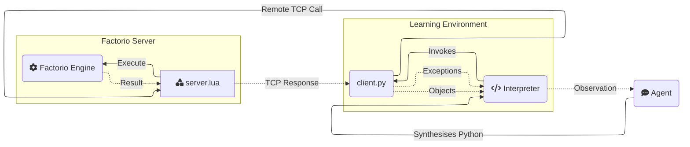

<h1 align="center">Factorio Learning Environment</h1>
<p align="center">
  <a href="https://jackhopkins.github.io/factorio-learning-environment/leaderboard">Leaderboard</a> | <a href="https://arxiv.org/abs/2503.09617">Paper</a> | <a href="https://jackhopkins.github.io/factorio-learning-environment/">Website</a>| <a href="https://discord.gg/zKaV2skewa">Discord (#factorio-learning-env)</a>
</p>

<p align="center">
An open source framework for developing and evaluating LLM agents in the game of <a href="https://factorio.com/">Factorio</a>.
</p>

<p align="center">


</p>
<p align="center"><em>Claude Opus 4.1 Plays Factorio</em></p>

## Why FLE?

[//]: # "FLE is a framework that tests agent capabilities in long-term planning, program synthesis, and resource optimization against a set of exponentially scaling challenges, ranging from basic automation to complex factories processing millions of resources per second. "

We provide two settings:

1. **Lab-play**: 24 structured tasks with fixed resources.
2. **Open-play** An unbounded task of building the largest possible factory on a procedurally generated map.

Our results demonstrate that models still lack strong spatial reasoning. In lab-play, we find that while LLMs
exhibit promising short-horizon skills, they are unable to operate effectively in constrained environments, reflecting limitations in error analysis. In open-play, while LLMs discover automation strategies that improve growth (e.g electric-powered drilling), they fail to achieve complex automation (e.g electronic-circuit manufacturing).

## Quick Links

- [Installation](#installation)
- [Environment](#environment)
- [Tools](#tool-documentation)
- [Project Structure](#project-structure)
- [Database](#database)
- [Contributions](#contributing-guidelines)

## Installation

### Prerequisites

- Docker
- Python 3.10+
- [Factorio](https://www.factorio.com/) (version 1.1.110), only for optional rendering.

### Installation

```bash
# Core FLE SDK package
pip install factorio-learning-environment
uv add factorio-learning-environment

# With optional features
pip install factorio-learning-environment[eval]      # For running experiments
pip install factorio-learning-environment[mcp]       # For MCP protocol support  
pip install factorio-learning-environment[psql]      # For PostgreSQL support
pip install factorio-learning-environment[eval,mcp,psql]  # All features

# Using uv (recommended)
uv add factorio-learning-environment[eval]
```

### Quickstart

Use the CLI:

```bash
# Start Factorio cluster
fle cluster start

# Run evaluation trajectories (requires [eval] dependencies)
fle eval --config configs/gym_run_config.json
```

> When you run `fle init` or `fle eval` for the first time, an `.env` file and a `configs/` directory with example configurations are created automatically


## Environment

FLE is an agent evaluation environment built on the game of Factorio, a popular resource management simulation game.

Agents interact with **FLE** by code synthesis through a **REPL** (Read-Eval-Print-Loop) pattern:

1. **Observation**: The agent observes the world through the output streams (stderr/stdout) of their last program.
2. **Action**: The agent generates a Python program to perform their desired action.
3. **Feedback**: The environment executes the program, assigns variables, add classes/functions to the namespace, and provides an output stream.

<!DOCTYPE html>
<html>
<body>
<table>
<tr>

<td class="python-code">
<b>Action</b>
<pre>
# 1. Get iron patch and place mining drill
drill = place_entity(
    entity=Prototype.MiningDrill,
    position=nearest(Resource.IronOre),
    direction=Direction.NORTH
)
# 2. Add output storage
chest = place_entity_next_to(
    entity=Prototype.IronChest,
    reference_position=drill.drop_position,
    direction=Direction.SOUTH
)
# 3. Verify automation chain and observe entities
sleep(10) # Sleep for 10 seconds
assert drill.status == EntityStatus.WORKING
print(get_entities())
</pre>
</td>
<td class="bash-code">
<b>Feedback</b>
<pre>
>>> [ BurnerMiningDrill(fuel=Inventory({'coal': 4}), 
>>>                     name='burner-mining-drill', 
>>>                     direction=Direction.DOWN, 
>>>                     position=Position(x=-28.0, y=-61.0), 
>>>                     energy=2666.6666666667, 
>>>                     tile_dimensions=TileDimensions(tile_width=2.0, tile_height=2.0), 
>>>                     status=EntityStatus.WORKING, 
>>>                     neighbours=[Entity(name='iron-chest', direction=DOWN, position=Position(x=-27.5 y=-59.5)], 
>>>                     drop_position=Position(x=-27.5, y=-59.5), 
>>>                     resources=[Ingredient(name='iron-ore', count=30000, type=None)]),
>>>   Chest(name='iron-chest', 
>>>         direction=Direction.UP, 
>>>         position=Position(x=-27.5, y=-59.5), 
>>>         energy=0.0, 
>>>         tile_dimensions=TileDimensions(tile_width=1.0, tile_height=1.0), 
>>>         status=EntityStatus.NORMAL, 
>>>         inventory=Inventory({'iron-ore': 75}))]
</pre>
</td>
</tr>
</table>
</body>
</html>

Agents are provided with the Python standard library, and an API comprising [tools](#tool-documentation) that they can use.

Tools are functions that perform a game action and return a typed object (e.g an Inventory), which can be stored as a named **variable** in the Python namespace for later use.

The namespace acts as an episodic symbolic memory system, and saved objects represent an observation of the environment at the moment of query.

This enables agents to maintain complex state representations and build hierarchical abstractions as the factories scale.

Agents observe **stdout** and **stderr** - the output streams of their program. Agents may intentionally choose to print relevant objects and computations to the output stream to construct observations.

Mistakes in the code or invalid operations raise typed **exceptions** with detailed context that is written to stderr.

This enables agents to reactively debug their programs after execution, and proactively use runtime assertions during execution to self-verify their actions.

Agents are able to enhance their internal representation of the game state by defining:

1. Utility functions for reuse throughout an episode, to encapsulate previously successful logic
2. Classes in the namespace to better organize the data retrieved from the game.

### Gym Environment Registry

The Factorio Learning Environment uses a gym environment registry to automatically discover and register all available tasks. This allows you to use `gym.make()` to create environments and reference them by their environment IDs.

#### Overview

The registry system automatically discovers all task definitions in `eval/tasks/task_definitions/` and registers them as gym environments. This means you can create any Factorio environment using the familiar `gym.make()` pattern.

#### Features

- **Automatic Discovery**: Automatically discovers all task definitions in `eval/tasks/task_definitions/`
- **Gym Integration**: All environments are registered with `gym` and can be created using `gym.make()`
- **Task Metadata**: Provides access to task descriptions, configurations, and metadata
- **Multi-agent Support**: Supports both single-agent and multi-agent environments
- **Command-line Tools**: Built-in tools for exploring and testing environments

#### Quick Start

**1. List Available Environments**

```python
from gym_env.registry import list_available_environments

# Get all available environment IDs
env_ids = list_available_environments()
print(f"Available environments: {env_ids}")
```

Or use the command-line tool:

```bash
python fle/env/gym_env/example_usage.py --list
```

**2. Create an Environment**

```python
import gym

# Create any available environment
env = gym.make("iron_ore_throughput")
```

**3. Use the Environment**

```python
from fle.env.gym_env.action import Action

# Reset the environment
obs = env.reset(options={'game_state': None})

# Take an action
action = Action(
    agent_idx=0,  # Which agent takes the action
    code='print("Hello Factorio!")',  # Python code to execute
    game_state=None  # Optional: game state to reset to before running code
)

# Execute the action
obs, reward, terminated, truncated, info = env.step(action)

# Clean up
env.close()
```

#### Available Environments

The registry automatically discovers all task definitions and creates corresponding gym environments using the task key as the environment ID.

**Throughput Tasks (Lab Play)**

All throughput tasks are defined in `fle/eval/tasks/task_definitions/lab_play/throughput_tasks.py`. The 24 available tasks are:

- **Circuits**: `advanced_circuit_throughput`, `electronic_circuit_throughput`, `processing_unit_throughput`
- **Science Packs**: `automation_science_pack_throughput`, `logistics_science_pack_throughput`, `chemical_science_pack_throughput`, `military_science_pack_throughput`, `production_science_pack_throughput`, `utility_science_pack_throughput`
- **Components**: `battery_throughput`, `engine_unit_throughput`, `inserter_throughput`, `iron_gear_wheel_throughput`, `low_density_structure_throughput`
- **Raw Materials**: `iron_ore_throughput`, `iron_plate_throughput`, `steel_plate_throughput`, `plastic_bar_throughput`
- **Oil & Chemicals**: `crude_oil_throughput`, `petroleum_gas_throughput`, `sufuric_acid_throughput`, `sulfur_throughput`
- **Military**: `piercing_round_throughput`, `stone_wall_throughput`

Most tasks require 16 items per 60 seconds; fluid tasks require 250 units per 60 seconds.

**Example Usage**

```python
# Create a throughput environment
env = gym.make("iron_plate_throughput")
env = gym.make("automation_science_pack_throughput")
env = gym.make("crude_oil_throughput")

# Create open play environment
env = gym.make("open_play")
```

#### Command-Line Tools

The `example_usage.py` script provides both interactive examples and command-line tools:

```bash
# Run interactive examples
python fle/env/gym_env/example_usage.py

# List all environments
python fle/env/gym_env/example_usage.py --list

# Show detailed information
python fle/env/gym_env/example_usage.py --detail

# Search for specific environments
python fle/env/gym_env/example_usage.py --search iron

# Output in gym.make() format
python fle/env/gym_env/example_usage.py --gym-format
```

#### Environment Interface

All environments follow the standard gym interface:

**Action Space**

```python
{
    'agent_idx': Discrete(instance.num_agents),  # Index of the agent taking the action
    'game_state': Text(max_length=1000000),      # Optional: game state to reset to before running code
    'code': Text(max_length=10000)               # Python code to execute
}
```

**Observation Space**
The observation space includes:

- `raw_text`: Output from the last action
- `entities`: List of entities on the map
- `inventory`: Current inventory state
- `research`: Research progress and technologies
- `game_info`: Game state (tick, time, speed)
- `score`: Current score
- `flows`: Production statistics
- `task_verification`: Task completion status
- `messages`: Inter-agent messages
- `serialized_functions`: Available functions
- `task_info`: Information about the task
- `map_image`: Base64 encoded PNG image

**Methods**

- `reset(options: Dict[str, Any], seed: Optional[int] = None) -> Dict[str, Any]`
- `step(action: Action) -> Tuple[Dict[str, Any], float, bool, bool, Dict[str, Any]]`
- `close() -> None`

#### API Reference

**Registry Functions**

- `list_available_environments() -> List[str]` - Returns a list of all registered environment IDs
- `get_environment_info(env_id: str) -> Optional[Dict[str, Any]]` - Returns detailed information about a specific environment
- `register_all_environments() -> None` - Manually trigger environment discovery and registration

**Environment Creation**

- `gym.make(env_id: str, **kwargs) -> FactorioGymEnv` - Creates a Factorio gym environment

#### Complete Example

Here's a complete example that demonstrates the full workflow:

```python
import gym
from fle.env.gym_env.registry import list_available_environments, get_environment_info
from fle.env.gym_env.action import Action

# 1. List available environments
env_ids = list_available_environments()
print(f"Found {len(env_ids)} environments")

# 2. Get information about a specific environment
info = get_environment_info("iron_ore_throughput")
print(f"Description: {info['description']}")

# 3. Create the environment
env = gym.make("iron_ore_throughput")

# 4. Use the environment
obs = env.reset(options={'game_state': None})
print(f"Initial observation keys: {list(obs.keys())}")

# 5. Take actions
current_state = None
for step in range(5):
    action = Action(
        agent_idx=0,
        game_state=current_state,
        code=f'print("Step {step}: Hello Factorio!")'
    )
    obs, reward, terminated, truncated, info = env.step(action)
    done = terminated or truncated
    current_state = info['output_game_state']
    print(f"Step {step}: Reward={reward}, Done={done}")

    if done:
        break

# 6. Clean up
env.close()
```
#### Error Handling

The registry includes error handling for:

- Missing task definition files
- Invalid JSON configurations
- Missing Factorio containers
- Environment creation failures

If an environment fails to load, a warning will be printed but the registry will continue to load other environments.

#### Troubleshooting

**Environment Creation Fails**

If `gym.make()` fails with connection errors:

1. Ensure Factorio containers are running
2. Check that the cluster setup is working
3. Verify network connectivity

**No Environments Found**

If no environments are listed:

1. Check that the task definitions directory exists
2. Verify JSON files are valid
3. Check file permissions

**Import Errors**

If you get import errors:

1. Ensure you're running from the correct directory
2. Check that all dependencies are installed
3. Verify the Python path includes the project root

#### Testing

Run the test suite to verify the registry is working correctly:

```bash
python env/tests/gym_env/test_registry.py
```

This registry system provides a clean, standardized interface for working with Factorio gym environments, making it easy to experiment with different tasks and integrate with existing gym-based frameworks.


### Client-side running (optional, renders graphics)

1. **Set up Factorio client**:
   - Purchase Factorio from the [official website](https://www.factorio.com/) (recommended) or on Steam.
   - Downgrade to version 1.1.110:
     - Steam: Right-click Factorio → Properties → Betas → Select 1.1.110
     - **Important**: Make sure to uncheck the Space Age DLC if you have it, as it forces the 2.x branch

2. **Activate server**:
   - Open Factorio client
   - Navigate to _Multiplayer_
   - Connect to `localhost:34197` (default) or your configured address in Docker.
     - Once connected, you can safely disconnect. This step confirms your Factorio license with the server.

### API Key Configuration

FLE supports multiple LLM providers for agent evaluation. To get started with API keys:

1. **Quick Setup** (Recommended):
   ```bash
   python fle/eval/infra/setup_api_keys.py
   ```

   This interactive script helps you:
   - Configure API keys for OpenAI, Anthropic, and other providers
   - Set up API key rotation for high-volume experiments
   - Generate provider-specific configuration files
   - Validate your API key setup

2. **Manual Setup**:
   Add your API keys to the `.env` file:
   ```bash
   # OpenAI
   OPENAI_API_KEY=sk-...

   # Anthropic
   ANTHROPIC_API_KEY=sk-ant-...

   # Additional providers as needed
   ```

3. **Advanced Configuration**:
   For large-scale experiments, you can set up API key rotation and provider-specific settings using the configuration files generated by `setup_api_keys.py`.

### Troubleshooting

- **"No valid programs found for version X"**: This is normal during initialization. The system will start generating programs shortly.
- **Database connection errors**: Verify your database configuration in the .env file and ensure the database exists.
- **API key errors**: Run `python fle/eval/infra/setup_api_keys.py` to verify your API key configuration.
- **Docker issues**: Ensure your user has permission to run Docker without sudo.
- **Connection issues**: Make sure the Factorio server is running and ports are properly configured.


## Tool Documentation

Agents interact with the game using _tools_, which represent a narrow API into the game.

### Anatomy of a Tool

Tools live in `env/src/tools`, and are either `admin` tools (non-agent accessible) or `agent` tools (used by the agent).

A tool requires 3 files:

1. `agent.md`: The agent documentation for the tool, including usage patterns, best practices and failure modes.
2. `client.py`: The client-side implementation, which is a Python class that can be invoked by the agent.
3. `server.lua`: The server-side implementation, which handles most of the logic and heavy lifting.



### Creating a custom Tool

1. Create a new directory in `env/src/tools/agent`, e.g `env/src/tools/agent/my_tool`
2. Add a `client.py` file, which should contain a class inheriting `Tool` and implementing a `__call__` function to treat the class as a callable function. The method signature should contain type annotations. This function _must_ call `self.execute` to invoke the server-side logic.
3. Add a `server.lua` file, containing a function structured like `global.actions.my_tool = function(arg1, arg2, ...)`. This file should invoke the [Factorio API](https://lua-api.factorio.com/1.1.110/) to perform the desired action, and return a table that will be serialized and sent back to the client.
4. Add an `agent.md` file, which should contain a markdown description of the tool. This file will be used by the agent to understand how to use the tool

Next time you run an eval, the tool will automatically be available to the agent and documented in the agent context.

5. (Optional) Create a test suite in `env/tests/actions` for your new tool.

### Core Tools

| Tool                    | Description                                      | Key Features                                                                                                                               |
| ----------------------- | ------------------------------------------------ | ------------------------------------------------------------------------------------------------------------------------------------------ |
| `inspect_inventory`     | Checks contents of player or entity inventories  | - Supports various inventory types (chests, furnaces, etc.)<br>- Returns Inventory object with count methods<br>- Can query specific items |
| `insert_item`           | Places items from player inventory into entities | - Works with machines, chests, belts<br>- Validates item compatibility<br>- Returns updated entity                                         |
| `extract_item`          | Removes items from entity inventories            | - Supports all inventory types<br>- Auto-transfers to player inventory<br>- Returns quantity extracted                                     |
| `place_entity`          | Places entities in the world                     | - Handles direction and positioning<br>- Validates placement requirements<br>- Returns placed Entity object                                |
| `place_entity_next_to`  | Places entities relative to others               | - Automatic spacing/alignment<br>- Handles entity dimensions<br>- Supports all entity types                                                |
| `pickup_entity`         | Removes entities from the world                  | - Returns items to inventory<br>- Handles entity groups<br>- Supports all placeable items                                                  |
| `rotate_entity`         | Changes entity orientation                       | - Affects entity behavior (e.g., inserter direction)<br>- Validates rotation rules<br>- Returns updated entity                             |
| `get_entity`            | Retrieves entity objects at positions            | - Updates stale references<br>- Returns typed Entity objects<br>- Handles all entity types                                                 |
| `get_entities`          | Finds multiple entities in an area               | - Supports filtering by type<br>- Returns List[Entity]<br>- Groups connected entities                                                      |
| `nearest`               | Locates closest resources/entities               | - Finds ores, water, trees<br>- Returns Position object<br>- 500 tile search radius                                                        |
| `get_resource_patch`    | Analyzes resource deposits                       | - Returns size and boundaries<br>- Supports all resource types<br>- Includes total resource amount                                         |
| `harvest_resource`      | Gathers resources from the world                 | - Supports ores, trees, rocks<br>- Auto-collects to inventory<br>- Returns amount harvested                                                |
| `connect_entities`      | Creates connections between entities             | - Handles belts, pipes, power<br>- Automatic pathfinding<br>- Returns connection group                                                     |
| `get_connection_amount` | Calculates required connection items             | - Pre-planning tool<br>- Works with all connection types<br>- Returns item count needed                                                    |
| `set_entity_recipe`     | Configures machine crafting recipes              | - Works with assemblers/chemical plants<br>- Validates recipe requirements<br>- Returns updated entity                                     |
| `get_prototype_recipe`  | Retrieves crafting requirements                  | - Shows ingredients/products<br>- Includes crafting time<br>- Returns Recipe object                                                        |
| `craft_item`            | Creates items from components                    | - Handles recursive crafting<br>- Validates technology requirements<br>- Returns crafted amount                                            |
| `set_research`          | Initiates technology research                    | - Validates prerequisites<br>- Returns required ingredients<br>- Handles research queue                                                    |
| `get_research_progress` | Monitors research status                         | - Shows remaining requirements<br>- Tracks progress percentage<br>- Returns ingredient list                                                |
| `move_to`               | Moves player to position                         | - Pathfinds around obstacles<br>- Can place items while moving<br>- Returns final position                                                 |
| `nearest_buildable`     | Finds valid building locations                   | - Respects entity dimensions<br>- Handles resource requirements<br>- Returns buildable position                                            |
| `sleep`                 | Pauses execution                                 | - Waits for actions to complete<br>- Adapts to game speed<br>- Maximum 15 second duration                                                  |
| `launch_rocket`         | Controls rocket silo launches                    | - Validates launch requirements<br>- Handles launch sequence<br>- Returns updated silo state                                               |
| `print`                 | Outputs debug information to stdout              | - Supports various object types<br>- Useful for monitoring state<br>- Returns formatted string                                             |

# Project Structure

Below is an overview of how the project is structured.

```
factorio-learning-environment/
├── .github/                        # GitHub workflows and CI/CD
├── .fle/                           # Runtime data (saves, scenarios, trajectory logs)
├── docs/                           # Documentation and website
├── examples/                       # Example agent implementations
├── fle/                            # Main codebase
│   ├── agents/                     # Agent implementations (BasicAgent, VisualAgent, etc.)
│   ├── cluster/                    # Docker orchestration and scenarios
│   ├── commons/                    # Shared utilities and models
│   ├── configs/                    # Configuration files
│   ├── data/                       # Data files and replays
│   ├── env/                        # Core environment
│   │   ├── gym_env/                # OpenAI Gym interface
│   │   ├── tools/                  # Agent-accessible tools (place_entity, craft_item, etc.)
│   │   ├── protocols/              # Communication protocols (A2A, MCP)
│   │   ├── exceptions/             # Custom exceptions
│   │   └── utils/                  # Environment utilities
│   ├── eval/                       # Evaluation framework
│   │   ├── algorithms/             # Beam search, MCTS, independent evaluation
│   │   ├── analysis/               # Analysis tools
│   │   ├── tasks/                  # Task definitions
│   │   └── evaluator.py            # Main evaluation logic
│   ├── run.py                      # CLI entry point
│   └── server.py                   # RCON server
├── tests/                          # Test suite (actions, benchmarks, functional, etc.)
├── .example.env                    # Environment variables template
├── BUILD.md                        # Build instructions
├── CONTRIBUTING.md                 # Contribution guidelines
├── pyproject.toml                  # Python project config
└── uv.lock                         # Dependency lock file
```
## Model Context Protocol (MCP)

FLE supports the [Model Context Protocol](fle/env/protocols/_mcp/README.md) (MCP) to enable LLM reasoning models to invoke tools.

## Sprites

FLE includes sprite management functionality for downloading spritemaps, extracting individual entity sprites, icons, and other visual assets from HuggingFace for use in visual reasoning tasks.

### Usage

```bash
# Download and generate sprites
fle sprites

# Force re-download even if sprites exist
fle sprites --force

# Use custom directories and worker count
fle sprites --spritemap-dir .fle/spritemaps --sprite-dir .fle/sprites --workers 5
```

## Database

To run long trajectories in FLE, we support checkpointing at every agent step using a SQL database. The `db_client` implements the interface for saving and loading agent outputs, environment feedbacks, game states and histories of the current trajectory. We support out of the box SQLite (default) and Postgres databases. The easiest way to set up a FLE-compatible database is to use the default SQLite, the env variable `FLE_DB_TYPE="sqlite"` lets you select the DB.

We recommend changing and setting up the `SQLITE_DB_FILE` variable in the `.env` file. It defaults to `.fle/data.db` in your working directory.

### Postgres

Make sure all variables are set in the `.env` file with `FLE_DB_TYPE="postgres"`.

To utilize postgres database you need to setup an instance of the db server yourself. The easiest way is to run it via Docker:

`docker run --name fle-postgres -e POSTGRES_PASSWORD=fle123 -e POSTGRES_USER=fle_user -e POSTGRES_DB=fle_database -p 5432:5432 -d postgres:15`

This launches a postgres:15 server with the defined settings, it can be used via the corresponding `.env` variables:

```
# Database Configuration - Set to postgres to use PostgreSQL
FLE_DB_TYPE="postgres"

# PostgreSQL Configuration
SKILLS_DB_HOST=localhost
SKILLS_DB_PORT=5432
SKILLS_DB_NAME=fle_database
SKILLS_DB_USER=fle_user
SKILLS_DB_PASSWORD=fle123
```

## Contributing Guidelines

Join our team and contribute to one of the AI research community's most challenging problems - building open-ended / unsaturateable evals for post-AGI frontier models. If you want to contribute, please read [CONTRIBUTING.md](CONTRIBUTING.md) first.

[](https://deepwiki.com/JackHopkins/factorio-learning-environment)
