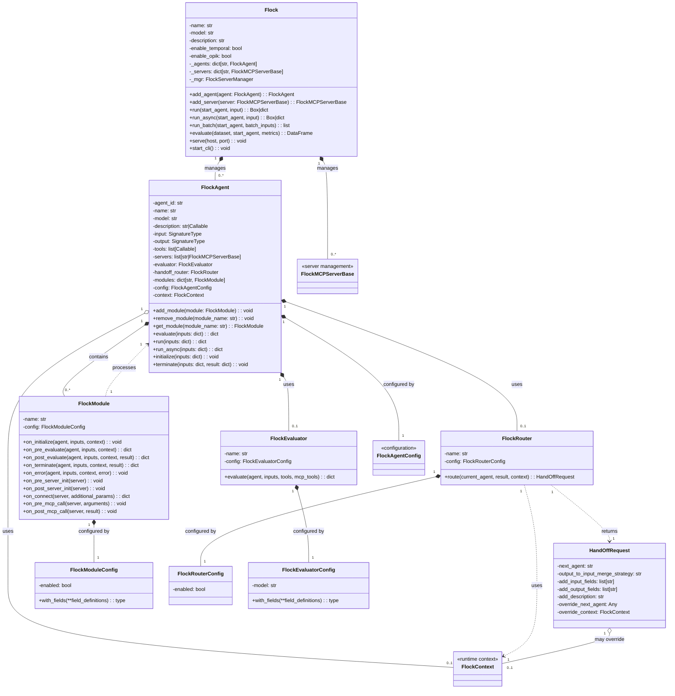

```mermaid
classDiagram
    class Flock {
        -name: str
        -model: str
        -description: str
        -enable_temporal: bool
        -enable_opik: bool
        -_agents: dict[str, FlockAgent]
        -_servers: dict[str, FlockMCPServerBase]
        -_mgr: FlockServerManager
        +add_agent(agent: FlockAgent): FlockAgent
        +add_server(server: FlockMCPServerBase): FlockMCPServerBase
        +run(start_agent, input): Box|dict
        +run_async(start_agent, input): Box|dict
        +run_batch(start_agent, batch_inputs): list
        +evaluate(dataset, start_agent, metrics): DataFrame
        +serve(host, port): void
        +start_cli(): void
    }
    
    class FlockAgent {
        -agent_id: str
        -name: str
        -model: str
        -description: str|Callable
        -input: SignatureType
        -output: SignatureType
        -tools: list[Callable]
        -servers: list[str|FlockMCPServerBase]
        -evaluator: FlockEvaluator
        -handoff_router: FlockRouter
        -modules: dict[str, FlockModule]
        -config: FlockAgentConfig
        -context: FlockContext
        +add_module(module: FlockModule): void
        +remove_module(module_name: str): void
        +get_module(module_name: str): FlockModule
        +evaluate(inputs: dict): dict
        +run(inputs: dict): dict
        +run_async(inputs: dict): dict
        +initialize(inputs: dict): void
        +terminate(inputs: dict, result: dict): void
    }
    
    class FlockModule {
        -name: str
        -config: FlockModuleConfig
        +on_initialize(agent, inputs, context): void
        +on_pre_evaluate(agent, inputs, context): dict
        +on_post_evaluate(agent, inputs, context, result): dict
        +on_terminate(agent, inputs, context, result): dict
        +on_error(agent, inputs, context, error): void
        +on_pre_server_init(server): void
        +on_post_server_init(server): void
        +on_connect(server, additional_params): dict
        +on_pre_mcp_call(server, arguments): void
        +on_post_mcp_call(server, result): void
    }
    
    class FlockRouter {
        -name: str
        -config: FlockRouterConfig
        +route(current_agent, result, context): HandOffRequest
    }
    
    class FlockEvaluator {
        -name: str
        -config: FlockEvaluatorConfig
        +evaluate(agent, inputs, tools, mcp_tools): dict
    }
    
    class HandOffRequest {
        -next_agent: str
        -output_to_input_merge_strategy: str
        -add_input_fields: list[str]
        -add_output_fields: list[str]
        -add_description: str
        -override_next_agent: Any
        -override_context: FlockContext
    }
    
    class FlockModuleConfig {
        -enabled: bool
        +with_fields(**field_definitions): type
    }
    
    class FlockRouterConfig {
        -enabled: bool
    }
    
    class FlockEvaluatorConfig {
        -model: str
        +with_fields(**field_definitions): type
    }
    
    class FlockAgentConfig {
        <<configuration>>
    }
    
    class FlockContext {
        <<runtime context>>
    }
    
    class FlockMCPServerBase {
        <<server management>>
    }
    
    %% Primary Composition Relationships
    Flock "1" *-- "0..*" FlockAgent : manages
    Flock "1" *-- "0..*" FlockMCPServerBase : manages
    FlockAgent "1" *-- "0..1" FlockEvaluator : uses
    FlockAgent "1" *-- "0..1" FlockRouter : uses
    FlockAgent "1" *-- "0..*" FlockModule : contains
    FlockAgent "1" *-- "1" FlockAgentConfig : configured by
    
    %% Configuration Relationships
    FlockModule "1" *-- "1" FlockModuleConfig : configured by
    FlockRouter "1" *-- "1" FlockRouterConfig : configured by
    FlockEvaluator "1" *-- "1" FlockEvaluatorConfig : configured by
    
    %% Runtime Relationships
    FlockAgent "1" o-- "0..1" FlockContext : uses
    FlockRouter "1" ..> "1" HandOffRequest : returns
    FlockModule "1" ..> "1" FlockAgent : processes
    
    %% Dependencies
    FlockRouter "1" ..> "1" FlockContext : uses
    HandOffRequest "1" o-- "0..1" FlockContext : may override
    
    click Flock call linkCallback("c:/Users/aratz/Projects/flock/src/flock/core/flock.py#L84")
    click FlockAgent call linkCallback("c:/Users/aratz/Projects/flock/src/flock/core/flock_agent.py#L58")
    click FlockModule call linkCallback("c:/Users/aratz/Projects/flock/src/flock/core/flock_module.py#L36")
    click FlockRouter call linkCallback("c:/Users/aratz/Projects/flock/src/flock/core/flock_router.py#L41")
    click FlockEvaluator call linkCallback("c:/Users/aratz/Projects/flock/src/flock/core/flock_evaluator.py#L32")
    click HandOffRequest call linkCallback("c:/Users/aratz/Projects/flock/src/flock/core/flock_router.py#L11")
    click FlockModuleConfig call linkCallback("c:/Users/aratz/Projects/flock/src/flock/core/flock_module.py#L11")
    click FlockRouterConfig call linkCallback("c:/Users/aratz/Projects/flock/src/flock/core/flock_router.py#L32")
    click FlockEvaluatorConfig call linkCallback("c:/Users/aratz/Projects/flock/src/flock/core/flock_evaluator.py#L9")
    click FlockAgentConfig call linkCallback("c:/Users/aratz/Projects/flock/src/flock/core/config/flock_agent_config.py#L5")
    click FlockContext call linkCallback("c:/Users/aratz/Projects/flock/src/flock/core/context/context.py#L34")
    click FlockMCPServerBase call linkCallback("c:/Users/aratz/Projects/flock/src/flock/core/mcp/flock_mcp_server.py#L44")
```