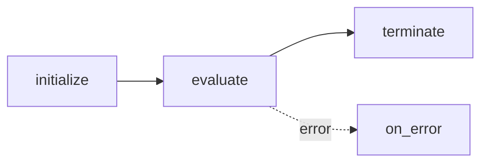

# Flock Agents 🐦

A **FlockAgent** is the fundamental unit of work. Each agent is declarative — you specify what goes in and what should come out. Components provide the “how”.

---

## 1. Anatomy of an Agent (Unified)

```python
from flock.core import DefaultAgent

agent = DefaultAgent(
    name="movie_pitcher",
    description="Create a fun movie idea",
    input="topic: str | Central subject",
    output="title: str, runtime: int, synopsis: str",
)
```

### Key Fields

| Field | Type | Intent |
| ----- | ---- | ------ |
| `name` | `str` | Unique identifier; becomes the registry key. |
| `model` | `str | None` | Override the default model for this agent. |
| `description` | `str \| Callable \| BaseModel` | High-level instruction (string or callable). |
| `input` | `str | BaseModel` | Contract for accepted data. |
| `output` | `str | BaseModel` | Contract for produced data. |
| `tools` | `list[Callable]` | Extra callables the evaluator may invoke. |
| `tool_whitelist` | `list[str] \| None` | Filter tools by name for security (recommended). |
| `servers` | `list[str \| FlockMCPServer]` | MCP servers providing additional tools. |
| `components` | `list[AgentComponent]` | Unified list: evaluation, routing, utility. |
| `evaluator` | `EvaluationComponent | None` | Convenience property: primary evaluator. |
| `router` | `RoutingComponent | None` | Convenience property: primary router. |

All these fields are **Pydantic-validated** and fully serialisable via `Serializable`.

---

## 2. Contracts: Input & Output

Signatures are written in a compact mini-DSL:

* `field` – just a name (type & description inferred by the LLM).
* `field: type` – adds a type hint.
* `field: type | description` – adds a natural-language description.
* Multiple fields are comma-separated.
* Lists/dicts follow normal Python typing: `list[dict[str, str]]`.

Alternatively, pass **Pydantic models** (recommended for complex schemas):

```python
from pydantic import BaseModel

class SearchIn(BaseModel):
    query: str
    top_k: int = 5

class SearchOut(BaseModel):
    documents: list[str]

search_agent = DefaultAgent(
    name="searcher",
    input=SearchIn,
    output=SearchOut,
)
```

---

## 3. Tools & Security

Agents can use both native Python functions and tools from MCP (Model Context Protocol) servers:

```python
agent = DefaultAgent(
    name="research_agent",
    tools=[my_python_function],      # Native Python tools
    servers=["web-search-server"],   # MCP servers
    tool_whitelist=["search_web", "summarize"],  # Security filtering
)
```

### Tool Whitelisting

For security and control, agents support tool filtering via `tool_whitelist`:

* **`tool_whitelist: list[str] | None`** – If provided, only tools with names in this list are accessible
* Applies to both native Python tools (by `__name__`) and MCP tools (by `name` attribute)
* If `None`, all tools from servers and the tools list are available

**Example:**
```python
# Only allow specific tools
secure_agent = DefaultAgent(
    name="secure_agent",
    servers=["general-tools"],
    tool_whitelist=["safe_search", "validate_input"],  # Restricted access
)

# Allow all tools (default)
open_agent = DefaultAgent(
    name="open_agent", 
    servers=["general-tools"],
    # No tool_whitelist = all server tools available
)
```

**Best Practice:** Use agent-level filtering for granular control. Different agents can access different tool subsets from the same server.

See the **[Tool Whitelisting & Security Guide](../guides/tool-whitelist.md)** for comprehensive security patterns and implementation details.

---

## 4. Lifecycle



1. **initialize** – prepare resources (DB connection, load embeddings, etc.).
2. **evaluate** – main logic executed by the evaluator.
3. **terminate** – clean-up, persist metrics.
4. **on_error** – triggered if any previous stage raises.

Components (utility) can hook into each stage to extend behavior.

---

## 4. Adding Components

```python
from flock.components.utility.output_utility_component import OutputUtilityComponent, OutputUtilityConfig
from flock.components.routing.default_routing_component import DefaultRoutingComponent, DefaultRoutingConfig

agent.add_component(OutputUtilityComponent(name="output", config=OutputUtilityConfig(render_table=True)))
agent.add_component(DefaultRoutingComponent(name="router", config=DefaultRoutingConfig()))
```

---

## 5. Best Practices

* Keep `description` concise; use the signature for fine-grained control.
* Prefer Pydantic models for complex schemas – you get validation for free.
* Separate concerns: evaluator handles logic, utility components handle cross‑cutting tasks.
* Register reusable tools with `@flock_tool` so any agent can adopt them.

---

**Next:**  Learn *why* this declarative approach works in [Declarative Programming](declarative.md).
