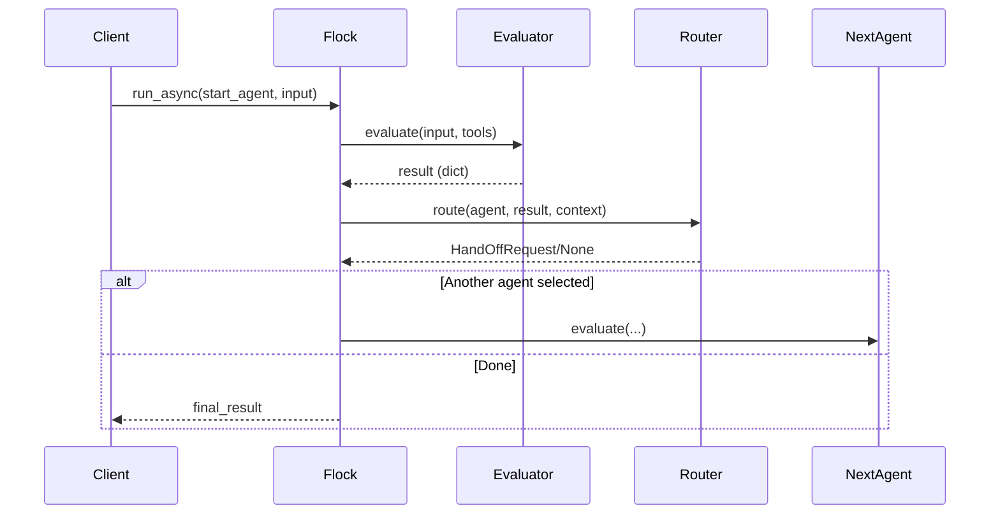

# Core Concepts Overview

Welcome to the beating heart of the **Flock Framework**.  If you understand the ideas on this page, the rest of the documentation will feel intuitive.

> **In one sentence:**  *Flock lets you describe **what** an agent-based system should do (declaratively) and then supplies the **how** at runtime through pluggable, observable components.*

---

## 1. The Building Blocks

| Concept | What it is | Where it lives | Why it matters |
| ------- | ---------- | -------------- | -------------- |
| **Flock** *(Orchestrator)* | A container for one or more agents plus their execution settings. | `flock.core.flock.Flock` | Starts runs, handles local vs. Temporal execution, and owns the shared `FlockContext`. |
| **FlockAgent** | A *declarative* description of an autonomous unit of work. | `flock.core.flock_agent.FlockAgent` | You specify `input`, `output`, optional `description`, and attach components (evaluator, router, modules, tools). |
| **Evaluator** | Implementation of an agent's logic.  Most call an LLM but any Python can live here. | `flock.core.flock_evaluator.*` | Lets you swap GPT-4 for rules-based logic without changing the agent spec. |
| **Module** | Cross-cutting behaviour that hooks into an agent's lifecycle (e.g. output rendering, metrics, memory). | `flock.core.flock_module.*` | Compose extra capabilities without touching the evaluator. |
| **Router** | Decides the next agent during a run (or ends it). | `flock.core.flock_router.*` | Enables dynamic, branching workflows. |
| **Tool** | A registered callable that the evaluator may invoke. | Anywhere, registered with `@flock_tool` | Gives agents super-powers beyond text generation. |
| **Context** | Runtime key-value store + history for a run. | `flock.core.context.FlockContext` | Share state between agents, enable logging/telemetry. |
| **Registry** | Global catalogue of agents/components/tools/types. | `flock.core.flock_registry.FlockRegistry` | Enables serialization, CLI lookup, and code-free composition. |

These components interact through well-defined contracts, all serialisable via the built-in `Serializable` mixin.

---

## 2. Data Flow at Runtime

1. **Client** starts a run locally or through Temporal.
2. **Flock** initialises a `FlockContext`, sets tracing baggage, and calls the starting agent's **Evaluator**.
3. The **Evaluator** produces a typed `dict` (optionally streaming via `litellm`).
4. The **Router** (if defined) inspects the result and context to pick the next agent.
5. Steps 2–4 repeat until no hand-off is returned.
6. Flock surfaces the last result to the caller (boxed for dot-notation convenience).

---

## 3. Declarative Signatures

The secret sauce is the `input` / `output` signature on each agent.  They accept **four** flavours:

1. **Simple string** – comma-separated keys: `"query, context"`.
2. **Rich string** – type hints & descriptions: `"query: str | Search query, top_k: int | # of documents"`.
3. **Pydantic model class** – strong-typed contract.
4. **Callable** returning either of the above – useful for dynamic schemas.

Flock turns these specs into prompts, validation rules, and OpenAPI-style docs automatically.

---

## 4. Lifecycle Hooks

Each agent exposes synchronous hooks that modules can intercept:

| Hook | When it fires |
| ---- | ------------- |
| `initialize` | Right before the evaluator runs. |
| `evaluate` | The evaluator itself. |
| `terminate` | After successful completion. |
| `on_error` | When an exception is raised during any stage. |

These hooks are **always awaited** so you can perform async actions (DB calls, telemetry uploads, etc.).

---

## 5. Execution Modes

* **Local (default):** Everything runs inside the current event-loop.
* **Temporal:** Pass `enable_temporal=True` when creating the flock.  Flock spins up or connects to a Temporal worker and runs the same workflow as a long-running durable process with retries.

You can switch a project from local debugging to production-grade resiliency by toggling a single flag and providing a `TemporalWorkflowConfig`.

---

## 6. Next Steps

* **Agents in Depth →** `core-concepts/agents.md`
* **Declarative Programming →** `core-concepts/declarative.md`
* **Workflows →** `core-concepts/workflows.md`

Happy flying! 🐦
