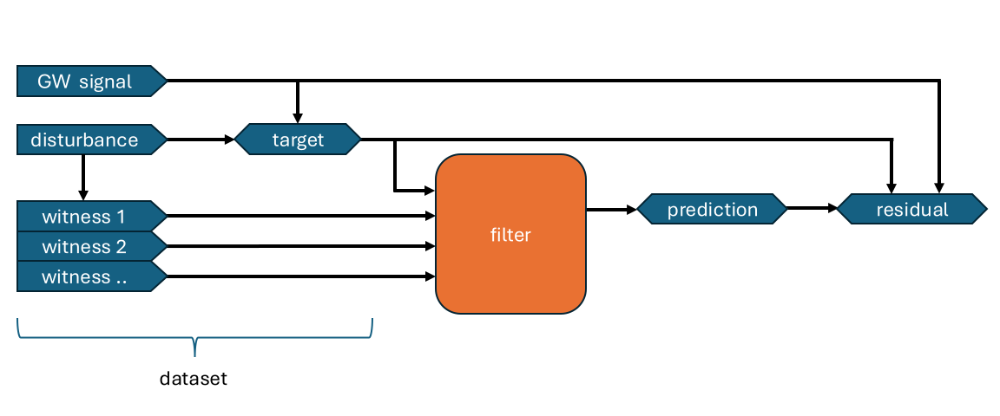

Concepts and wording
**********************

Datamodel
==========

The following overview summarizes the underlying data processing model of this framework:

* Noise cancellation methods are called filters to have a shorter name
* The goal of the filters is to make an as good as possible `prediction` of the `disturbance` channel based on the `target` and `witness` signals.
* A dataset defines a set of signals that can be used to test filtering techniques

  * Each `dataset` contains one `target` channel, one or multiple `witness` channels and optionally one `GW signals` channel
  * The `GW signal` or short `signal` channel contains the useful signal that should be recovered through cancellation
  * In a real-world application, only the `witness` and `target` channels would be available. The exact realization of the `GW signal` and `disturbance` channels would be unknown
  * To evaluate the performance on simulated data, the `GW signal` channel can be added. The disturbance channel is implicitly defined as the difference between `target` and `GW signal`

* The `residual` signal is the most relevant indicator of the cancellation performance. It indicates the difference between the `prediction` and the targeted `disturbance`

Concepts
=========

* Hashing is used to prevent unnecessary rerunning of calculations
  
  * All objects that are part of an evaluation run configuration run provide a comparable hash that is a unique, comparable indicator of their configuration and version
  * These hashes are e.g. used in filenames to determine if a result for a given calcuation is already available
  * The python `__hash__` interface is randomized for every session of the python interpreter for security reasons. It is therefore not usable here.
