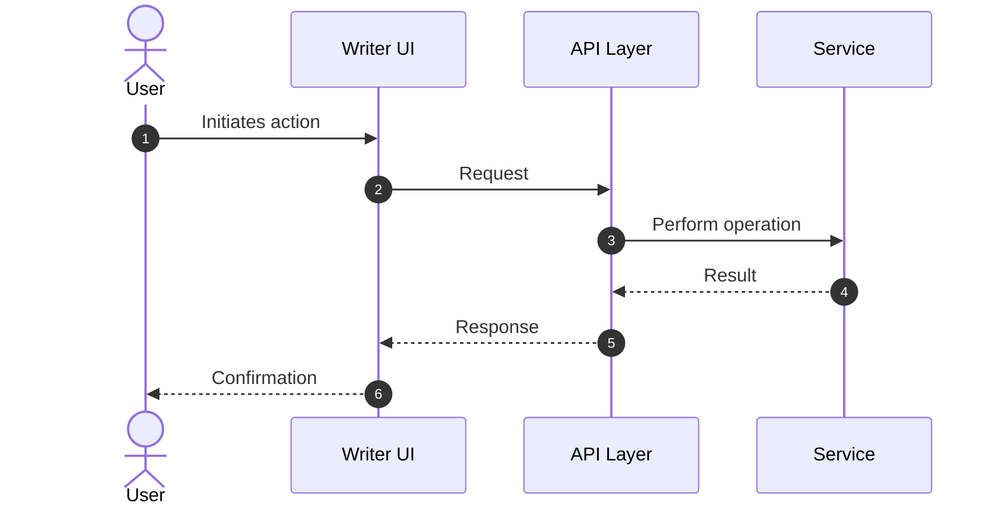

# Specifications WARP (docs/specs)

## Scope and Purpose

- This directory contains only specifications written in Markdown format.
- Each file describes a single feature or change at a product/engineering level.
- Specifications are the source of truth for implementation plans and should be kept up to date as features evolve.

## File Naming Conventions

- Files must be named using kebab-case with a .md extension: <feature-name>.md
- Examples:
  - arena-moderator.md
  - knowledge-graph-export.md
  - jit-ideas-ranking.md

## Required Template

Every specification MUST follow this template:

```markdown path=null start=null
# <Feature Name>

<Executive summary of the feature>

## Motivation

<Reason we are implementing the feature>

## Functional Requirements

<List of functional requirements>

## Non-Functional Requirements

<List of non-functional requirements>

## High Level Design

<Detailed high level design>
<Most specifications should start with a detailed sequence diagram>
<Prefer to use Mermaid for the diagrams>
<Include code snippets that documents how to use libraries/functions required for this implementation>

## Task Breakdown

<List of tasks that need to be executed, in order, to implement this specification>
<Do NOT include date/time estimates>

## Context

<List of files with context/documentation that might be helpful during implementation>
<Can also include code blocks and instructions to use context7 / perplexity to search for information>
```

## Research Is Mandatory

When writing a specification, always perform research:

- For open-source libraries and frameworks, fetch the latest official documentation via the context7 MCP server.
  - Use the resolve-library-id tool first, then get-library-docs to retrieve focused, up-to-date docs for the library section you need.
- For broader internet research or comparisons, use the perplexity-ask MCP tool to gather sources and perspectives.
- Cite important references inline with URLs and include a short “Sources” list at the end when appropriate.

Normative specs only: do not include words like "optional", "nice-to-have", or "future work" in the main body. Every requirement and step must be exact, actionable, and testable. If you need to capture future ideas, create a separate follow-ups section explicitly marked as non-spec content.

## Language and Stack Defaults

- Default implementation language is Python unless explicitly stated otherwise in the spec.
- Explicitly list all dependencies with pinned versions in the spec’s Context or a dedicated Dependencies section.
- Determine latest versions at the time of writing using pip on the command line, then record the chosen pinned versions in the spec. Example commands:

```bash path=null start=null
# Show available versions (pip 23.2+)
python -m pip index versions <package>

# Inspect an installed version
python -m pip show <package>

# Install a specific version while drafting a spike
python -m pip install <package>==<version>
```

Guidance for versions:

- Prefer semver-compatible pins that are reproducible (e.g., == for specs; ranges like ~= may be used later in requirements.txt if justified).
- If a library is pre-1.0 or unstable, document the stability considerations and test risks.

## Diagrams

- Prefer Mermaid for all sequence, flow, and component diagrams.
- Place the primary sequence diagram at the start of the High Level Design section.
- Keep diagrams self-explanatory with clear actor/component names and message labels.

Example Mermaid sequence diagram scaffold:



## Task Breakdown

- Provide an ordered list of implementation tasks.
- Do NOT include date/time estimates.
- When tasks are large, suggest sub-tasks and checkpoints suitable for PR boundaries and reviews.

## Context Section Guidance

- Link relevant code (paths), documents, RFCs, and prototypes that inform the design.
- Include minimal, runnable examples or commands when helpful.
- You may include instructions for context7 or perplexity-ask usage to quickly retrieve authoritative references during implementation.

Example context pointers:

- Related prototypes: prototypes/<prototype_name>
- Key modules to extend: src/... or backend/... (as applicable)
- External references: library docs via context7; articles/benchmarks via perplexity-ask

## Document Generation Policy

**CRITICAL: Never generate documentation or summary files without explicit user request.**

- Do NOT create fix summaries, change logs, or documentation files after making code changes unless explicitly asked.
- Do NOT create "helpful" documentation proactively.
- Keep the repository tidy - only create files when specifically requested.
- When fixing issues, make the code changes and explain them in the response, but don't write them to disk as documentation.

Exceptions:
- User explicitly asks for documentation: "create a document about...", "write a summary of..."
- Specifications requested as part of a feature design process
- Updates to existing documentation files when clearly part of the task

## Review Checklist (for authors and reviewers)

- Naming is kebab-case and file ends with .md
- Template sections are present and complete
- Mermaid diagram included and correct at the start of High Level Design
- Functional and non-functional requirements are explicit and testable
- Dependencies are listed with pinned versions determined via pip
- Research notes and citations are included where appropriate
- Task Breakdown is ordered, scoped, and free of time estimates
- No "optional" or "nice-to-have" language in the spec body (specs are exact)
