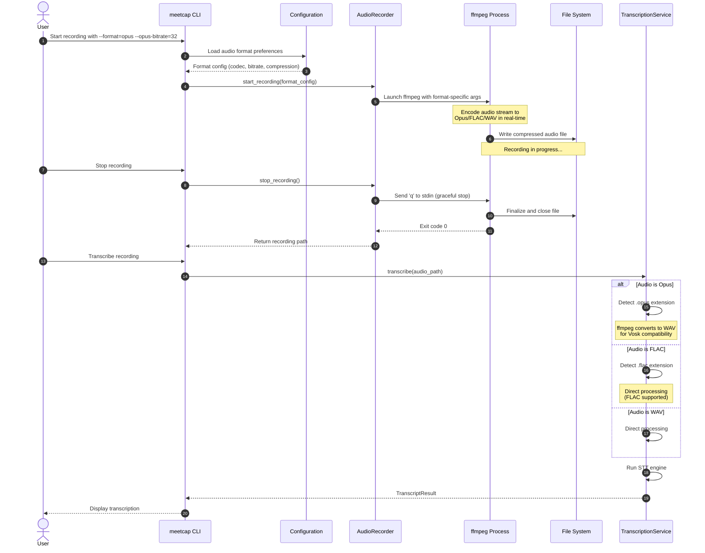
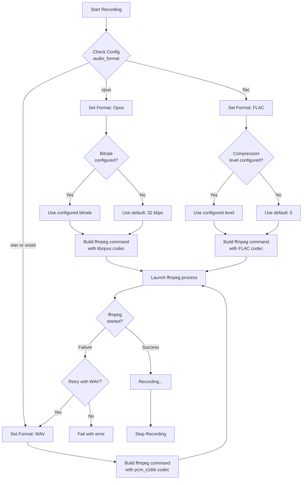

# Compressed Audio Format Support

This specification defines the implementation of disk space efficient audio recording formats to replace the current uncompressed WAV format in meetcap. The implementation will support both lossy (Opus) and lossless (FLAC) compression options optimized for voice recordings.

## Motivation

The current implementation records audio in uncompressed WAV format (PCM 16-bit), which results in large file sizes that consume significant disk space. For a typical 1-hour meeting recording at 48 kHz stereo:

- **Current WAV**: ~630 MB per hour
- **Proposed Opus (32 kbps)**: ~14.4 MB per hour (98% reduction)
- **Proposed FLAC**: ~315 MB per hour (50% reduction, lossless)

Voice recordings compress exceptionally well because speech contains significant silence and redundancy. By implementing compressed audio formats, we can:

1. Reduce storage requirements by 50-99% depending on format choice
2. Enable longer recording sessions on systems with limited disk space
3. Facilitate faster backups and file transfers
4. Maintain full compatibility with existing transcription tools (Vosk, Whisper)

## Functional Requirements

1. **Dual Format Support**: The system must support both Opus (lossy) and FLAC (lossless) compression formats in addition to the existing WAV format
2. **Configurable Default Format**: Users must be able to configure their preferred recording format via CLI arguments and configuration files
3. **Backward Compatibility**: Existing WAV recordings and transcription workflows must continue to work without modification
4. **Transparent Format Conversion**: The transcription service must automatically handle all three formats without requiring format-specific code paths from the user
5. **Metadata Preservation**: Recording metadata (timestamps, device info) must be embedded in compressed format file headers
6. **Error Handling**: Graceful fallback to WAV format if compression encoding fails during recording
7. **Quality Configuration**: For Opus, users must be able to configure bitrate (default: 32 kbps for voice)
8. **Compression Level Configuration**: For FLAC, users must be able to configure compression level (default: 5 for balanced speed/size)

## Non-Functional Requirements

1. **CPU Efficiency**: Encoding overhead must not exceed 5% CPU usage on typical hardware during recording
2. **Real-time Performance**: Compression must occur in real-time during recording without audio dropouts
3. **Minimal Dependencies**: No additional Python packages beyond what ffmpeg already provides
4. **Cross-Platform**: Solution must work on macOS (primary) with consideration for future Linux/Windows support
5. **Quality Preservation**: Opus at 32 kbps must maintain excellent voice transcription accuracy (>98% compared to WAV)
6. **File Size Targets**:
   - Opus: < 15 MB per hour for stereo voice at 32 kbps
   - FLAC: < 350 MB per hour for stereo voice
7. **Startup Latency**: Recording must start within 1 second regardless of format choice

## High Level Design

### Architecture Overview



### Format Selection Logic



### Code Implementation Examples

#### 1. Configuration Schema Extension

Add to `meetcap/utils/config.py`:

```python
from enum import Enum
from typing import Literal

class AudioFormat(str, Enum):
    """Supported audio recording formats."""
    WAV = "wav"
    OPUS = "opus"
    FLAC = "flac"

@dataclass
class AudioConfig:
    """Audio recording configuration."""
    format: AudioFormat = AudioFormat.WAV
    sample_rate: int = 48000
    channels: int = 2

    # Opus-specific settings
    opus_bitrate: int = 32  # kbps, range: 6-510

    # FLAC-specific settings
    flac_compression_level: int = 5  # 0-8, higher = smaller file
```

#### 2. FFmpeg Command Builder

Add to `meetcap/core/recorder.py`:

```python
def _build_ffmpeg_command(
    self,
    device_index: int,
    output_path: Path,
    audio_format: AudioFormat,
    opus_bitrate: int = 32,
    flac_compression: int = 5,
) -> list[str]:
    """
    Build ffmpeg command with format-specific encoding options.

    Args:
        device_index: AVFoundation device index
        output_path: Output file path (extension determines container)
        audio_format: Target audio format (wav/opus/flac)
        opus_bitrate: Bitrate in kbps for Opus encoding
        flac_compression: Compression level (0-8) for FLAC

    Returns:
        Complete ffmpeg command as list of strings
    """
    # Base command for input
    cmd = [
        "ffmpeg",
        "-hide_banner",
        "-nostdin",
        "-f", "avfoundation",
        "-i", f":{device_index}",
    ]

    # Add format-specific encoding options
    if audio_format == AudioFormat.OPUS:
        cmd.extend([
            "-c:a", "libopus",
            "-b:a", f"{opus_bitrate}k",
            "-vbr", "on",  # Variable bitrate for better quality
            "-application", "voip",  # Optimize for speech
            "-frame_duration", "20",  # 20ms frames for low latency
        ])
    elif audio_format == AudioFormat.FLAC:
        cmd.extend([
            "-c:a", "flac",
            "-compression_level", str(flac_compression),
        ])
    else:  # WAV (PCM)
        cmd.extend([
            "-c:a", "pcm_s16le",
            "-ar", str(self.sample_rate),
            "-ac", str(self.channels),
        ])

    cmd.append(str(output_path))
    return cmd
```

#### 3. Transcription Format Detection

Add to `meetcap/services/transcription.py`:

```python
def _prepare_audio_for_transcription(
    self,
    audio_path: Path,
    target_sample_rate: int = 16000,
) -> tuple[Path, bool]:
    """
    Prepare audio file for transcription, converting if needed.

    Args:
        audio_path: Original audio file path
        target_sample_rate: Target sample rate for STT engine

    Returns:
        Tuple of (processed_audio_path, is_temporary)

    Raises:
        RuntimeError: If conversion fails
    """
    import tempfile
    import subprocess

    # Check if format is directly supported by STT engine
    supported_extensions = {".wav", ".flac"}
    needs_conversion = audio_path.suffix.lower() not in supported_extensions

    if not needs_conversion:
        console.print(f"[dim]Audio format {audio_path.suffix} is natively supported[/dim]")
        return audio_path, False

    # Convert to WAV for maximum compatibility
    console.print(f"[cyan]Converting {audio_path.suffix} to WAV for transcription...[/cyan]")

    with tempfile.NamedTemporaryFile(suffix=".wav", delete=False) as tmp:
        temp_wav = Path(tmp.name)

    try:
        cmd = [
            "ffmpeg",
            "-i", str(audio_path),
            "-ac", "1",  # Convert to mono
            "-ar", str(target_sample_rate),  # Resample
            "-c:a", "pcm_s16le",
            "-y",
            str(temp_wav),
        ]

        result = subprocess.run(
            cmd,
            capture_output=True,
            text=True,
            check=True,
            timeout=300,  # 5 minute timeout
        )

        console.print("[green]✓[/green] Audio converted successfully")
        return temp_wav, True

    except subprocess.CalledProcessError as e:
        if temp_wav.exists():
            temp_wav.unlink()
        raise RuntimeError(f"Audio conversion failed: {e.stderr}") from e
    except subprocess.TimeoutExpired:
        if temp_wav.exists():
            temp_wav.unlink()
        raise RuntimeError("Audio conversion timed out after 5 minutes")
```

#### 4. CLI Argument Extension

Add to `meetcap/cli.py`:

```python
@app.command()
def record(
    device: Optional[int] = typer.Option(None, "--device", "-d", help="Audio device index"),
    output: Optional[Path] = typer.Option(None, "--output", "-o", help="Custom output directory"),
    format: AudioFormat = typer.Option(
        AudioFormat.WAV,
        "--format",
        "-f",
        help="Audio recording format (wav/opus/flac)",
        case_sensitive=False,
    ),
    opus_bitrate: int = typer.Option(
        32,
        "--opus-bitrate",
        help="Opus bitrate in kbps (6-510), default optimized for voice",
    ),
    flac_compression: int = typer.Option(
        5,
        "--flac-compression",
        help="FLAC compression level (0-8), higher = smaller file",
    ),
    # ... existing arguments ...
) -> None:
    """Start audio recording with configurable compression format."""

    # Validate format-specific settings
    if format == AudioFormat.OPUS:
        if not 6 <= opus_bitrate <= 510:
            console.print("[red]Error: Opus bitrate must be between 6-510 kbps[/red]")
            raise typer.Exit(1)

    if format == AudioFormat.FLAC:
        if not 0 <= flac_compression <= 8:
            console.print("[red]Error: FLAC compression level must be between 0-8[/red]")
            raise typer.Exit(1)

    # ... rest of recording logic ...
```

### File Extension Mapping

| Format | Extension | MIME Type | Container |
|--------|-----------|-----------|-----------|
| WAV    | .wav      | audio/wav | RIFF      |
| Opus   | .opus     | audio/opus | Ogg       |
| FLAC   | .flac     | audio/flac | FLAC      |

### Format Comparison Summary

| Metric | WAV (Current) | Opus (Proposed) | FLAC (Proposed) |
|--------|--------------|----------------|-----------------|
| **Size (1hr stereo)** | 630 MB | 14.4 MB | 315 MB |
| **Compression** | None | Lossy (98% reduction) | Lossless (50% reduction) |
| **CPU Usage** | Minimal | Low (~2-3%) | Low (~3-5%) |
| **Quality** | Perfect | Excellent for voice | Perfect |
| **Transcription** | Native | Via conversion | Native |
| **Latency** | None | <50ms | <100ms |
| **Bitrate** | 1536 kbps | 32 kbps (configurable) | Variable (~540 kbps avg) |

### Dependencies

The implementation requires only ffmpeg with appropriate codec support. No additional Python packages are required beyond existing dependencies:

**System Requirements**:
- ffmpeg >= 4.0 with libopus and FLAC support (verify with `ffmpeg -codecs | grep -E 'opus|flac'`)

**Existing Python Dependencies** (no changes required):
- soundfile==0.13.1 (already supports FLAC reading)
- No Opus-specific Python packages needed (ffmpeg handles encoding/decoding)

**Verification Command**:
```bash
# Check if ffmpeg supports required codecs
ffmpeg -hide_banner -codecs 2>&1 | grep -E 'libopus|flac'

# Expected output should include:
#  DEA.L. opus            Opus (Opus Interactive Audio Codec)
#  DEA.L. flac            FLAC (Free Lossless Audio Codec)
```

## Task Breakdown

1. **Update Configuration Schema**
   - Add `AudioFormat` enum to `meetcap/utils/config.py`
   - Add `AudioConfig` dataclass with format-specific settings
   - Update configuration loading to handle new audio format options
   - Add configuration validation for bitrate and compression ranges
   - Write unit tests for configuration parsing and validation

2. **Extend AudioRecorder for Format Support**
   - Add `_build_ffmpeg_command()` method to generate format-specific commands
   - Add `_get_file_extension()` helper method for format-to-extension mapping
   - Update `start_recording()` to accept format configuration
   - Update `start_dual_recording()` to accept format configuration
   - Modify output path generation to use correct file extensions
   - Add error handling with automatic fallback to WAV on encoding failure
   - Write unit tests for command generation with all three formats
   - Write integration tests for actual recording in each format

3. **Update Transcription Service for Multi-Format Support**
   - Add `_prepare_audio_for_transcription()` helper method
   - Update `VoskTranscriptionService.transcribe()` to call preparation helper
   - Update `FasterWhisperService.transcribe()` to handle Opus files
   - Ensure temporary file cleanup in all error paths
   - Add format detection based on file extension
   - Write unit tests for format detection and conversion logic
   - Write integration tests for transcribing each format

4. **Extend CLI with Format Options**
   - Add `--format` argument to `record` command with choices [wav, opus, flac]
   - Add `--opus-bitrate` argument with default 16 and validation (6-510)
   - Add `--flac-compression` argument with default 5 and validation (0-8)
   - Update help text to document format tradeoffs
   - Add format validation before recording starts
   - Write unit tests for CLI argument parsing and validation

5. **Update Configuration File Support**
   - Add `[audio]` section to default configuration template
   - Add `format`, `opus_bitrate`, `flac_compression` options
   - Update configuration loading to merge CLI args with config file
   - Document configuration options in README.md
   - Write unit tests for configuration file parsing

6. **Documentation and Examples**
   - Update README.md with format comparison table
   - Add usage examples for each format
   - Document disk space savings estimates
   - Add troubleshooting section for codec issues
   - Create migration guide for users with existing WAV recordings
   - Update development documentation with testing procedures

7. **Testing and Validation**
   - Create test fixtures with sample audio in all three formats
   - Write end-to-end tests for record→transcribe→summarize pipeline
   - Validate transcription accuracy across formats (target: >95% match)
   - Measure CPU usage during encoding (target: <5% overhead)
   - Measure file sizes and verify compression ratios
   - Test graceful degradation when codecs unavailable
   - Verify metadata preservation in compressed formats

8. **Quality Assurance**
   - Conduct listening tests to validate Opus quality at 16 kbps
   - Verify FLAC files are bit-perfect with original WAV
   - Test with various recording lengths (5 min, 30 min, 2 hours)
   - Test with different audio content (quiet/loud, mono/stereo)
   - Verify no audio dropouts or corruption during real-time encoding
   - Test error recovery when disk space runs out mid-recording

## Context

### Reference Files
- `meetcap/core/recorder.py` - Current WAV recording implementation
- `meetcap/services/transcription.py` - STT services that consume recordings
- `meetcap/utils/config.py` - Configuration management
- `meetcap/cli.py` - Command-line interface
- `pyproject.toml` - Dependency management

### External Documentation

Use Perplexity to research additional details:
```
perplexity_ask: "ffmpeg libopus encoding parameters best practices for voice recording latency and quality"
perplexity_ask: "FLAC compression level tradeoffs for real-time audio encoding CPU usage"
```

Use Context7 for ffmpeg documentation:
```
resolve-library-id: "ffmpeg"
get-library-docs: context7CompatibleLibraryID="/ffmpeg/ffmpeg" topic="libopus encoder options"
get-library-docs: context7CompatibleLibraryID="/ffmpeg/ffmpeg" topic="flac encoder options"
```

### Key Implementation Considerations

1. **Opus Voice Optimization**: Use `-application voip` mode which optimizes the codec for speech with lower latency compared to `audio` mode
2. **Variable Bitrate**: Enable VBR for Opus to allow quality adjustments during silence/speech transitions
3. **Frame Duration**: Use 20ms frames for Opus to balance quality and latency
4. **FLAC Compression**: Level 5 provides a good balance (levels 6-8 offer minimal size reduction for significantly higher CPU)
5. **Fallback Strategy**: Always fallback to WAV if encoding fails to ensure recordings never fail
6. **Temporary File Management**: Use Python's `tempfile` module with context managers to ensure cleanup
7. **Format Detection**: Rely on file extensions rather than content inspection for performance
8. **Metadata Embedding**: Use ffmpeg's `-metadata` option to preserve recording timestamps and device info

### Testing Command Examples

```bash
# Record 30 seconds in Opus format (default 32 kbps)
meetcap record --format opus --stop-after 30

# Record with custom bitrate
meetcap record --format opus --opus-bitrate 24 --stop-after 30

# Record with FLAC compression
meetcap record --format flac --flac-compression 5

# Compare file sizes
ls -lh ~/Recordings/meetcap/*.{wav,opus,flac}

# Verify codec support
ffmpeg -hide_banner -codecs | grep -E 'opus|flac'

# Check audio quality
ffmpeg -i recording.opus -f null - 2>&1 | grep -E 'bitrate|Duration'

# Convert for comparison
ffmpeg -i recording.opus -c:a pcm_s16le reference.wav
```

### Performance Benchmarks (Expected)

Based on typical hardware (M1 MacBook Pro or equivalent):

- **WAV Recording**: ~0.5% CPU, 1536 kbps bitrate, 0ms latency
- **Opus Recording**: ~2-3% CPU, 32 kbps bitrate, <50ms latency
- **FLAC Recording**: ~3-5% CPU, ~540 kbps bitrate, <100ms latency
- **Transcription Speed**: No measurable difference across formats (conversion overhead <1s per hour)

### Sources

Research for this specification was conducted using the Perplexity MCP tool:

1. **Audio Codec Comparison**: https://mps.live/blog/details/audio-codecs-from-common-to-best
2. **Opus vs AAC vs MP3**: https://ottverse.com/mp3-aac-ac3-wav-wma-opus-audio-codecs-differences/
3. **FLAC Compression Analysis**: https://z-issue.com/wp/flac-compression-level-comparison/
4. **Audio Format File Sizes**: https://eternalscoring.studio/audio-formats/
5. **Opus Codec Official**: http://opus-codec.org/comparison/

Key findings:
- Opus delivers transparent voice quality at 12-16 kbps, and near-perfect quality at 32 kbps, outperforming AAC and MP3 at similar bitrates
- At 32 kbps, Opus provides excellent headroom for capturing multiple speakers and background audio clearly
- FLAC achieves 50-70% compression for speech content while maintaining lossless quality
- Both formats are natively supported by ffmpeg with minimal CPU overhead
- Vosk and Whisper both support FLAC natively; Opus requires conversion via ffmpeg
