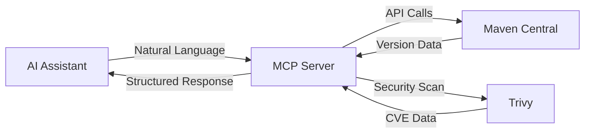

# Maven MCP Server

[](https://github.com/danielscholl/mvn-mcp-server/actions/workflows/ci.yml)
[](https://github.com/danielscholl/mvn-mcp-server/releases)
[](https://www.python.org/downloads/)
[](https://opensource.org/licenses/MIT)
[](https://modelcontextprotocol.io)

**AI-powered Maven dependency management through natural language.**

Maven MCP Server enables AI assistants to interact with Maven Central repository, providing comprehensive tools for version checking, security scanning, and dependency analysis—all through conversational interfaces.

## Why Maven MCP Server?

**Traditional Maven workflow:**
```bash
mvn versions:display-dependency-updates  # Check all dependencies
# Read through XML output, manually check each update
# Manually verify security advisories
# Repeat for each project...
```

**With Maven MCP Server:**
```
You: "Scan my-service for vulnerabilities and create an update plan"
AI: ✅ Found 3 critical CVEs, 12 outdated dependencies
    📋 Created prioritized update plan with file locations
    🎯 Ready to implement
```

> **Key Benefits:**
> - Natural language instead of complex Maven commands
> - Single workflow combining version checks + security + planning
> - AI-assisted decision making with full context
> - Intelligent caching for faster repeated queries
> - Enterprise-ready with audit trails and traceability

## Features

| Category | Capabilities |
|----------|-------------|
| **Version Management** | Check single or batch dependency versions • Discover available updates (major/minor/patch) • List version history grouped by tracks |
| **Security Scanning** | Integrate Trivy vulnerability scanning • CVE detection with severity filtering • Multi-module project support |
| **Enterprise Workflows** | Guided dependency triage analysis • Actionable remediation planning • Complete audit trail with CVE traceability |
| **AI-Optimized** | Single-call comprehensive responses • Batch operations for efficiency • Intelligent caching |

## Quick Start

### Installation

```bash
# Install from PyPI
pip install mvn-mcp-server

# Or using uv (recommended)
uv pip install mvn-mcp-server
```

### Configuration

Add to your MCP settings (`.mcp.json` or Claude Desktop config):

```json
{
  "mcpServers": {
    "mvn-mcp-server": {
      "command": "uvx",
      "args": ["mvn-mcp-server"]
    }
  }
}
```

### First Query

Try asking your AI assistant:

> "Check if Spring Core 5.3.0 has any updates available"

Or:

> "Scan my Java project for security vulnerabilities"

## Requirements

### Optional: Security Scanning

Install **Trivy** for vulnerability detection:

```bash
# macOS
brew install trivy

# Linux
# See: https://aquasecurity.github.io/trivy/latest/getting-started/installation/
```

Without Trivy, version checking and dependency analysis work normally. Security scanning tools will gracefully report Trivy unavailable.

**Security Note:** All processing happens locally. No source code or project data is sent to external services (except public Maven Central API queries for version information).

## Available Tools

| Tool | Description | Example Query |
|------|-------------|---------------|
| **check_version_tool** | Check single dependency version | `Check org.springframework:spring-core version 5.3.0` |
| **check_version_batch_tool** | Check multiple dependencies | `Check these for updates: spring-core 5.3.0, junit 4.13.2` |
| **list_available_versions_tool** | List version history by tracks | `Show all versions of commons-lang3` |
| **scan_java_project_tool** | Security scan with Trivy | `Scan this project for vulnerabilities` |
| **analyze_pom_file_tool** | Analyze POM file | `Analyze this pom.xml for issues` |

## Available Prompts

| Prompt | Description | Example Query |
|--------|-------------|---------------|
| **list_mcp_assets_prompt** | Show all capabilities with examples | `What can this server do?` |
| **triage** | Complete dependency and vulnerability analysis | `Run triage for my-service` |
| **plan** | Generate actionable remediation plan | `Create update plan for my-service` |

## How It Works



## Support

- **Issues**: [GitHub Issues](https://github.com/danielscholl/mvn-mcp-server/issues)
- **Questions**: Open an issue with the `question` label

## License

This project is licensed under the MIT License - see [LICENSE](LICENSE) for details.

---

<div align="center">

**[Usage](docs/project-usage.md)** • **[Architecture](docs/project-architect.md)** • **[Contributing](CONTRIBUTING.md)**

</div>
