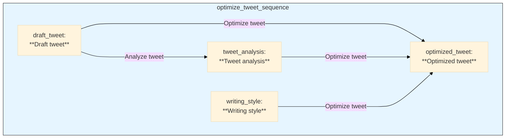

<div align="center">
  <a href="https://www.pipelex.com/"></a>

  <h2 align="center">Open-source language for repeatable AI workflows</h2>
Pipelex is an open-source devtool that transforms how you build repeatable AI workflows. Think of it as Docker or SQL for AI operations.

Create modular "pipes", each using a different LLM and guaranteeing structured outputs. Connect them like LEGO blocks sequentially, in parallel, or conditionally, to build complex knowledge transformations from simple, reusable components.

Stop reinventing AI workflows from scratch. With Pipelex, your proven methods become shareable, versioned artifacts that work across different LLMs. What took weeks to perfect can now be forked, adapted, and scaled instantly.

  <div>
    <a href="https://go.pipelex.com/demo"><strong>Demo</strong></a> -
    <a href="https://docs.pipelex.com/"><strong>Documentation</strong></a> -
    <a href="https://github.com/Pipelex/pipelex/issues"><strong>Report Bug</strong></a> -
    <a href="https://github.com/Pipelex/pipelex/discussions"><strong>Feature Request</strong></a>
  </div>
  <br/>

  <p align="center">
    <a href="LICENSE"></a>
    <a href="https://github.com/Pipelex/pipelex/actions/workflows/check-test-count-badge.yml"></a>
    
    <br/>
    <br/>
    <a href="https://go.pipelex.com/discord"></a>
    <a href="https://www.youtube.com/@PipelexAI"></a>
    <a href="https://pipelex.com"></a>
    <a href="https://github.com/Pipelex/pipelex-cookbook"></a>
    <a href="https://docs.pipelex.com/"></a>
    <a href="https://docs.pipelex.com/changelog/"></a>
    <br/> 
    <br/>
</div>

<div align="center">
  <h2 align="center">📜 The Knowledge Pipeline Manifesto</h2>
  <p align="center">
    <a href="https://go.pipelex.com/manifesto"><strong>Read why we built Pipelex to transform unreliable AI workflows into deterministic pipelines 🔗</strong></a>
  </p>

  <h2 align="center">🚀 See Pipelex in Action</h2>
  <h3 align="center">From Whiteboard to AI Workflow in less than 5 minutes with no hands</h3>
  <p align="center">
    <a href="https://go.pipelex.com/demo"></a>
  </p>
  
</div>

# 📑 Table of Contents

- [Introduction](#introduction)
- [Quick start](#-quick-start)
  - [Prerequisites](#prerequisites)
  - [Installation](#installation)
  - [Optional features](#optional-features)
- [Contributing](#-contributing)
- [Support](#-support)
- [License](#-license)

# Introduction

Pipelex makes it easy for developers to define and run repeatable AI workflows. At its core is a clear, declarative pipeline language specifically crafted for knowledge-processing tasks.

Build **pipelines** from modular pipes that snap together. Each pipe can use different AI models - language models (LLMs) for text generation, OCR models for document processing, or image generation models for creating visuals. Pipes consistently deliver **structured, predictable outputs** at each stage.

Pipelex uses its own syntax PLX, based on TOML, making workflows readable and shareable. Business professionals, developers, and AI coding agents can all understand and modify the same pipeline definitions.

Example:
```plx
[concept]
Buyer = "The person who made the purchase"
PurchaseDocumentText = "Transcript of a receipt, invoice, or order confirmation"

[pipe.extract_buyer]
type = "PipeLLM"
description = "Extract buyer from purchase document"
inputs = { purchase_document_text = "PurchaseDocumentText" }
output = "Buyer"
llm = "llm_to_extract_info"
prompt_template = """
Extract the first and last name of the buyer from this purchase document:
@purchase_document_text
"""
```

Pipes are modular building blocks that **connect sequentially, run in parallel, or call sub-pipes.** Like function calls in traditional programming, but with a clear contract: knowledge-in, knowledge-out. This modularity makes pipelines perfect for sharing: fork someone's invoice processor, adapt it for receipts, share it back. 

Pipelex is an **open-source Python library** with a hosted API launching soon. It integrates seamlessly into existing systems and automation frameworks. Plus, it works as an [MCP server](https://github.com/Pipelex/pipelex-mcp) so AI agents can use pipelines as tools.

# 🚀 Quick start

> :books: Note that you can check out the [Pipelex Documentation](https://docs.pipelex.com/) for more information and clone the [Pipelex Cookbook](https://github.com/Pipelex/pipelex-cookbook) repository for ready-to-run examples.

Follow these steps to get started:

## Installation

### Prerequisites

- Python ≥3.10
- [pip](https://pip.pypa.io/en/stable/), [poetry](https://python-poetry.org/), or [uv](https://github.com/astral-sh/uv) package manager

We **highly** recommend installing our own extension for PLX files into your IDE of choice. You can find it in the [Open VSX Registry](https://open-vsx.org/extension/Pipelex/pipelex). It's coming soon to VS Code marketplace too and if you are using Cursor, Windsurf or another VS Code fork, you can search for it directly in your extensions tab.

### Option #1: Run examples

Visit the 
[](https://github.com/Pipelex/pipelex-cookbook/): you can clone it, fork it, play with it 

### Option #2: Install the package

```bash
# Using pip
pip install pipelex

# Using Poetry
poetry add pipelex

# Using uv (Recommended)
uv pip install pipelex
```

### Optional Features

The package supports the following additional features:

- `anthropic`: Anthropic/Claude support for text generation
- `google`: Google models (Vertex) support for text generation
- `mistralai`: Mistral AI support for text generation and OCR
- `bedrock`: AWS Bedrock support for text generation
- `fal`: Image generation with Black Forest Labs "FAL" service

Install all extras:

Using `pip`:
```bash
pip install "pipelex[anthropic,google,mistralai,bedrock,fal]"
```

Using `poetry`:
```bash
poetry add "pipelex[anthropic,google,mistralai,bedrock,fal,pypdfium2]"
```

Using `uv`:
```bash
uv pip install "pipelex[anthropic,google,mistralai,bedrock,fal]"
```

---

## Example: optimizing a tweet in 2 steps

Example with the extension you can download now on Cursor, Windsurf or another VS Code fork. (Coming soon for VS Code Marketplace)

<div>
<a href="https://open-vsx.org/extension/Pipelex/pipelex">

</a>
</div>

### 1. Define the pipeline in PLX

```plx
domain = "tech_tweet"
description = "A pipeline for optimizing tech tweets using Twitter/X best practices"

[concept]
DraftTweet = "A draft version of a tech tweet that needs optimization"
OptimizedTweet = "A tweet optimized for Twitter/X engagement following best practices"
TweetAnalysis = "Analysis of the tweet's structure and potential improvements"
WritingStyle = "A style of writing"

[pipe]
[pipe.analyze_tweet]
type = "PipeLLM"
description = "Analyze the draft tweet and identify areas for improvement"
inputs = { draft_tweet = "DraftTweet" }
output = "TweetAnalysis"
llm = "llm_for_writing_analysis"
system_prompt = """
You are an expert in social media optimization, particularly for tech content on Twitter/X.
Your role is to analyze tech tweets and check if they display typical startup communication pitfalls.
"""
prompt_template = """
Evaluate the tweet for these key issues:

**Fluffiness** - Overuse of buzzwords without concrete meaning (e.g., "synergizing disruptive paradigms")

**Cringiness** - Content that induces secondhand embarrassment (overly enthusiastic, trying too hard to be cool, excessive emoji use)

**Humblebragginess** - Disguising boasts as casual updates or false modesty ("just happened to close our $ 10M round 🤷")

**Vagueness** - Failing to clearly communicate what the product/service actually does

For each criterion, provide:
1. A score (1-5) where 1 = not present, 5 = severely present
2. If the problem is not present, no comment. Otherwise, explain of the issue and give concise guidance on fixing it, 
without providing an actual rewrite

@draft_tweet
"""

[pipe.optimize_tweet]
type = "PipeLLM"
description = "Optimize the tweet based on the analysis"
inputs = { draft_tweet = "DraftTweet", tweet_analysis = "TweetAnalysis", writing_style = "WritingStyle" }
output = "OptimizedTweet"
llm = "llm_for_social_post_writing"
system_prompt = """
You are an expert in writing engaging tech tweets that drive meaningful discussions and engagement.
Your goal is to rewrite tweets to be impactful and avoid the pitfalls identified in the analysis.
"""
prompt_template = """
Rewrite this tech tweet to be more engaging and effective, based on the analysis:

Original tweet:
@draft_tweet

Analysis:
@tweet_analysis

Requirements:
- Include a clear call-to-action
- Make it engaging and shareable
- Use clear, concise language

### Reference style example

@writing_style

### Additional style instructions

No hashtags.
Minimal emojis.
Keep the core meaning of the original tweet.
"""

[pipe.optimize_tweet_sequence]
type = "PipeSequence"
description = "Analyze and optimize a tech tweet in sequence"
inputs = { draft_tweet = "DraftTweet", writing_style = "WritingStyle" }
output = "OptimizedTweet"
steps = [
    { pipe = "analyze_tweet", result = "tweet_analysis" },
    { pipe = "optimize_tweet", result = "optimized_tweet" },
]
```

### 2. Run the pipeline

Here is the flowchart generated during this run:



### 3. wait… no, there is no step 3, you're done!

---

## 🤝 Contributing

We welcome contributions! Please see our [Contributing Guidelines](CONTRIBUTING.md) for details on how to get started, including development setup and testing information.

## 👥 Join the Community

Join our vibrant Discord community to connect with other developers, share your experiences, and get help with your Pipelex projects!

[](https://go.pipelex.com/discord)

## 💬 Support

- **GitHub Issues**: For bug reports and feature requests
- **Discussions**: For questions and community discussions
- [**Documentation**](https://docs.pipelex.com/)

## ⭐ Star Us!

If you find Pipelex helpful, please consider giving us a star! It helps us reach more developers and continue improving the tool.

## 📝 License

This project is licensed under the [MIT license](LICENSE). Runtime dependencies are distributed under their own licenses via PyPI.

---

"Pipelex" is a trademark of Evotis S.A.S.

© 2025 Evotis S.A.S.
