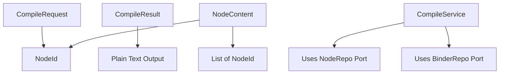

# Data Model

## Entities

### CompileRequest
**Purpose**: Encapsulates the request to compile a node and its subtree
**Fields**:
- `node_id: NodeId` - The root node to start compilation from
- `include_empty: bool = False` - Whether to include empty nodes (default: skip)

**Validation Rules**:
- `node_id` must be a valid NodeId (UUIDv7 format)
- `node_id` must exist in the node repository

### CompileResult
**Purpose**: Contains the compiled output from the subtree
**Fields**:
- `content: str` - The concatenated plain text content
- `node_count: int` - Number of nodes included in compilation
- `total_nodes: int` - Total nodes traversed (including skipped)
- `skipped_empty: int` - Number of empty nodes skipped

**Validation Rules**:
- `node_count >= 0`
- `total_nodes >= node_count`
- `skipped_empty >= 0`
- `skipped_empty <= total_nodes - node_count`

### NodeContent
**Purpose**: Represents the content of a single node during traversal
**Fields**:
- `id: NodeId` - Node identifier
- `content: str` - The text content of the node
- `children: List[NodeId]` - List of child node IDs

**Validation Rules**:
- Content may be empty string
- Children list may be empty

## Relationships



## State Transitions

### Compilation Process States
1. **Initiated**: CompileRequest created with target node_id
2. **Validating**: Checking node exists and is accessible
3. **Traversing**: Walking the tree in depth-first pre-order
4. **Aggregating**: Building the concatenated output
5. **Complete**: CompileResult produced with content and statistics

## Domain Operations

### CompileService Operations
- `compile_subtree(request: CompileRequest) -> CompileResult`
  - Validates node exists
  - Traverses subtree depth-first pre-order
  - Skips empty nodes (unless include_empty=True)
  - Concatenates content with double newline separation
  - Returns result with statistics

### Tree Traversal Algorithm
```python
def traverse_depth_first(node_id: NodeId) -> Generator[NodeContent, None, None]:
    """
    Yields nodes in depth-first pre-order:
    1. Process current node
    2. Recursively process each child left-to-right
    """
```

## Integration with Existing Domain

### Reused Entities
- `NodeId` from `domain/models.py`
- `Node` entity for node data access
- `Binder` entity for hierarchy navigation

### New Port Interfaces
- `CompileServicePort`: Defines the compile operation contract
- Implementation will use existing `NodeRepo` and `BinderRepo` ports

## Performance Considerations
- Streaming generation to handle large subtrees
- Lazy content loading (only load when non-empty)
- Target: 1000 nodes compiled in <1 second
