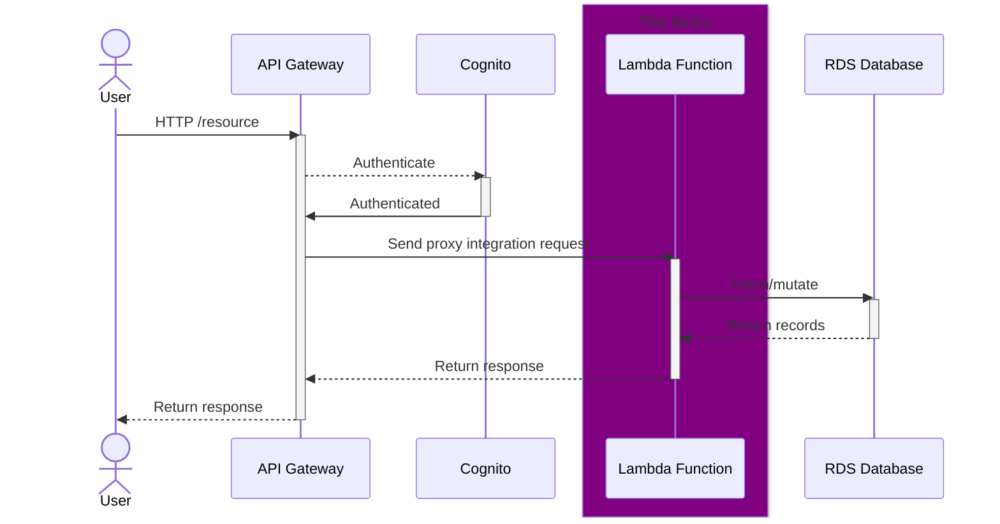
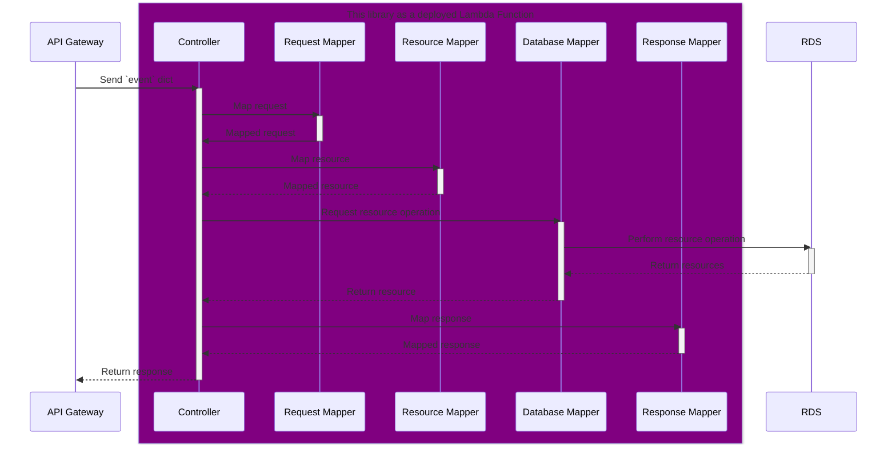

# Python PostgreSQL REST API framework for AWS Lambda functions
> [!NOTE]
> Project status: `Alpha`

A REST API web framework for persisting records in a PostgreSQL database.

## Supported features
- Automatic creation of `uid` fields
- Automatic setting of `created_at` and `last_updated_at` timestamps
- Automatic setting of `creator_uid` and `last_updater_uid`
- RDS with IAM credentials

## Examples
See [Examples docs directory](./docs/examples/)

## Sequence diagrams

### High-level infrastructure

This sequence diagram shows how a lambda function running this library is intended to be deployed.

### Low-level architecture

This sequence diagram shows the layers within the library that handle request and response processing.

