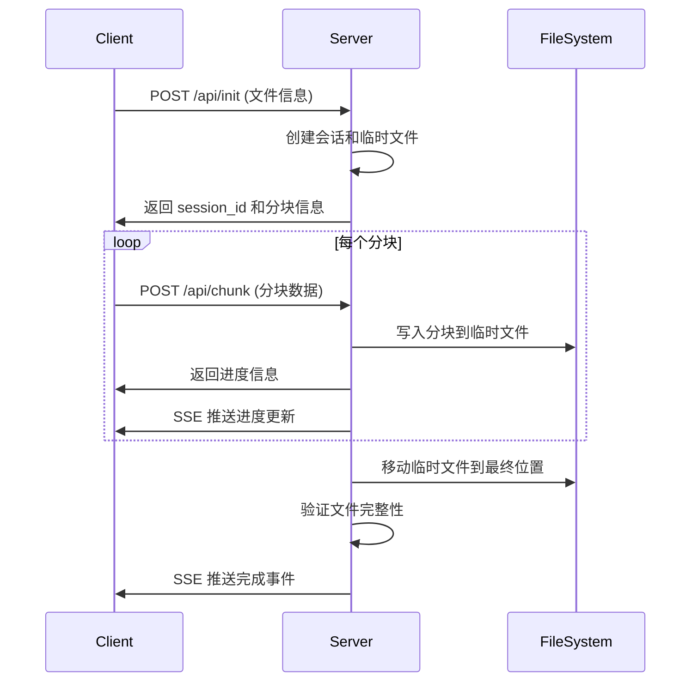

# 简单分块上传演示指南

## 概述

`simple_chunked_upload.py` 是一个基于 RAT Engine 的文件分块上传演示应用，展示了如何实现大文件的分块上传功能。该应用提供了完整的文件上传解决方案，包括进度监控、文件验证和现代化的用户界面。

## 主要特性

### 🚀 核心功能
- **分块上传**: 将大文件分割成小块进行上传，避免超时和内存问题
- **进度监控**: 实时显示上传进度和分块状态
- **文件验证**: 支持 SHA-256 哈希验证确保文件完整性
- **断点续传**: 支持上传中断后的续传功能
- **多文件支持**: 同时处理多个文件上传

### 📊 技术规格
- **最大文件大小**: 500MB
- **分块大小**: 64KB（可配置）
- **支持格式**: 所有文件类型
- **并发上传**: 支持多个文件同时上传
- **会话管理**: 基于 UUID 的会话隔离

## 快速开始

### 1. 环境准备

确保已安装 RAT Engine Python 绑定：

```bash
cd /path/to/rat_engine/python
pip install -e .
```

### 2. 启动应用

```bash
python examples/simple_chunked_upload.py
```

应用将在 `http://127.0.0.1:8088` 启动。

### 3. 使用流程

1. **选择文件**: 点击"选择文件"按钮或拖拽文件到上传区域
2. **查看信息**: 确认文件名、大小和分块数量
3. **开始上传**: 点击"开始上传"按钮
4. **监控进度**: 观察实时进度条和分块状态
5. **完成验证**: 上传完成后自动进行文件完整性验证

## API 接口

### 上传初始化

#### POST `/api/init`
初始化文件上传会话

**请求体**:
```json
{
  "filename": "example.pdf",
  "file_size": 10485760,
  "file_hash": "sha256_hash_optional"
}
```

**响应**:
```json
{
  "session_id": "550e8400-e29b-41d4-a716-446655440000",
  "chunk_size": 65536,
  "total_chunks": 160
}
```

### 分块上传

#### POST `/api/chunk`
上传单个文件分块

**请求体**:
```json
{
  "session_id": "550e8400-e29b-41d4-a716-446655440000",
  "chunk_index": 0,
  "chunk_data": "base64_encoded_chunk_data"
}
```

**响应**:
```json
{
  "success": true,
  "progress": 0.625,
  "completed": false
}
```

**完成时响应**:
```json
{
  "success": true,
  "progress": 100.0,
  "completed": true,
  "filename": "example.pdf",
  "file_size": 10485760,
  "download_url": "/api/download/example.pdf"
}
```

### 进度查询

#### GET `/api/progress/<session_id>` (SSE)
Server-Sent Events 进度推送

**事件类型**:
- `init`: 连接初始化
- `progress`: 上传进度更新
- `completed`: 上传完成
- `error`: 错误信息

**事件数据格式**:
```json
{
  "type": "progress",
  "session_id": "uuid",
  "progress": 45.5,
  "completed": false,
  "current_chunk": 73,
  "total_chunks": 160
}
```

### 文件下载

#### GET `/api/download/<filename>`
下载已上传的文件

**响应**: 文件二进制数据流

### 状态查询

#### GET `/api/status/<session_id>`
获取上传会话状态

**响应**:
```json
{
  "session_id": "uuid",
  "filename": "example.pdf",
  "file_size": 10485760,
  "progress": 100.0,
  "completed": true,
  "chunks_received": 160,
  "total_chunks": 160,
  "created_at": "2024-01-01T12:00:00Z",
  "completed_at": "2024-01-01T12:05:30Z"
}
```

## 配置选项

### 服务器配置

```python
# 基本设置
SERVER_HOST = "127.0.0.1"
SERVER_PORT = 8088

# 文件处理设置
UPLOAD_DIR = Path(__file__).parent / "uploads"
CHUNK_SIZE = 64 * 1024  # 64KB
MAX_FILE_SIZE = 500 * 1024 * 1024  # 500MB

# 安全设置
ALLOWED_EXTENSIONS = None  # None 表示允许所有格式
SECURE_FILENAME = True  # 启用文件名安全处理
```

### 前端配置

```javascript
class ChunkedUploader {
    constructor() {
        this.chunkSize = 65536; // 64KB，需与后端一致
        this.maxRetries = 3;    // 分块上传重试次数
        this.retryDelay = 1000; // 重试延迟（毫秒）
    }
}
```

## 技术实现

### 分块上传流程



### 会话管理

```python
class UploadSession:
    def __init__(self, session_id, filename, file_size, file_hash=None):
        self.session_id = session_id
        self.filename = filename
        self.file_size = file_size
        self.file_hash = file_hash
        self.chunks_received = set()
        self.total_chunks = math.ceil(file_size / CHUNK_SIZE)
        self.created_at = datetime.now()
        self.temp_file = UPLOAD_DIR / f"{session_id}.tmp"
```

### 错误处理和重试

```javascript
async function uploadChunk(chunk, index, retries = 0) {
    try {
        const response = await fetch('/api/chunk', {
            method: 'POST',
            headers: { 'Content-Type': 'application/json' },
            body: JSON.stringify({
                session_id: this.sessionId,
                chunk_index: index,
                chunk_data: await this.encodeChunk(chunk)
            })
        });
        
        if (!response.ok) {
            throw new Error(`HTTP ${response.status}`);
        }
        
        return await response.json();
    } catch (error) {
        if (retries < this.maxRetries) {
            await this.delay(this.retryDelay * (retries + 1));
            return this.uploadChunk(chunk, index, retries + 1);
        }
        throw error;
    }
}
```

## 性能优化

### 分块大小调优

**网络环境建议**:

| 网络类型 | 建议分块大小 | 说明 |
|---------|-------------|------|
| 高速网络 | 256KB - 1MB | 减少请求次数，提高吞吐量 |
| 普通网络 | 64KB - 256KB | 平衡传输效率和错误恢复 |
| 移动网络 | 32KB - 64KB | 适应不稳定连接 |
| 低速网络 | 16KB - 32KB | 减少超时风险 |

### 并发控制

```javascript
class ConcurrentUploader {
    constructor(maxConcurrent = 3) {
        this.maxConcurrent = maxConcurrent;
        this.activeUploads = 0;
        this.uploadQueue = [];
    }
    
    async uploadChunks(chunks) {
        const promises = chunks.map((chunk, index) => 
            this.queueUpload(() => this.uploadChunk(chunk, index))
        );
        return Promise.all(promises);
    }
}
```

### 内存优化

```python
# 流式写入，避免内存积累
def write_chunk(session_id: str, chunk_index: int, chunk_data: bytes):
    session = upload_sessions[session_id]
    
    with open(session.temp_file, 'r+b') as f:
        f.seek(chunk_index * CHUNK_SIZE)
        f.write(chunk_data)
        f.flush()  # 立即写入磁盘
```

## 安全考虑

### 文件验证

```python
def validate_upload(session: UploadSession):
    # 1. 文件大小验证
    actual_size = session.temp_file.stat().st_size
    if actual_size != session.file_size:
        raise ValueError(f"文件大小不匹配: 期望 {session.file_size}, 实际 {actual_size}")
    
    # 2. 哈希验证（如果提供）
    if session.file_hash:
        actual_hash = calculate_file_hash(session.temp_file)
        if actual_hash != session.file_hash:
            raise ValueError("文件哈希验证失败")
```

### 路径安全

```python
from werkzeug.utils import secure_filename

def safe_filename(filename: str) -> str:
    # 移除危险字符，防止路径遍历攻击
    safe_name = secure_filename(filename)
    
    # 限制文件名长度
    if len(safe_name) > 255:
        name, ext = os.path.splitext(safe_name)
        safe_name = name[:255-len(ext)] + ext
    
    return safe_name
```

### 资源限制

```python
# 会话数量限制
MAX_CONCURRENT_SESSIONS = 100

# 会话超时清理
SESSION_TIMEOUT = 3600  # 1小时

def cleanup_expired_sessions():
    current_time = datetime.now()
    expired_sessions = [
        sid for sid, session in upload_sessions.items()
        if (current_time - session.created_at).seconds > SESSION_TIMEOUT
    ]
    
    for sid in expired_sessions:
        cleanup_session(sid)
```

## 错误处理

### 常见错误类型

| 错误代码 | 错误类型 | 原因 | 解决方案 |
|---------|---------|------|----------|
| 400 | 请求格式错误 | JSON 格式不正确 | 检查请求体格式 |
| 404 | 会话不存在 | session_id 无效 | 重新初始化上传 |
| 413 | 文件过大 | 超过大小限制 | 分割文件或调整限制 |
| 422 | 分块索引错误 | chunk_index 超出范围 | 检查分块计算逻辑 |
| 500 | 服务器内部错误 | 磁盘空间不足等 | 检查服务器资源 |

### 客户端错误处理

```javascript
class ErrorHandler {
    static handle(error, context) {
        switch (error.status) {
            case 413:
                return '文件过大，请选择较小的文件';
            case 422:
                return '文件数据损坏，请重新选择文件';
            case 500:
                return '服务器错误，请稍后重试';
            default:
                return `上传失败: ${error.message}`;
        }
    }
}
```

## 监控和日志

### 性能指标

```python
import time
from collections import defaultdict

class UploadMetrics:
    def __init__(self):
        self.upload_times = []
        self.chunk_counts = defaultdict(int)
        self.error_counts = defaultdict(int)
    
    def record_upload(self, session: UploadSession, duration: float):
        self.upload_times.append(duration)
        self.chunk_counts[session.total_chunks] += 1
    
    def get_stats(self):
        return {
            'avg_upload_time': sum(self.upload_times) / len(self.upload_times),
            'total_uploads': len(self.upload_times),
            'error_rate': sum(self.error_counts.values()) / len(self.upload_times)
        }
```

### 日志配置

```python
import logging

logging.basicConfig(
    level=logging.INFO,
    format='%(asctime)s - %(name)s - %(levelname)s - %(message)s',
    handlers=[
        logging.FileHandler('upload.log'),
        logging.StreamHandler()
    ]
)

logger = logging.getLogger('chunked_upload')
```

## 扩展开发

### 添加文件类型限制

```python
ALLOWED_EXTENSIONS = {'.pdf', '.doc', '.docx', '.jpg', '.png', '.zip'}

def validate_file_type(filename: str) -> bool:
    if ALLOWED_EXTENSIONS is None:
        return True
    
    ext = Path(filename).suffix.lower()
    return ext in ALLOWED_EXTENSIONS
```

### 实现断点续传

```python
def resume_upload(session_id: str) -> dict:
    session = upload_sessions.get(session_id)
    if not session:
        return {"error": "会话不存在"}
    
    # 检查已接收的分块
    received_chunks = list(session.chunks_received)
    missing_chunks = [
        i for i in range(session.total_chunks)
        if i not in received_chunks
    ]
    
    return {
        "session_id": session_id,
        "missing_chunks": missing_chunks,
        "progress": len(received_chunks) / session.total_chunks * 100
    }
```

### 添加压缩支持

```python
import gzip

def compress_chunk(chunk_data: bytes) -> bytes:
    return gzip.compress(chunk_data)

def decompress_chunk(compressed_data: bytes) -> bytes:
    return gzip.decompress(compressed_data)
```

## 故障排除

### 调试模式

```python
# 启用详细日志
app.configure_logging(level="debug", enable_access_log=True)

# 添加调试端点
@app.get("/api/debug/sessions")
def debug_sessions():
    return {
        "active_sessions": len(upload_sessions),
        "sessions": {
            sid: {
                "filename": session.filename,
                "progress": len(session.chunks_received) / session.total_chunks * 100,
                "created_at": session.created_at.isoformat()
            }
            for sid, session in upload_sessions.items()
        }
    }
```

### 常见问题

**Q: 上传速度很慢？**
A: 尝试增大分块大小或启用并发上传。

**Q: 经常出现网络错误？**
A: 减小分块大小，增加重试次数和延迟。

**Q: 内存使用过高？**
A: 检查是否有会话泄漏，启用定期清理。

**Q: 文件验证失败？**
A: 检查网络传输是否稳定，确认哈希计算正确。

## 相关文档

- [RAT Engine 官方文档](../README.md)
- [SSE 流式传输指南](./SSE_STREAMING_GUIDE.md)
- [TXT 文件读取器指南](./TXT_LINE_READER_GUIDE.md)
- [环境配置指南](./ENV_SETUP.md)

## 许可证

本示例遵循 RAT Engine 的开源许可证。