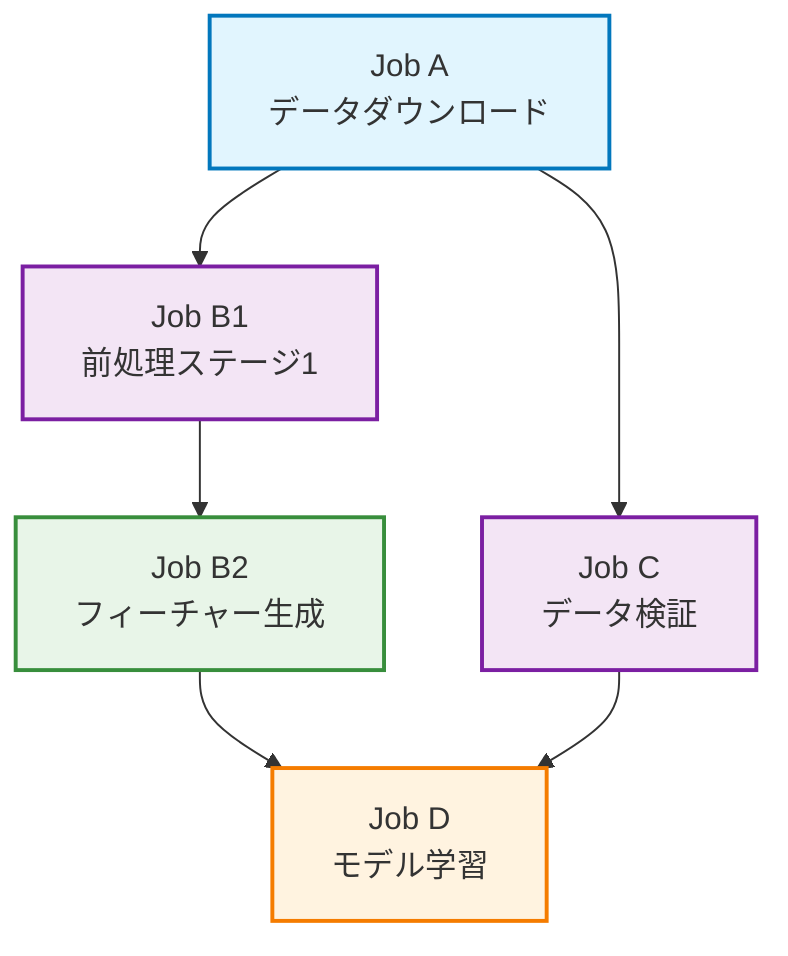

## 問題：Slurmのジョブ依存関係管理が面倒すぎる

機械学習パイプラインをHPCクラスター上で実行する際、Slurmのジョブ依存関係管理で以下のような課題に直面していませんか？

```bash
# 毎回こんな感じで依存関係を手動管理...
$ sbatch preprocess.sh
Submitted batch job 12345

# ジョブIDをメモして...
$ sbatch --dependency=afterok:12345 train.sh
Submitted batch job 12346

# また手動で次のジョブを...
$ sbatch --dependency=afterok:12346 evaluate.sh
Submitted batch job 12347
```

前処理、トレーニング、評価、さらに細かいステップ（SFT、DPO...）が増えると、手動での管理は複雑さを増し、エラーの元にもなります。

この煩雑さを一気に解決するツールが **srunx** です。

## srunxとは？

srunxは、Slurmの複雑なジョブ依存関係を簡単なYAMLファイルで直感的に管理できるCLIツール/Pythonパッケージです。

- **直感的なYAMLによるワークフロー定義**
- **依存関係に基づく自動並列実行**
- **Slackを使ったワークフローの死活監視**

## srunxの始め方

```bash
# uv
uv add srunx

# pypi
pip install srunx
```

## YAMLでワークフローを定義

srunxの最大の特徴は、複雑な依存関係を持つワークフローをYAMLで直感的に定義できることです。

### 基本的なワークフロー

```yaml
name: ml_pipeline
jobs:
  - name: preprocess
    command: ["python", "preprocess.py", "--input", "raw_data.csv"]
    resources:
      nodes: 1
      memory_per_node: "16GB"
    environment:
      conda: pytorch_env

  - name: train
    command: ["python", "train.py", "--data", "processed_data.csv"]
    depends_on:
      - preprocess
    resources:
      nodes: 2
      gpus_per_node: 2
    environment:
      conda: pytorch_env

  - name: evaluate
    command: ["python", "evaluate.py", "--model", "trained_model.pt"]
    depends_on:
      - train
    resources:
      nodes: 1
    environment:
      venv: /home/user/xxx/.venv
```

これで`preprocess → train → evaluate`が簡潔に定義されます。

### 並列実行の威力

srunxの最大の強みは、依存関係を自動解析して並列実行可能なジョブを同時実行してくれることです。

```yaml
name: parallel_ml_pipeline
jobs:
  # 初期データ準備
  - name: job_a
    command: ["python", "download_data.py", "--dataset", "imagenet"]
    resources:
      nodes: 1
      memory_per_node: "8GB"
    environment:
      conda: ml_env

  # 並列実行される2つのタスク
  - name: job_b1
    command: ["python", "preprocess.py", "--stage", "1"]
    depends_on:
      - job_a
    resources:
      nodes: 1
      memory_per_node: "16GB"
    environment:
      conda: ml_env

  - name: job_c
    command: ["python", "validate_data.py", "--check", "quality"]
    depends_on:
      - job_a
    resources:
      nodes: 1
    environment:
      conda: ml_env

  # B1の後に実行
  - name: job_b2
    command: ["python", "feature_engineering.py"]
    depends_on:
      - job_b1
    resources:
      nodes: 2
      memory_per_node: "32GB"
    environment:
      conda: ml_env

  # B2とCの両方が完了してから実行
  - name: job_d
    command: ["python", "train_model.py", "--final"]
    depends_on:
      - job_b2
      - job_c
    resources:
      nodes: 4
      gpus_per_node: 2
    environment:
      conda: pytorch_env
```

この並列実行の流れを依存関係グラフで可視化すると以下のようになります：



ジョブは準備が整い次第、即座に実行されるため、計算リソースの無駄を最小限に抑えます。ワークフローは細粒度の依存関係制御を提供します。

- **Job A** 完了時 → **Job B1** と **Job C** が即座に並列に投入される
- **Job B1** 完了時 → **Job C** の状態に関係なく **Job B2** が即座に投入される
- **Job D** は **Job B2** と **Job C** の両方が完了するまで待機してから投入される

この仕組みにより、最大限の並列化を実現し、全体の実行時間を大幅に短縮できます。

## ワンコマンドでの簡単実行

```bash
$ srunx flow run ml_pipeline.yaml

🚀 Starting Workflow test with 5 jobs
🌋 SUBMITTED    Job a
👀 MONITORING   Job a            (ID: 12232)
✅ COMPLETED    Job a            (ID: 12232)

...

✅ Workflow completed successfully!

   Workflow test Summary
┏━━━━━┳━━━━━━━━━━━┳━━━━━━━┓
┃ Job ┃ Status    ┃ ID    ┃
┡━━━━━╇━━━━━━━━━━━╇━━━━━━━┩
│ a   │ COMPLETED │ 12232 │
│ b1  │ COMPLETED │ 12233 │
│ c   │ COMPLETED │ 12234 │
│ b2  │ COMPLETED │ 12235 │
│ d   │ COMPLETED │ 12236 │
└─────┴───────────┴───────┘
```

## Slackでの死活監視

Slackを使用した簡単な死活監視機能もあります。

```bash
export SLACK_WEBHOOK_URL=xxx # 自分のSlackのWebhook URLを設定

# Slack通知付きでワークフロー実行
srunx flow run ml_pipeline.yaml --slack
```

もしくはプログラムから：

```python
from srunx.callbacks import SlackCallback
from srunx.workflows import WorkflowRunner

slack_callback = SlackCallback(webhook_url="your_webhook_url")
runner = WorkflowRunner.from_yaml("workflow.yaml", callbacks=[slack_callback])
results = runner.run()
```

実際の通知画面：


## まとめ

srunxのYAMLワークフローにより：

- **依存関係が明確**: 視覚的にワークフローが理解できる
- **自動並列実行**: 手動管理不要で最適化された実行
- **再利用性**: ワークフローファイルを使い回し可能
- **エラー削減**: 手動依存関係管理のミスがなくなる

srunxを使うことで、Slurmの煩雑なジョブ管理から解放されます。ジョブの依存関係が視覚的に理解しやすくなり、手動管理で生じるミスを防ぎます。また、依存関係を自動で解析し、最大限の並列化を実現することで、計算リソースの効率化と全体の実行時間を劇的に短縮できます。

複雑なSLURMジョブ管理に悩んでいる方は、ぜひ試してみてください！

今回紹介したレポジトリ

https://github.com/ksterx/srunx
