# StatsKita Architecture Documentation

## TL;DR

**What StatsKita Does:**
- 🚀 Loads BPS survey data (SAKERNAS, SUSENAS, PODES) efficiently with Polars backend
- 📊 Applies complex survey corrections (weights, strata, PSUs) automatically
- 🎯 Calculates official indicators (labour force participation, unemployment rate, etc.) with one function call
- 💾 Exports to Stata/Excel/Parquet with metadata preserved
- 🐍 Works seamlessly with pandas/polars DataFrames

## How It Works

```mermaid
graph LR
    A[Load Data<br/>📁 .sav/.dta/.dbf] --> B[Wrangle<br/>🔧 Clean & Harmonize]
    B --> C[Design Survey<br/>⚖️ Weights & Strata]
    C --> D[Calculate<br/>📊 Indicators]
    D --> E[Export<br/>💾 .xlsx/.dta/.parquet]

    style A fill:#e1f5fe
    style B fill:#fff3e0
    style C fill:#f3e5f5
    style D fill:#e8f5e9
    style E fill:#fce4ec
```

