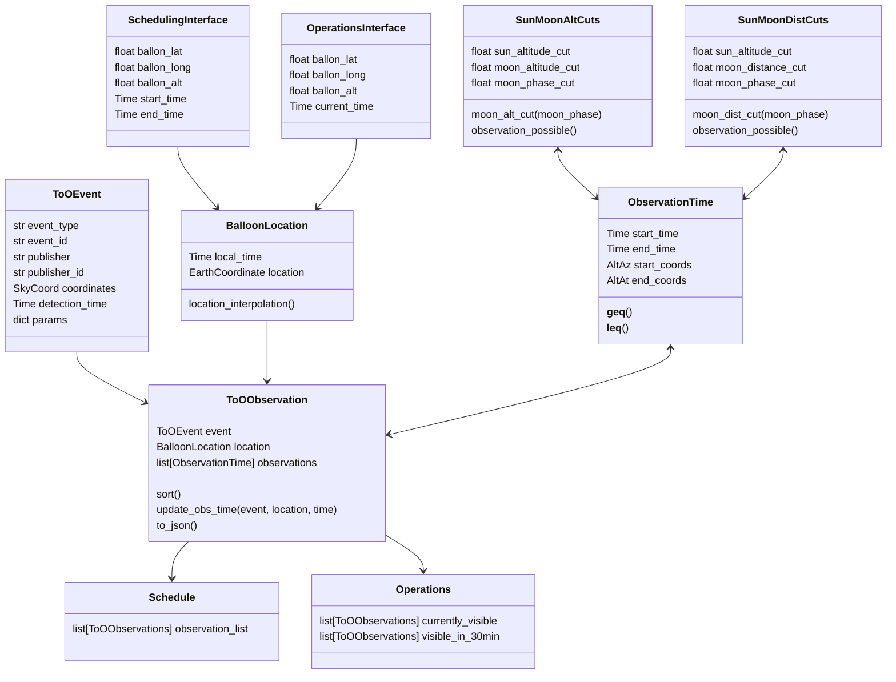

```mermaid
classDiagram
ToOEvent --> ToOObservation
BalloonLocation --> ToOObservation
ObservationTime <--> ToOObservation
SunMoonAltCuts <--> ObservationTime
SunMoonDistCuts <--> ObservationTime
SchedulingInterface --> BalloonLocation
OperationsInterface --> BalloonLocation
ToOObservation --> Schedule
ToOObservation --> Operations
ToOEvent : str event_type
ToOEvent : str event_id
ToOEvent : str publisher
ToOEvent : str publisher_id
ToOEvent : SkyCoord coordinates
ToOEvent : Time detection_time
ToOEvent : dict params
BalloonLocation : Time local_time
BalloonLocation : EarthCoordinate location
BalloonLocation : location_interpolation()
ToOObservation : ToOEvent event
ToOObservation : BalloonLocation location
ToOObservation : list[ObservationTime] observations
ToOObservation : sort()
ToOObservation : update_obs_time(event, location, time)
ToOObservation : to_json()
ObservationTime : Time start_time
ObservationTime : Time end_time
ObservationTime : AltAz start_coords
ObservationTime : AltAt end_coords
ObservationTime : __geq__()
ObservationTime : __leq__()
SunMoonAltCuts : float sun_altitude_cut
SunMoonAltCuts : float moon_altitude_cut
SunMoonAltCuts : float moon_phase_cut
SunMoonAltCuts : moon_alt_cut(moon_phase)
SunMoonAltCuts : observation_possible()
SunMoonDistCuts : float sun_altitude_cut
SunMoonDistCuts : float moon_distance_cut
SunMoonDistCuts : float moon_phase_cut
SunMoonDistCuts : moon_dist_cut(moon_phase)
SunMoonDistCuts : observation_possible()
SchedulingInterface : float ballon_lat
SchedulingInterface : float ballon_long
SchedulingInterface : float ballon_alt
SchedulingInterface : Time start_time
SchedulingInterface : Time end_time
OperationsInterface : float ballon_lat
OperationsInterface : float ballon_long
OperationsInterface : float ballon_alt
OperationsInterface : Time current_time
Schedule : list[ToOObservations] observation_list
Operations : list[ToOObservations] currently_visible
Operations : list[ToOObservations] visible_in_30min
```
