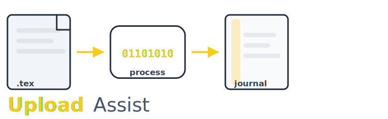

**UploadAssist** is a modern fork of [arxiv-collector](https://github.com/djsutherland/arxiv-collector), designed to help researchers and authors package their LaTeX sources for submission to journals and repositories. This project builds on the original arxiv-collector, adding support for contemporary workflows and requirements.

## About This Fork

UploadAssist began as a fork of the abandoned `arxiv-collector` tool. While the original focused on preparing submissions for arXiv, UploadAssist expands its capabilities to support a wider range of journal and repository requirements.

**Key improvements over arxiv-collector:**
- **LuaTeX and XeLaTeX support:** Works seamlessly with projects that use LuaTeX or XeLaTeX, in addition to standard pdfLaTeX.
- **Flatten by default:** UploadAssist now flattens your project structure by default, placing all files in a single directory and updating all referenced paths—essential for journals that require flat submissions. Use `--noflatten` to preserve the original directory structure.
- Retains and improves all original features, including comment stripping and dependency tracking.

If you are looking for the original package, see [arxiv-collector on GitHub](https://github.com/djsutherland/arxiv-collector).

---

## Features

- **Automatic packaging:** Collects all files needed for your LaTeX project, including images, bibliographies, and custom packages.
- **Comment stripping:** Removes potentially embarrassing comments from `.tex` files (disable with `--no-strip-comments`).
- **Smart dependency tracking:** Only includes files actually used in your project.
- **LuaTeX/XeLaTeX support:** Handles modern TeX engines and their dependencies.
- **Flattening:** By default, all files (including those referenced via `\input`, `\include`, and `\includegraphics`) are placed in a single directory, and all LaTeX source paths are updated accordingly. Use `--noflatten` to disable this behavior.
- **System package inclusion:** Optionally includes system packages or directories you specify.

---

## Installation

UploadAssist is a stand-alone Python script with no dependencies. You can:

- Download [`uploadassist.py`](uploadassist.py) directly.
- (Coming soon) Install via PyPI: `pip install uploadassist`

Works with any reasonable version of Python 3.

---

## Usage

From your project's main directory, run:

```
uploadassist
```

Or specify your main `.tex` file if needed:

```
uploadassist main.tex
```

For help and options:

```
uploadassist --help
```

By default, UploadAssist flattens your project for journal submission.
To preserve the original directory structure, use:

```
uploadassist --noflatten
```

---

## Requirements

- A working installation of [`latexmk`](http://personal.psu.edu/jcc8/software/latexmk/) on your PATH.
  - If `latexmk` is not on your PATH, use `--latexmk ./path/to/latexmk`.
  - **Note:** `latexmk` version 4.63b has broken dependency tracking. Please use a newer version.

---

## Caveats

- Unusual project layouts may require manual adjustment; always check your output before submission.
- All referenced files (including those in subdirectories) are collected and placed at the top level when flattening, and all LaTeX source paths are rewritten to match.
- Absolute paths in commands like `\includegraphics{/home/me/image.png}` may not be handled as expected. Prefer relative paths or use `--include-packages` to specify additional directories.
- If you encounter issues, please open an issue and include a copy of your problematic project if possible.

---

## Using on Overleaf

You can configure Overleaf to run UploadAssist on each compilation, ensuring your project is always ready for submission. The process is similar to the original arxiv-collector—see their documentation for details.

---

**UploadAssist** is not affiliated with arXiv or any journal. This project is maintained independently and welcomes contributions.

---
